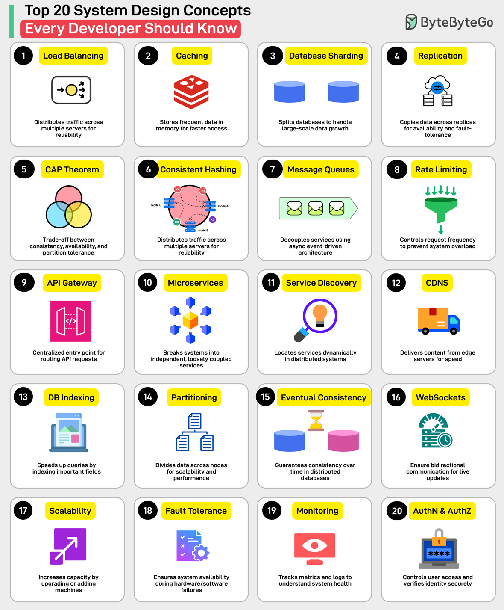
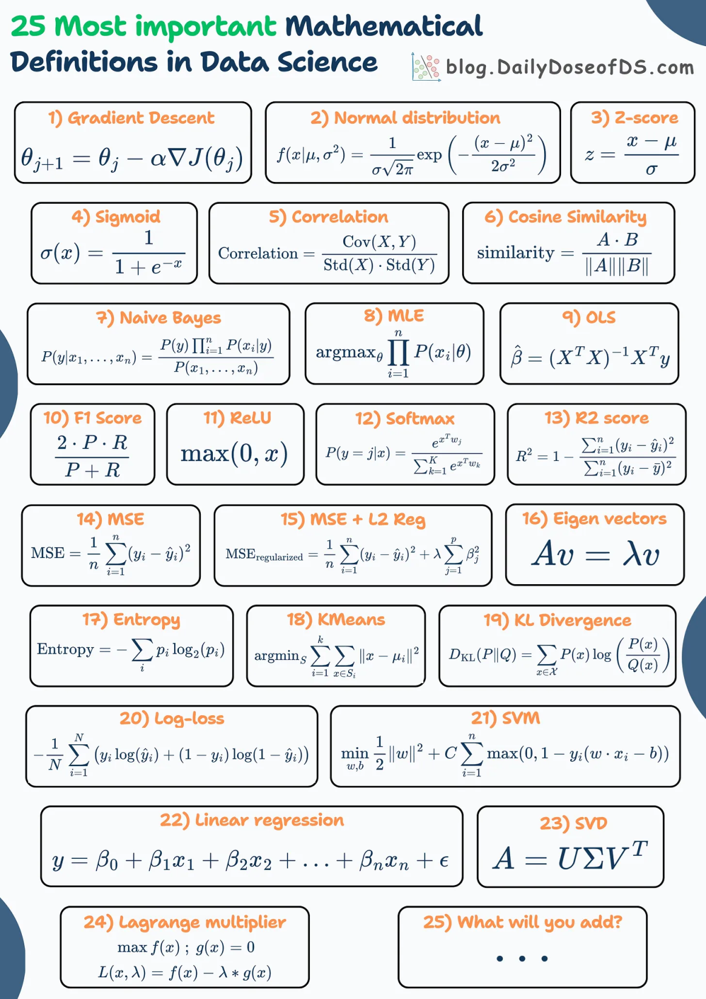
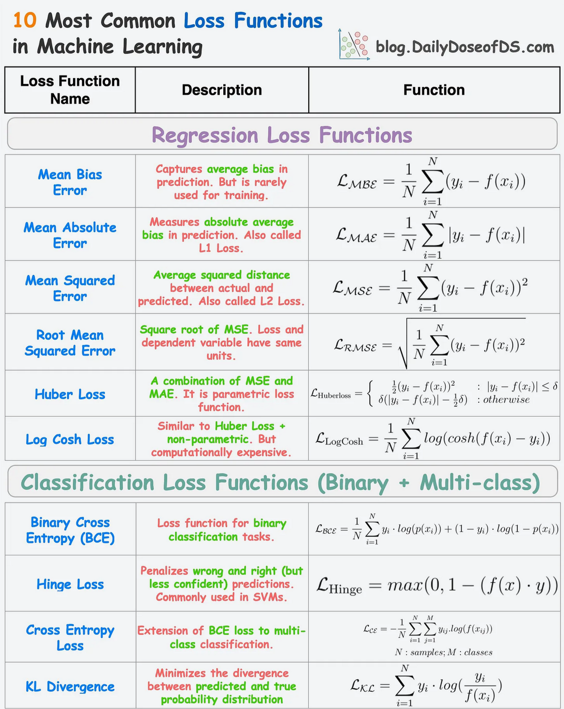
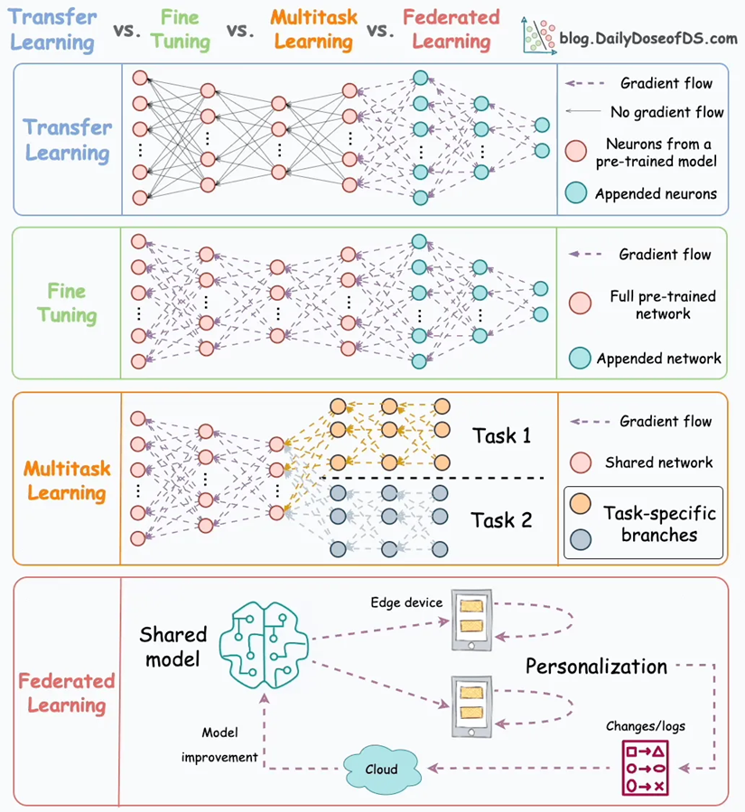
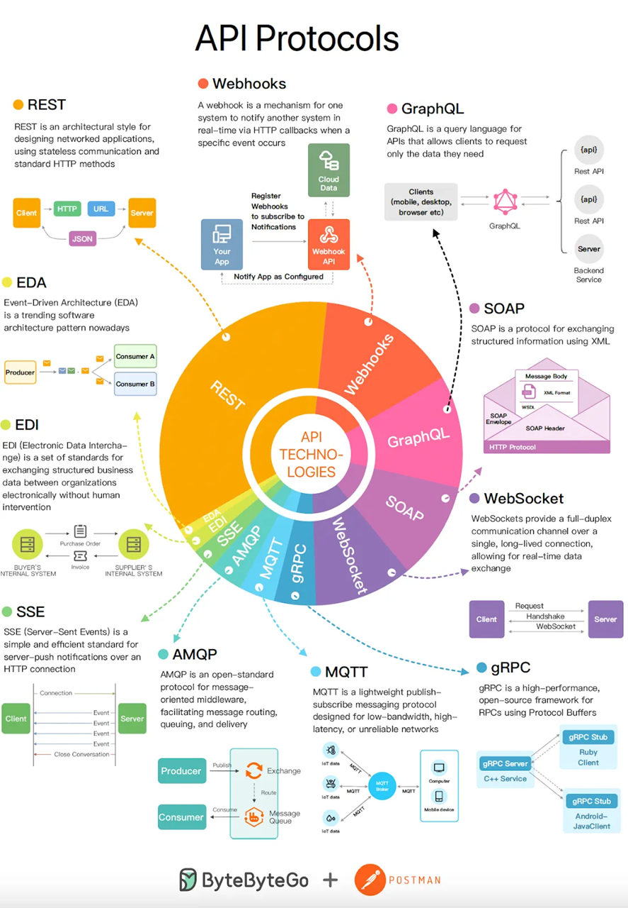

## Terminology and Comparisons

#### Alphabetical Index

- 9 Clean Code Principles To Keep In Mind
- A CIO’s framework for measuring engineering productivity
- API Gateway vs Load Balancer
- API Protocols
- Azure vs AWS vs GCP in Cloud Network
- Are Architecture Styles, Patterns, and Design Patterns Different?
- B-Tree vs LSM Tree vs Bloom filter
- Cloud Design Patterns
- Common (Conway's law) – *Conway's law*
- Compiler Framework: LLVM vs GCC
- Cracking coding interviews
- Data engineering & Data Scientists Vocab 101
- Data Management in Distributed systems (Partitioning, Shuffling and Bucketing)
- Database Normalization
- Deploy-ment Styles: Blue/Green, Canary, and A/B
- Essential Algorithms for System Design Interviews
- Flaky Test
- Gartner's PACE Layered Application Strategy
- Generic: PECS: Producer Extends, Consumer Super
- Hadoop Ecosystem
- JIT vs AOT
- Mixin
- Memory consistency model: A Primer on Memory Consistency and Cache Coherence
- Medallion architecture
- OLAP vs OLTP
- Passkey
- Principles & Concepts: YAGNI, KISS, DRY, CAP Theorem, PACELC, ACID, BASE
- Popular Enterprise Architecture Frameworks
- Push & Pull model in Azure
- Real-time communication and messaging (MQTT, AMQP and WebSocket)
- Reactive programming vs event-driven architecture
- RABC vs ReABC
- Security Words 101
- SLA, SLO, and SLI
- SSO (Single Sign-On)
- Space-Based Architecture (SBA) vs Cell-based architecture
- SSG: Static site generator list
- Star schema
- Software defined Networking (SDN) Northbound vs Southbound
- Test-Driven Development
- Transfer Learning, Fine-tuning, Multitask Learning and Federated Learning
- Top 20 System Design Concepts
- Windows UI Development Frameworks
- Web services and APIs (SOAP, RestAPI, GraphQL, gRPC and Kafka)

---

1. [Gartner's PACE Layered Application Strategy](https://cio-wiki.org/wiki/Gartner%27s_PACE_Layered_Application_Strategy): A methodology for categorizing, selecting, managing and governing applications based on their characteristics and the speed of change they require1.
1. [JIT vs AOT](https://stackoverflow.com/questions/32653951/when-does-ahead-of-time-aot-compilation-happen): JIT and AOT are two types of compilers that differ in when they convert a program from one language to another, either at run-time or build-time.
1. [SSG: Static site generator list](https://jamstack.org/generators/): A tool that generates a full static HTML website based on raw data and a set of templates.
1. [Popular Enterprise Architecture Frameworks](https://dzone.com/articles/popular-enterprise-architecture-frameworks): TOGAF, Zachman, Federal Enterprise Architecture (FEA), Gartner Enterprise Architecture Framework, Business Architecture Guild’s BIZBOK, Department of Defense Architecture Framework (DoDAF), ArchiMate, and Sherwood Applied Business Security Architecture (SABSA).
1. [Are Architecture Styles, Patterns, and Design Patterns Different?](https://x.com/milan_milanovic/status/1747683090598711725?s=20)

    - **Architecture Styles vs Patterns vs Design Patterns**

        1. **Architectural styles**

            This is the highest level of abstraction, where architectural designs instruct us on structuring our code. The highest level of granularity describes the application's layers and high-level modules and how they relate to and interact with one another. Examples of architectural styles include:
            
            🔹 Monolith  
            🔹 Layered  
            🔹 Event-driven  
            🔹 Self-contained Systems  
            🔹 Microservices  
            🔹 Space-Based

        2. **Architectural patterns**

            These patterns represent a way to implement an architectural style, so we can do this regularly. Some examples are how to separate the user interface (UI) and data, how internal modules interact, and what layers we will use. Patterns answer these types of questions. They usually impact the code base and how to structure the code inside. Examples of architectural patterns include:

            🔹 Model-View-Presenter (MVP): 1:1 Relationship between View and Presenter. e.g., Windows forms  
            🔹 Model-View-Controller (MVC): e.g., Smalltalk, ASP.Net MVC  
            🔹 Model–View–Viewmodel (MVVM): One to Many relationship between View and ViewModel. e.g., Silverlight, WPF, AngularJs:  
            🔹 Domain-Driven Design

        3. **Design patterns**

            These differ from architectural patterns in that they focus on a smaller code base area and have a smaller influence (focus on a local problem). These include limiting the creation of a class to only one object or notifying all dependent objects when the internal state of an object is changed. These patterns are described in the book "Design Patterns: Elements of Reusable Object-Oriented Software" by Erich Gamma, Richard Helm, Ralph Johnson, and John Vlissides from 1994.

            We have three groups of Design Patterns:

            🔹 Creational: here we have Factory Method, Builder, Singleton, ...  
            🔹 Structural: here we have an Adapter, Bridge, and Decorator, ...  
            🔹 Behavioral: here we have Command, Iterator, State, Strategy, ...  

1. Top 20 System Design Concepts

    

1. Memory consistency model: [A Primer on Memory Consistency and Cache Coherence](https://link.springer.com/book/10.1007/978-3-031-01764-3)

    - **SC vs TSO vs Relaxed Memory Consistency**

        1. Sequential Consistency (SC): Operations execute in order as per the program.
        
            🔹 SC preserves order for two memory operations from the same thread for all four combinations of loads and stores (Load → Load, Load → Store, Store → Store, and Store → Load).  
            🔹 MIPS R10000

        2. Total Store Order (TSO): Reads can happen before preceding writes complete. 
        
            🔹 TSO preserves the first three orders (Load → Load, Load → Store, Store → Store) but not Store → Load order.  
            🔹 x86 CPU.
    
        3. Relaxed Memory Consistency: Allows more reordering of operations for performance. 
        
            🔹 ARM and RISC-V

1. **API Gateway vs Load Balancer**

    🔹 API Gateway: Manages access to backend services, handles tasks like rate-limiting, authentication, logging, and security policies.

    🔹 Load Balancer: Distributes network traffic across multiple servers for high availability and even load distribution.

1. **Data engineering & Data Scientists Vocab 101** [ref](https://x.com/SeattleDataGuy/status/1753950189314810358?s=20) | [15 DS/ML Cheat Sheets](https://blog.dailydoseofds.com/p/15-dsml-cheat-sheets) | [git](https://github.com/ChawlaAvi/Daily-Dose-of-Data-Science)

    🔹 Data engineering Vocab 101

    [ref](https://x.com/SeattleDataGuy/status/1753950189314810358?s=20)

    

    🔹 75 Key Terms That Data Scientists Remember by Heart 
    
    [ref](https://www.blog.dailydoseofds.com/p/75-key-terms-that-data-scientists)

    

    🔹 A Comprehensive NumPy Cheat Sheet Of 40 Most Used Methods 
    
    [ref](https://www.blog.dailydoseofds.com/p/a-comprehensive-numpy-cheat-sheet)

    

    🔹 15 Pandas ↔ Polars ↔ SQL ↔ PySpark Translations 
    
    [ref](https://www.blog.dailydoseofds.com/p/15-pandas-polars-sql-pyspark-translations)

    

    🔹 11 Key Probability Distributions 

    [ref](https://www.blog.dailydoseofds.com/p/11-key-probability-distributions)

    

    🔹 6 Must-Know Types of Clustering Algorithms in Machine Learning 

    [ref](https://blog.dailydoseofds.com/p/beyond-kmeans-6-must-know-types-of)

    

    🔹 25 Most Important Mathematical Definitions in Data Science

    [ref](https://blog.dailydoseofds.com/p/25-most-important-mathematical-definitions)

    

    🔹 10 Regression and Classification Loss Functions

    [ref](https://blog.dailydoseofds.com/p/10-regression-and-classification)

    

1. **Transfer Learning, Fine-tuning, Multitask Learning and Federated Learning** [ref](https://blog.dailydoseofds.com/p/transfer-learning-fine-tuning-multitask)

    


1. **DevOps, Platform engineering and SRE (site reliability engineering)** [ref](https://www.splunk.com/en_us/blog/learn/sre-vs-devops-vs-platform-engineering.html)

    - **SRE vs. DevOps vs. Platform Engineering**

        🔹DevOps, SRE, and Platform Engineering are practices that streamline software development and maintenance. They all involve automation and collaboration.

        🔹DevOps covers the entire software development process promoting team collaboration.

        🔹SRE focuses on system reliability, including application monitoring and emergency response.

        🔹Platform Engineering manages the infrastructure and tools needed for software development and operations.
        
        🔹DevOps is about the whole development process, SRE emphasizes reliability and scalability, and Platform Engineering is about infrastructure and tool management.

1. **API Protocols** (ref. ByteByteGo)

    

1. **Web services and APIs (SOAP, RestAPI, GraphQL, gRPC and Kafka)** [ref](https://www.redhat.com/architect/apis-soap-rest-graphql-grpc)

    - **SOAP, RestAPI, GraphQL, gRPC and Kafka**

        🔹SOAP (Simple Object Access Protocol): XML-based protocol for web services, heayweight, favored for security and reliability.

        🔹REST (Representational State Transfer): Uses HTTP methods, simple and easy to use, but can be resource-heavy.

        🔹GraphQL: Allows flexible data queries, reduces data over-fetching.

        🔹gRPC (Google Remote Procedure Call)**: High-performance RPC framework, ideal for connecting microservices. Built on top of HTTP/2 and uses Protocol Buffers for data exchange.

        🔹Kafka: Distributed streaming platform, uses publish-subscribe model for message queueing. real-time consistency. "at-least-once" delivery.

1. **Real-time communication and messaging (MQTT, AMQP and WebSocket)** [ref](https://www.cloudamqp.com/blog/amqp-vs-mqtt.html)

    - **MQTT vs AMQP vs WebSocket**

        🔹MQTT (Message Queuing Telemetry Transport): Lightweight messaging protocol, uses publish-subscribe model, ideal for IoT and M2M communication. Three levels of Quality of Service (QoS): “At most once” (QoS 0), “At least once” (QoS 1), and “Exactly once” (QoS 2).

        🔹AMQP (Advanced Message Queuing Protocol): Open-standard application layer protocol, robust message delivery, routing, and security features. Two qualities of service: “At most once (delivered once or lost)” and “At least once (delivered one or more times.)”.

        🔹WebSocket: Enables full-duplex communication channels over a single TCP connection

1. **Reactive programming vs event-driven architecture** [ref](https://reactiveweb.org/reactive-programming-vs-event-driven-key-differences/)
   
    - Event-Driven: Handles user actions or system events. More general and can be used in any context where an event occurs
    - Reactive: Data-driven approach. managing data streams and propagating changes, like in a spreadsheet model.

1. **RABC vs ReABC**: RBAC (Role-Based Access Control) is an authorization model that assigns permissions based on predefined roles. On the other hand, ReBAC (Relationship-Based Access Control) extends RBAC’s capabilities by considering relationships between entities.
1. **Conway's law**: Software engineering principle that states that the structure of a system reflects the structure of the organization that designs it.
1.  Data Management in Distributed systems (Partitioning, Shuffling and Bucketing)

    - **Partitioning vs Shuffling vs Bucketing**

        🔹Partitioning: The process of dividing a large dataset into smaller parts, known as partitions. This process splits Hive table's files into multiple files. For example, `../hive/warehouse/sales_table/product_id=P1`.

        🔹Shuffling: Shuffling is the process of redistributing data across different partitions. The overhead of operations can be ranked as follows: `orderby` > `join` > `groupby`.

        🔹Bucketing: This is the process of decomposing data into manageable parts based on a certain column, thereby improving query performance and storage efficiency. It is best used when there are very few repeating values in a column (for example 1. a primary key column). For instance, Bucket0: `../hive/warehouse/sales_table/product_id=P1/000000_0`, Bucket1: `../hive/warehouse/sales_table/product_id=P1/000001_0`, and so on.

1. **SSO (Single Sign-On)** is an authentication scheme that allows a user to log in with a single ID and password to any of several related, yet independent, software systems.

    - **SSO workflow, Types of SSO, SSO Implementations**

        🔹SSO workflow: Identity Provider (IdP), Service Provider (SP), SSO Server
        - IdP: Central Authentication server e.g., Google
        - SP: Individual Applications rely on SSO e.g, Trello
        - SSO Server: Bridge between IdP and SPs

        🔹Types of SSO: SAML, OAuth (Open Authorization) 2.0, Open ID Connect (OIDC)

        | Protocol | Purpose | Token Format | - |
        | --- | --- | --- | --- |
        | OAuth 2.0 | Open standard for Authorization | Access Tokens | Temporary access to 3rd party app |
        | OpenID Connect (OIDC) | Open standard for Authentication | JSON Web Token (JWT) | Newer type of SSO based on OAuth 2.0, Straightforward protocol than SAML |
        | SAML | Authentication, Authorization | XML | Most common, Use SAML Protocol to exchange authentication between SSO server and SP |

        🔹Some other Types of SSO: Kerberos, Smart card authentication
        - Kerberos: Less suitable for internet-facing SSO due to the shared secret between KDC (Key Distributin Center) and all participants.
        - Smart card authentication: Physical card

        🔹SSO Implementations: Microsoft Entra ID (FKA Micorsoft Active Directory), Okta, Ping Identity, OneLogin, Auth0

1. Deployment Styles: Blue/Green, Canary, and A/B

    - **Blue/Green, Canary, A/B**

        🔹Blue/Green Deployment: Two identical environments, "Blue" and "Green". Deploy new version in inactive environment, test, then switch users to it. For example, AWS supports blue/green deployment strategies including Elastic Beanstalk, OpsWorks, CloudFormation, CodeDeploy, and Amazon ECS.

        🔹Canary Deployment: Roll out new version to a small group of users, monitor feedback, then do a full-scale release.

        🔹A/B Testing: Compare two versions of a webpage or app to see which performs better. A typical example of A/B testing is website usability testing.

1. **Flaky Test**: A Flaky Test is a test that sometimes passes and sometimes fails, despite no changes in the code. Causes can include poorly written tests, async waits, test order dependency, and concurrency issues. They can slow down CI/CD pipelines and cause issues for end users. [ref](https://github.com/jmicco/JaSST_tutorial)

1. Hadoop Ecosystem
    
    - **Hadoop vs Azure, AWS, GCP**

        🔹1. **HDFS (File Storage)**: Azure Data Lake Storage, Amazon S3, Google Cloud Storage  
        🔹2. **YARN (Resource Management)**: No direct equivalent in Azure, AWS, GCP  
        🔹3. **MapReduce (Data Processing)**: HDInsight, Amazon EMR, Google Cloud Dataproc  
        🔹4. **Spark (Fast Data Processing)**: Databricks, Spark in HDInsight, Azure Synapse Analytics, Amazon EMR, Google Cloud Dataproc  
        🔹5. **PIG, HIVE (Query Data)**: HDInsight, Azure Synapse Analytics, Amazon EMR, Google Cloud Dataproc  
        🔹6. **HBase (NoSQL DB)**: Azure Cosmos DB, HBase on a virtual machine (VM), HBase in Azure HDInsight, Amazon DynamoDB, Google Cloud Bigtable  
        🔹7. **Mahout, Spark MLLib (ML Libraries)**: Databricks, Amazon SageMaker, No direct equivalent in GCP  
        🔹8. **Solar, Lucene (Search/Index)**: Azure Cognitive Search, Amazon CloudSearch, Google Cloud Search  
        🔹9. **Zookeeper (Cluster Management)**: No direct equivalent in Azure, Amazon Managed Apache ZooKeeper, No direct equivalent in GCP  
        🔹10. **Oozie (Job Scheduling)**: Azure Data Factory, AWS Step Functions, Google Cloud Composer
    
1. **Software defined Networking (SDN)** Northbound vs Southbound

    ```mermaid
    graph TD
        A[Application layer - routing, load balancing, etc] -->|Northbound APIs| B[Control layer - SDN controller]
        B -->|Southbound APIs| C[Infrastructure layer - physical switches, data plane]
    ```

    🔹The **Controller** is the SDN network's brain, directing traffic flows.  
    🔹 The **Southbound Interface** communicates the controller's decisions to the switches using protocols like OpenFlow.  
    🔹**SDN Switches** direct traffic based on the controller's instructions.  
    🔹**Network Devices** (servers, routers, etc.) send and receive data flows as directed by the SDN switches.  
    🔹The **Northbound Interface** uses APIs to exchange data between the controller and applications.  
    🔹**SDN Applications** use network data to perform tasks, communicating their needs to the controller.

    ```mermaid
    graph LR
    A[Controller] -- API --> B[Southbound Interface]
    B -- OpenFlow --> C[SDN Switches]
    C -- Data Flow --> D[Network Devices]
    A -- API --> E[Northbound Interface]
    E -- Applications --> F[SDN Applications]
    ```

1. **Cracking coding interviews**

    🔹**src**: [ref](https://x.com/systemdesign42/status/1776590986837160427)

    🔹Two Pointers: Navigating arrays with two indices. [ref](https://www.pluralsight.com/resources/blog/guides/algorithm-templates-two-pointers-part-2)  
    🔹Intervals: Working with ranges of values. [ref](https://medium.com/@timpark0807/leetcode-is-easy-the-interval-pattern-d68a7c1c841) / [ref](https://leetcode.com/problems/minimum-number-of-arrows-to-burst-balloons/solutions/93735/a-concise-template-for-overlapping-interval-problem/) / [ref](https://leetcode.com/discuss/general-discussion/794725/General-Pattern-for-greedy-approach-for-Interval-based-problems)  
    🔹Dynamic Programming: Solving complex problems by breaking them down into simpler subproblems. [ref](https://www.youtube.com/watch?v=ZwDDLAeeBM0&t=294s) / [ref](https://leetcode.com/discuss/general-discussion/651719/how-to-solve-dp-string-template-and-4-steps-to-be-followed)  
    🔹Tree Traversal: Visiting all nodes in a tree. [ref](https://medium.com/leetcode-patterns/leetcode-pattern-0-iterative-traversals-on-trees-d373568eb0ec) / [ref](https://leetcode.com/problems/binary-tree-postorder-traversal/solutions/45551/Preorder-Inorder-and-Postorder-Iteratively-Summarization/)  
    🔹DFS-BFS: Depth-first and breadth-first search algorithms. [ref](https://leetcode.com/problems/pacific-atlantic-water-flow/solutions/438276/Python-beats-98.-DFS-template-for-Matrix/) / [ref](https://medium.com/leetcode-patterns/leetcode-pattern-2-dfs-bfs-25-of-the-problems-part-2-a5b269597f52) / [ref](https://medium.com/leetcode-patterns/leetcode-pattern-1-bfs-dfs-25-of-the-problems-part-1-519450a84353) / [ref](https://www.youtube.com/watch?v=TIbUeeksXcI)  
    🔹Binary Search: Finding an element in a sorted array. [ref](https://leetcode.com/problems/binary-search/solutions/423162/Binary-Search-101-The-Ultimate-Binary-Search-Handbook/)  
    🔹Array: A data structure holding elements. [ref](https://leetcode.com/problems/reverse-pairs/solutions/97268/General-principles-behind-problems-similar-to-%22Reverse-Pairs%22/)  
    🔹Sliding Window: A subset of data that moves. [ref](https://www.pluralsight.com/resources/blog/guides/algorithm-templates-two-pointers-part-3) / [ref](https://medium.com/leetcode-patterns/leetcode-pattern-2-sliding-windows-for-strings-e19af105316b) / [ref](https://leetcode.com/problems/minimum-window-substring/solutions/26808/Here-is-a-10-line-template-that-can-solve-most-'substring'-problems/) / [ref](https://leetcode.com/problems/find-all-anagrams-in-a-string/solutions/92007/Sliding-Window-algorithm-template-to-solve-all-the-Leetcode-substring-search-problem./) / [ref](https://leetcode.com/problems/best-time-to-buy-and-sell-stock-with-transaction-fee/solutions/108870/Most-consistent-ways-of-dealing-with-the-series-of-stock-problems/)  
    🔹Backtracking: Trying out all possibilities to find a solution. [ref](https://leetcode.com/problems/permutations/solutions/18284/Backtrack-Summary:-General-Solution-for-10-Questionsh/) / [ref](https://medium.com/leetcode-patterns/leetcode-pattern-3-backtracking-5d9e5a03dc26) / [ref](https://leetcode.com/problems/combination-sum/solutions/16502/A-general-approach-to-backtracking-questions-in-Java-(Subsets-Permutations-Combination-Sum-Palindrome-Partitioning)/)  
    🔹Combination: Finding all possible arrangements of elements. [ref](https://leetcode.com/problems/combination-sum-iv/solutions/85120/C++-template-for-ALL-Combination-Problem-Set/)  
    🔹Trie: A tree-like data structure for storing strings. [ref](https://leetcode.com/discuss/general-discussion/931977/beginner-friendly-guide-to-trie-tutorial-practice-problems)  
    🔹Word Break: Dividing a string into words. [ref](https://leetcode.com/problems/concatenated-words/solutions/836924/Python-Template-Word-Break-I-Word-Break-II-Concatenated-Words/)  
    🔹Bit Manipulation: Performing operations on binary numbers. [ref](https://leetcode.com/problems/sum-of-two-integers/solutions/84278/A-summary:-how-to-use-bit-manipulation-to-solve-problems-easily-and-efficiently/) / [ref](https://leetcode.com/problems/single-number-ii/solutions/43295/Detailed-explanation-and-generalization-of-the-bitwise-operation-method-for-single-numbers/)  
    🔹Sum: Adding numbers together. [ref](https://leetcode.com/problems/two-sum/solutions/737092/Sum-MegaPost-Python3-Solution-with-a-detailed-explanation/)  
    🔹Monotonic Stack: A stack keeping elements in an ordered manner. [ref](https://leetcode.com/problems/sum-of-subarray-minimums/solutions/178876/stack-solution-with-very-detailed-explanation-step-by-step/)  
    🔹Big-O-Notation: [ref](https://blog.bytebytego.com/p/ep132-big-o-notation-101-the-secret)

    🔹**src**: [ref](https://blog.algomaster.io)

    🔹[Master Graph Algorithms for Coding Interviews](https://blog.algomaster.io/p/master-graph-algorithms-for-coding)  
    🔹[20 Patterns to Master Dynamic Programming](https://blog.algomaster.io/p/20-patterns-to-master-dynamic-programming)  
    🔹[LeetCode was HARD until I Learned these 15 Patterns](https://blog.algomaster.io/p/15-leetcode-patterns)  
    🔹[How I Mastered Data Structures and Algorithms](https://blog.algomaster.io/p/how-i-mastered-data-structures-and-algorithms)

1. **Medallion architecture**: A data design pattern for lakehouses. It enhances data quality across three layers: bronze (raw), silver (curated), and gold (presentation). This “multi-hop” architecture allows data to transition between layers as required. [ref](https://www.databricks.com/glossary/medallion-architecture)

1. **Slowly changing dimensions (SCD)**: Slowly Changing Dimensions change over time, but at a slow pace and unpredictably. For example, a customer’s address in a retail business.

1. **Star schema**: The Star Schema is a data model for data warehouses. It has a central fact table for measurable data and surrounding dimension tables for descriptive data. [ref](https://learn.microsoft.com/en-us/power-bi/guidance/star-schema)

1. **OLAP vs OLTP**: `OLAP`: Used for complex data analysis and business reporting, such as financial analysis and sales forecasting. `OLTP`: Used for real-time processing of online transactions, including everyday transactions like ATM withdrawals and in-store purchases.

1. **Test-Driven Development**

    🔹F.I.R.S.T: A testing principle where tests are Fast, Isolated, Repeatable, Self-validating, and Timely/Thorough.  
    🔹DAMP: Stands for "Descriptive And Meaningful Phrases" in testing.  
    🔹BDD: Behavior Driven Development uses "Given-When-Then" format.  
    🔹DRY: "Don’t Repeat Yourself" principle avoids redundancy.  
    🔹TDD: Test-Driven Development focuses on tests first.  
    🔹Exploratory Testing: Simultaneous learning, test design, and test execution. It is about exploring the application and finding defects that were not anticipated.  
    🔹Smoke Testing: A preliminary test to check the basic functionality of an application to ensure that the most crucial functions work.  
    🔹Alpha/Beta Testing: 🔹Alpha: Initial testing performed by internal staff / 🔹Beta: Testing performed by actual users

1. **SLA, SLO, and SLI**

    🔹SLA (Service Level Agreement): A contract defining the expected level of service. `99.9% uptime`  
    🔹SLO (Service Level Objective): A measure of service performance agreed upon in an SLA. `200ms response`  
    🔹SLI (Service Level Indicator): A quantitative measure of a specific aspect of the level of service. `Query latency`

1. **Space-Based Architecture (SBA) vs Cell-based architecture**
    - Space-Based Architecture (SBA): Removing the database and instead using a shared memory (memory grids) model
    - Cell-based architecture: multiple isolated workload instances (cells) for fault isolation and handling subsets of workload requests

1. **Azure vs AWS vs GCP in Cloud Network**

    🔹**Cloud Network Structures:**

    - **AWS:** Region → VPC → Availability Zone → Subnet (public, private)
    - **Azure:** Region → Virtual Network (VNet) → Availability Zone → Subnet
    - **GCP:** Global → VPC → Subnet (Region-specific)

    🔹**Traffic Between VNet or VPC:**

    * Requires setup of a VNet/VPC gateway or peering, and appropriate route configuration.
    - **Azure**: One VPN Gateway per Virtual Network (used for site-to-site, point-to-site, ExpressRoute). Route tables can be assigned at the **subnet level**.
    - **AWS**: Route tables are associated with **subnets**, not just the VPC. Controls intra-VPC and external traffic via routes per subnet.
    - **GCP**: Routing is defined at the **VPC level**. Routes apply globally within the VPC and are evaluated based on subnet CIDR.

    🔹**Regional Traffic:**

    * Use **peering** to enable traffic between VNets/VPCs in the same or different regions.
    * Benefits of peering: Lower latency, Higher bandwidth, Reduced cost compared to VPN gateways

    🔹**Hybrid Connectivity:**

    * Enables on-premises networks to connect securely to cloud networks.
    - **AWS:** Direct Connect, VPN Gateway, Transit Gateway
    - **Azure:** ExpressRoute, VPN Gateway, Virtual WAN
    - **GCP:** Cloud Interconnect, Cloud VPN

    🔹**Connectivity Scenarios**

    | **Scenario**            | **AWS**                                                        | **Azure**                               | **GCP**                                                                            |
    | ----------------------- | -------------------------------------------------------------- | --------------------------------------- | ---------------------------------------------------------------------------------- |
    | VNet ↔ VNet / VPC ↔ VPC | VPC Peering, AWS Transit Gateway                               | VNet Peering, Virtual WAN, VNet Gateway | VPC Network Peering, Cloud VPN                                                     |
    | On-Prem ↔ VNet/VPC      | Direct Connect, VPN Gateway, Transit Gateway                   | ExpressRoute, VPN Gateway, Virtual WAN  | Cloud Interconnect, Cloud VPN                                                      |
    | VNet/VPC ↔ Internet     | Internet Gateway (public subnet), NAT Gateway (private subnet) | Internet Gateway, NAT Gateway           | Cloud Router, Cloud NAT                                                            |
    | Subnet Traffic Control  | Network ACLs + Security Groups                                 | Network Security Groups (NSGs)          | 1. Shared VPC with IAM on subnets  <br> 2. Firewall rules at VPC or instance level |

    - Azure’s **Virtual WAN** is conceptually similar to **AWS Transit Gateway**.  
    - Azure and GCP do **not** have a strict public/private subnet designation—this is controlled through IP assignment, routes, and firewall/NSG configurations.

    🔹**Gateway Types in Azure:**

    - **VNet Gateway** types: 
        - **VPN Gateway:** For site-to-site and point-to-site connections
        - **ExpressRoute Gateway:** For private MPLS-style connections to Azure
    * Connection modes:
        - **Point-to-site:** Device-to-cloud
        - **Site-to-site:** Network-to-network
        - **VNet-to-VNet:** Secure private communication between VNets

    🔹**Public IP vs Private IP**

    - **Private IP:** `192.168.1.4` – Not routable on the internet
    - **Public IP:** `34.207.152.137` – Routable on the public internet

    🔹**Cloud Resource Hierarchy**

    | **Level**             | **AWS**                  | **Azure**        | **GCP**      |
    | --------------------- | ------------------------ | ---------------- | ------------ |
    | 1. Organization Level | Organization             | Management Group | Organization |
    | 2. Grouping Level     | Organizational Unit (OU) | Subscription     | Folder       |
    | 3. IAM/Billing Unit   | Account                  | Resource Group   | Project      |
    | 4. Resource Level     | Resources                | Resources        | Resources    |

    🔹**Subnet Comparison**

    | **Feature**              | **AWS**                                | **Azure**                           | **GCP**                                |
    | ------------------------ | -------------------------------------- | ----------------------------------- | -------------------------------------- |
    | **Subnet Scope**         | AZ-scoped                              | Region-scoped                       | Region-scoped                          |
    | **Public/Private Setup** | Via route table + Internet Gateway     | Via route + NSG                     | Via route + firewall + external IP     |
    | **Firewall Controls**    | Security Groups + NACLs (subnet-level) | NSGs (subnet or NIC level)          | Firewall rules (VPC or instance level) |
    | **Secondary IP Ranges**  | ❌ Not supported                        | ❌ Not supported                     | ✅ Alias IPs supported                  |
    | **HA / Kubernetes Fit**  | Multi-AZ subnet design required        | Simplified with region-wide subnets | Best for GKE (regional + alias IPs)    |

1. **Security Words 101**

    - **Identity and Access Management**

        - **MIM/PAM**: Microsoft Identity Manager / Privileged Access Management
        - **PAW**: Privileged Account Workstations
        - **AADIS**: Azure Active Directory Implementation Services
        - **DIAD**: Design and Implementation for Azure Active Directory
        - **LAPS/SLAM**: Local Administrator Password Solution / Security Lifecycle Automation & Management
        - **IAM**: Identity and Access Management
        - **SSO**: Single Sign-On
        - **MFA**: Multi-Factor Authentication

    - **Threat Detection and Response**

        - **ATA**: Advanced Threat Analytics
        - **PADS**: Persistent Advisory Detection Service
        - **IR&R**: Incident Response & Recovery
        - **ATP**: Advanced Threat Protection
        - **OMS**: Operations Management Suite
        - **ETD**: Enterprise Threat Detection
        - **SIEM**: Security Information and Event Management
        - **EDR**: Endpoint Detection and Response
        - **XDR**: Extended Detection and Response
        - **SCEP**: System Center Endpoint Protection (Microsoft Defender for Endpoint)

    - **Information Protection**

        - **AIP**: Azure Information Protection (=AD RMS+On-premise files)
        - **AD RMS**: Active Directory Rights Management Services
        - **WIP**: Windows Information Protection
        - **DLP**: Data Loss Prevention
        - **IRM**: Information Rights Management

    - **Security Development and Assessment**

        - **SDL**: Security Development Lifecycle
        - **MSRA**: Microsoft Security Risk Assessment
        - **DIF**: Dynamic Identity Framework
        - **OAWSS**: Offline Assessment for Windows Server Security
        - **OAADS**: Offline Assessment for Active Directory Security
        - **SAST**: Static Application Security Testing
        - **DAST**: Dynamic Application Security Testing

    - **Security Management**

        - **ESAE**: Enhanced Security Administrative Environment
        - **SCCM**: System Center Configuration Manager
        - **EMS**: Enterprise Mobility Suite
        - **SCOM/ACS**: System Center Operations Manager / Audit Collection Services
        - **GRC**: Governance, Risk, and Compliance
        - **SOC**: Security Operations Center

1. **Cloud Design Patterns.** [ref](https://newsletter.techworld-with-milan.com/p/what-are-the-main-cloud-design-patterns)

    1. **Data Management** 📊

        - **Cache-Aside**: Cache frequently used data for performance.  
        - **CQRS**: Separate reads/writes for scalability.  
        - **Event Sourcing**: Record full data change history.  
        - **Materialized View**: Precompute query results for speed.  
        - **Sharding**: Partition data to scale storage.

    2. **Design and Implementation** 🛠️

        - **Strangler Fig**: Gradually migrate legacy systems.  
        - **Anti-Corruption Layer**: Isolate new systems from old ones.  
        - **Bulkhead**: Prevent failure spread across components.  
        - **Sidecar**: Add functionality without changing the core.  
        - **BFF**: Tailor backend for different clients.

    3. **Messaging** 📨

        - **Queue-Based Load Leveling**: Buffer requests for smooth load handling.  
        - **Publisher-Subscriber**: Broadcast messages to multiple consumers.  
        - **Competing Consumers**: Process messages in parallel for scalability.  
        - **Message Broker**: Route messages via intermediary.  
        - **Pipes and Filters**: Sequentially process data through components.

    4. **Security** 🔒

        - **Valet Key**: Provide secure temporary access.  
        - **Gatekeeper**: Filter requests to protect backends.  
        - **Federated Identity**: Use third-party login credentials.  
        - **Secret Store**: Secure sensitive data.  
        - **Validation**: Ensure data input is sanitized.

    5. **Reliability** ⚙️

        - **Retry**: Retry failed operations automatically.  
        - **Circuit Breaker**: Stop repeated failing operations.  
        - **Throttling**: Limit resource usage via request control.  
        - **Health Endpoint Monitoring**: Expose health checks for monitoring.

1. Principles & Concepts: **YAGNI, KISS, DRY, CAP Theorem, PACELC, ACID, BASE**

    - **YAGNI (You Aren't Gonna Need It)**: Don’t add features until necessary.
    - **KISS (Keep It Simple, Stupid)**: Keep designs simple.
    - **DRY (Don't Repeat Yourself)**: Avoid code duplication.
    - **CAP Theorem (Consistency, Availability, Partition Tolerance)**: Choose between consistency, availability, and partition tolerance.
    - **PACELC (Partition Tolerance, Availability, Consistency, Else Latency/Consistency)**: Trade-offs exist in availability/consistency and latency/consistency.
    - **ACID (Atomicity, Consistency, Isolation, Durability)**: Properties ensuring reliable database transactions.
    - **BASE (Basically Available, Soft State, Eventually Consistent)**: Prioritizes availability and eventual consistency in distributed systems.

1. **Windows UI Development Frameworks**: WinUI3, Windows Form, WPF, UWP, Win32, .NET MAUI, Uno

    - For new Windows apps, use the Windows App SDK and WinUI instead of UWP, which is no longer actively developed.
    - .NET MAUI is backed by Microsoft, whereas the Uno Platform is supported by nventive.

    ```mermaid
    graph TD
        A[WinUI 3 <br/>'Windows UI Library 3 <br/>Supports only Windows'] -->|Builds on| B[UWP <br/>'Universal Windows Platform <br/>Supports only Windows']
        A -->|Supports| E[.NET MAUI <br/>'Multi-platform App UI <br/>Cross-platform support: not support Linux']
        B -->|Shares components with| E
        C[WPF <br/>'Windows Presentation Foundation <br/>Supports only Windows'] -->|Integrates with| E
        D[Windows Forms <br/>'Older framework <br/>Supports only Windows'] -->|Legacy framework| C
        F[Uno Platform <br/>'Cross-platform apps <br/>Cross-platform support incl. WebAssembly'] -->|Uses| A
        F -->|Leverages| B
        G[Win32 MFC <br/>'Microsoft Foundation Classes <br/>Supports only Windows'] -->|Legacy framework| C
        H[PWA <br/>'Progressive Web Apps <br/>Cross-platform support'] -->|Builds on| B
        I[React Native for Windows <br/>'Cross-platform mobile framework <br/>Cross-platform support'] -->|Supports| A
        J[Blazor Hybrid <br/>'Web UI with native capabilities <br/>Cross-platform support'] -->|Integrates with| E

        %% Set styles for the backgrounds
        style A fill:#f3e5f5,stroke:#6a1b9a,stroke-width:2px;  %% WinUI 3 as Windows-only
        style B fill:#f3e5f5,stroke:#6a1b9a,stroke-width:2px;  %% UWP as Windows-only
        style E fill:#e0f7fa,stroke:#4d94ff,stroke-width:2px;  %% Cross-platform
        style F fill:#e0f7fa,stroke:#4d94ff,stroke-width:2px;  %% Cross-platform
        
        style C fill:#f3e5f5,stroke:#6a1b9a,stroke-width:2px;  %% WPF as Windows-only
        style D fill:#f3e5f5,stroke:#6a1b9a,stroke-width:2px;  %% Windows Forms as Windows-only
        style G fill:#f3e5f5,stroke:#6a1b9a,stroke-width:2px;  %% Win32 MFC as Windows-only

        %% Set styles for web app frameworks
        style H fill:#c8e6c9,stroke:#388e3c,stroke-width:2px;  %% PWA as Cross-platform
        style I fill:#c8e6c9,stroke:#388e3c,stroke-width:2px;  %% React Native for Windows
        style J fill:#c8e6c9,stroke:#388e3c,stroke-width:2px;  %% Blazor Hybrid
        
        %% Add color legend
        K[Legend: <br/> <span style='color:#4d94ff'>Blue Background:</span> Cross-platform support <br/> <span style='color:#6a1b9a'>Purple Background:</span> Supports only Windows <br/> <span style='color:#388e3c'>Green Background:</span> Web app frameworks] 
        
        %% Set styles for the legend background
        style K fill:#fff9c4,stroke:#f57f17,stroke-width:2px;

        %% Comments
        click A "https://docs.microsoft.com/en-us/windows/apps/winui/winui3/" "WinUI 3: Modern UI framework for Windows apps."
        click B "https://docs.microsoft.com/en-us/windows/uwp/" "UWP: Build universal apps for all Windows devices."
        click C "https://docs.microsoft.com/en-us/dotnet/desktop/wpf/" "WPF: Rich desktop applications with advanced graphics."
        click D "https://docs.microsoft.com/en-us/dotnet/desktop/winforms/" "Windows Forms: Simplified desktop app development."
        click E "https://docs.microsoft.com/en-us/dotnet/maui/" ".NET MAUI: Cross-platform UI framework for mobile and desktop."
        click F "https://platform.uno/" "Uno Platform: Build cross-platform apps using WinUI."
        click G "https://learn.microsoft.com/en-us/cpp/mfc/overview-of-mfc?view=msvc-160" "Win32 MFC: C++ framework for Windows desktop applications."
        click H "https://learn.microsoft.com/en-us/microsoft-edge/progressive-web-apps-chromium/" "PWA: Build web apps that behave like native apps."
        click I "https://microsoft.github.io/react-native-windows/" "React Native for Windows: Build cross-platform apps using React Native."
        click J "https://docs.microsoft.com/en-us/aspnet/core/client-side/blazor/hybrid?view=aspnetcore-7.0" "Blazor Hybrid: Build web UIs with native capabilities."
    ```

1. **Mixin** = Interface + actual implementation. It is a class that provides reusable methods/behavior to other classes without requiring full inheritance.
1. Compiler Framework: **LLVM vs GCC**

    🔹**GCC (GNU Compiler Collection)**: Originally released in 1987, GCC translates C code to RTL (Register Transfer Language), then to machine code. It supports many languages, including C, C++, Fortran, and more. Licensed under the GPL, GCC is known for its robust optimizations and is widely used for system-level programming and cross-platform compilation. 
    `C code ---> GCC's C frontend ---> RTL ---> GCC's x86 backend ---> x86 machine code`

    🔹**LLVM (Low-Level Virtual Machine)**: First released in 2003, LLVM uses an Intermediate Representation (IR) and a modular design, translating code to machine code via various backends. It supports a variety of languages, such as C, C++, Swift, Rust, and others. LLVM is Apache 2.0 licensed and is recognized for its flexibility, extensibility, and modern features, including Just-In-Time (JIT) compilation.

    🔹Key Differences: LLVM's modularity and permissive licensing foster broader tool integration and extensibility, while GCC is renowned for its mature optimization capabilities.

1. A CIO’s framework for measuring engineering productivity

    🔹**DORA (DevOps Research and Assessment)**: Measures software delivery performance using metrics like deployment frequency, lead time, MTTR, and change failure rate.  [ref](https://dora.dev/guides/dora-metrics-four-keys/)

    🔹**SPACE**: S atisfaction & Wellbeing, P erformance, A ctivity, C ommunication & Collaboration, and E fficiency & Flow. Developed by Microsoft researchers to measure Developer Productivity. [ref](https://queue.acm.org/detail.cfm?id=3454124)

    🔹**DX Core 4**: Combines DORA, SPACE, and DevEx. DX Core 4 dimensions: Speed, Effectiveness, Quality, Impact.  [ref](https://getdx.com/research/measuring-developer-productivity-with-the-dx-core-4/)

    🔹**DevEx (Developer Experience)**: Enhances developer productivity by improving tools, workflows, and environments, prioritizing satisfaction and efficiency. [ref](https://queue.acm.org/detail.cfm?id=3595878)

1. Generic: PECS: Producer Extends, Consumer Super

   🔹Producer Extends → Covariance → Only Read (you can only read from the collection). `subtype (? extends T)`: **Pepper Cola**: <b>P</b>roducer <b>E</b>xtend <b>CO</b>variance <b>R</b>ead

   🔹Consumer Super → Contravariance → Only Add (reading is restricted). `supertype (? super T)`: **Corn Salsa**: <b>CON</b>(travariance|sumer) <b>S</b>uper <b>A</b>dd

   ```java
    // Producer: Extends (covariant), meaning we provide data of a more specific type
    public static void produce(List<? extends Shape> shapes) {
        for (Shape shape : shapes) {
            shape.draw();
        }
    }

    // Consumer: Super (contravariant), meaning we accept data of a more general type
    public static void consume(List<? super Shape> shapes) {
        shapes.add(new Circle());   // We can add a Circle, because Shape is the supertype
        shapes.add(new Rectangle()); // We can add a Rectangle, same reason
    }
   ```

1. 9 Clean Code Principles To Keep In Mind: [ref](https://blog.bytebytego.com/p/ep162-9-clean-code-principles-to)

    🔹 **Meaningful Names:** Use clear, descriptive names.  
    🔹 **Small Functions:** Functions should do one thing well.  
    🔹 **Avoid Duplicates:** **DRY** (Don’t Repeat Yourself).   
    🔹 **Readable Code:** Code should be easy to read and understand.  
    🔹 **Single Responsibility Principle:** One class or function should have only one reason to change.  
    🔹 **Consistent Formatting:** Use a uniform style for indentation, spacing, etc.  
    🔹 **Error Handling:** Handle errors gracefully and explicitly.  
    🔹 **Write Tests:** Tests improve code reliability.  
    🔹 **Refactor Regularly:** Keep improving code to avoid decay.  

1. Domain-Driven Design (DDD): [ref](https://blog.bytebytego.com/p/domain-driven-design-ddd-demystified)

    🔹 **Focus on the Core Domain:** Identify and model the essential part of the business.  
    🔹 **Ubiquitous Language:** Create a shared language between developers and domain experts.  
    🔹 **Bounded Contexts:** Divide the system into explicit boundaries where a model applies.  
    🔹 **Entities and Value Objects:** Entities have identity; value objects are immutable.  
    🔹 **Aggregates:** Group related entities to maintain consistency.  
    🔹 **Domain Events:** Capture important business events explicitly.  
    🔹 **Repositories:** Provide a way to retrieve and persist domain objects.  
    🔹 **Continuous Collaboration:** Domain experts and developers work closely.  

1. B-Tree vs LSM Tree vs Bloom filter

    🔹 **B-Tree:** Balanced tree for fast reads and range queries; used in RDBMS and file systems.  
    🔹 **LSM Tree:** Write-optimized structure with batched disk writes; used in NoSQL databases.  
    🔹 **A Bloom Filter:** is a probabilistic data structure used to quickly check whether an element might be in a set. It's extremely space-efficient and fast but allows `false positives` (wrongly saying an item exists) while guaranteeing no `false negatives` (never says an existing item is missing).

1. Public cloud security services mapped to the TCP/IP model

    | **TCP/IP Layer**                            | **Azure**                                                                                                                                     | **AWS**                                                                                                                               | **GCP**                                                                                                                                                 |
    | ------------------------------------------- | --------------------------------------------------------------------------------------------------------------------------------------------- | ------------------------------------------------------------------------------------------------------------------------------------- | ------------------------------------------------------------------------------------------------------------------------------------------------------- |
    | **1. Network Interface (Link)**             | - **VNet/Subnets** <br> - Private Endpoints <br> - NIC configurations                                                                         | - **VPC/Subnets** <br> - PrivateLink <br> - ENI (Elastic Network Interfaces)                                                          | - **VPC/Subnets** <br> - Private Service Connect <br> - VPC Network Interfaces                                                                          |
    | **2. Internet Layer (IP & Routing)**        | - NSG (Network Security Groups) <br> - Azure Firewall <br> - Route Tables <br> - VPN Gateway / ExpressRoute                                   | - Security Groups (Inbound/Outbound IP filtering) <br> - AWS Network Firewall <br> - Route Tables <br> - VPN / Direct Connect         | - VPC Firewall Rules <br> - Cloud Armor (IP-based) <br> - Routes <br> - VPN / Interconnect                                                              |
    | **3. Transport Layer (Ports, Sessions)**    | - NSG Port-level control <br> - Load Balancer Probes <br> - Azure Firewall Port Rules                                                         | - Security Groups Port filtering <br> - Network Load Balancer Health Checks <br> - Firewall Rules                                     | - Firewall Rules (Port/Protocol) <br> - Load Balancer Health Checks <br> - Cloud Armor (some transport-layer protections)                               |
    | **4. Application Layer (Identity, Access)** | - Azure AD <br> - RBAC (Role-Based Access Control) <br> - Conditional Access <br> - Key Vault <br> - API Management <br> - Defender for Cloud | - AWS IAM <br> - Resource Policies <br> - Cognito (Identity) <br> - KMS (Key Management) <br> - API Gateway security <br> - GuardDuty | - Cloud IAM <br> - Resource Policies <br> - Identity-Aware Proxy <br> - Secret Manager / KMS <br> - API Gateway Security <br> - Security Command Center |

1. Database Normalization

    | **Normalization Stage**   | **What It Means**                                                        | **Simple Example (with More Detail)**                                                                                                                                                                                                                                     |
    | ------------------------- | ------------------------------------------------------------------------ | ------------------------------------------------------------------------------------------------------------------------------------------------------------------------------------------------------------------------------------------------------------------------- |
    | **1st Normal Form (1NF)** | Don't put multiple values in one cell!                                   | 📛 **Bad Example:** <br> `Name: John` , `Phone: 123-4567, 987-6543` <br> ✔️ **Good Example:** <br> Row 1: `Name: John`, `Phone: 123-4567` <br> Row 2: `Name: John`, `Phone: 987-6543`                                                                                     |
    | **2nd Normal Form (2NF)** | Don't define other values using part of the primary key!                 | Suppose the **Primary Key** is `(StudentID, Course)` <br> 📛 **Bad Example:** <br> `StudentID → Major` included in same table <br> ✔️ **Good Example:** <br> Move `StudentID → Major` to a separate `Student` table, only `(StudentID, Course)` stays in enrollment table |
    | **3rd Normal Form (3NF)** | Don't let non-key values depend on each other!                           | 📛 **Bad Example:** <br> In `Student` table: <br> `DepartmentCode → DepartmentName` <br> Both stored together <br> ✔️ **Good Example:** <br> `Department` info in separate table <br> Student table only keeps `DepartmentCode`                                           |
    | **BCNF**                  | Even if it looks normal, make sure every determinant is a candidate key! | 📛 **Bad Example:** <br> `Course → Instructor` <br> But `Course` is not a candidate key (multiple sections exist) <br> ✔️ **Good Example:** <br> Have a table: `(Course, Section)` as key, with Instructor info based on full key only                                    |

1. Push & Pull model in Azure

    | Service                 | Push Model                                      | Pull Model                             |
    | ----------------------- | ----------------------------------------------- | -------------------------------------- |
    | **Cosmos DB**           | Change Feed → Azure Function/Event Grid         | SDK Queries / SQL-like polling         |
    | **Azure Blob Storage**  | Event Grid notifications → Function, Logic Apps | Manual polling or listing blobs        |
    | **Azure Event Hubs**    | Downstream consumers get real-time events       | Some apps read older offsets on demand |
    | **Azure Queue Storage** | Function triggers when new messages arrive      | App polls queue for messages           |
    | **Azure Table Storage** | Change detection via Event Grid (limited)       | Query with filters for updates         |
    | **SQL Database**        | Change Tracking / CDC with Event Grid triggers  | App polls with timestamp-based queries |
    | **Azure Data Lake**     | Event Grid for file events                      | Manual folder scanning via SDK/API     |

1. Essential Algorithms for System Design Interviews

    - [Top Leader Election Algorithms in Distributed Databases](https://blog.bytebytego.com/p/top-leader-election-algorithms-in)

    | Algorithm                                                                  | Category / Approach  | Use Case(s)                                 | Description                                                                                                                | Complexity                                       | Usage in Real Systems                                     |
    | -------------------------------------------------------------------------- | -------------------- | ------------------------------------------- | -------------------------------------------------------------------------------------------------------------------------- | ------------------------------------------------ | --------------------------------------------------------- |
    | [**Geohash**](https://en.wikipedia.org/wiki/Geohash)                       | Spatial indexing     | Location-based services                     | Encodes geographic coordinates into short alphanumeric strings, enabling efficient spatial queries and proximity searches. | O(1) encode/decode; O(log n) search              | Elasticsearch, MongoDB, Redis geospatial queries          |
    | [**Quadtree**](https://en.wikipedia.org/wiki/Quadtree)                     | Spatial partitioning | Location-based services, game maps          | Recursively divides 2D space into four quadrants for efficient spatial indexing and collision detection.                   | O(log n) insertion/query                         | Google Maps tiling, GIS databases, game engines           |
    | [**Consistent Hashing**](https://en.wikipedia.org/wiki/Consistent_hashing) | Data distribution    | Load balancing in distributed systems       | Distributes data across nodes such that minimal reorganization is required when nodes are added or removed.                | O(1) lookup; O(n) rebalance (worst)              | Amazon DynamoDB, Apache Cassandra, Akamai CDN             |
    | [**Leaky Bucket**](https://en.wikipedia.org/wiki/Leaky_bucket)             | Rate limiting        | API request throttling                      | Processes requests at a fixed rate; excess requests are discarded, ensuring steady traffic flow.                           | O(1) per request                                 | Network routers, Nginx rate limiting, payment gateways    |
    | [**Token Bucket**](https://en.wikipedia.org/wiki/Token_bucket)             | Rate limiting        | Network traffic shaping, API burst handling | Allows bursts of requests while enforcing an average rate by consuming accumulated tokens.                                 | O(1) per request                                 | Google Cloud APIs, AWS API Gateway, Kubernetes API server |
    | [**Trie**](https://en.wikipedia.org/wiki/Trie)                             | String search        | Search autocomplete, spell checking         | Tree-like structure for storing strings, enabling fast prefix-based lookups.                                               | O(m) where m = key length                        | Search engines, DNS resolvers, text editors               |
    | [**Rsync**](https://en.wikipedia.org/wiki/Rsync)                           | Delta transfer       | File synchronization                        | Transfers only changed parts of files, reducing bandwidth usage.                                                           | O(n) compare; transfer proportional to diff size | Git, Dropbox, Linux package managers                      |
    | [**Raft**](https://en.wikipedia.org/wiki/Raft_%28algorithm%29)             | Consensus algorithm  | Distributed databases, leader election      | Simplifies consensus with leader-based log replication; easier to understand than Paxos.                                   | O(n) message exchanges per term                  | etcd, Consul, RethinkDB                                   |
    | [**Paxos**](https://en.wikipedia.org/wiki/Paxos_%28computer_science%29)    | Consensus algorithm  | Distributed databases                       | Achieves consensus in unreliable distributed systems; more complex but widely proven.                                      | O(n²) message exchanges                          | Google Chubby, Apache ZooKeeper                        |

1. Passkey

**[`^        back to top        ^`](#terminology-and-comparisons)**