# Software Architecture Glossary

#### Index

**101s**

1. [CPU 101](#cpu-101)
1. [Data Engineering & Data Scientists Vocab 101](#data-engineering--data-scientists-vocab-101)
1. [Distributed system 101](#distributed-system-101)
1. [DNS 101](#dns-101)
1. [Network Design 101](#network-design-101)
1. [Scaling a system 101](#scaling-a-system-101)
1. [Security Words 101](#security-words-101)
1. [System Design Patterns 101](#system-design-patterns-101)
1. [System Design Terminology 101](#system-design-terminology-101)

**Comparisons**

1. [API Gateway vs Load Balancer](#api-gateway-vs-load-balancer)
1. [Azure vs AWS vs GCP in Cloud Network](#azure-vs-aws-vs-gcp-in-cloud-network)
1. [B-Tree vs LSM Tree vs Bloom Filter](#b-tree-vs-lsm-tree-vs-bloom-filter)
1. [Compiler Framework: LLVM vs GCC](#compiler-framework-llvm-vs-gcc)
1. [Concurrency vs Parallelism](#concurrency-vs-parallelism)
1. [Hadoop Ecosystem vs Azure, AWS, GCP](#hadoop-ecosystem)
1. [JIT vs AOT](#jit-vs-aot)
1. [OLAP vs OLTP](#olap-vs-oltp)
1. [RBAC vs ReBAC](#rbac-vs-rebac)
1. [Reactive Programming vs Event-Driven Architecture](#reactive-programming-vs-event-driven-architecture)
1. [Space-Based Architecture vs Cell-Based Architecture](#space-based-architecture-vs-cell-based-architecture)

**Architecture**

1. [Architecture Styles, Patterns, and Design Patterns](#architecture-styles-patterns-and-design-patterns)
1. [Cloud Design Patterns](#cloud-design-patterns)
1. [Conway's Law](#conways-law)
1. [Domain-Driven Design (DDD)](#domain-driven-design-ddd)
1. [Gartner's PACE Layered Application Strategy](#gartners-pace-layered-application-strategy)
1. [Jevons paradox](#jevons-paradox)
1. [Landing zone](#landing-zone)
1. [Lehman's laws of software evolution](#lehmans-laws-of-software-evolution)
1. [OKR (From OKR to Work item)](#okr-from-okr-to-work-item)
1. [Popular Enterprise Architecture Frameworks](#popular-enterprise-architecture-frameworks)
1. [Principles & Concepts: YAGNI, KISS, DRY, CAP, PACELC, ACID, BASE](#principles-concepts-yagni-kiss-dry-cap-pacelc-acid-base)
1. [Top 20 System Design Concepts](#top-20-system-design-concepts)

**Data**

1. [Data Management in Distributed Systems (Partitioning, Shuffling and Bucketing)](#data-management-in-distributed-systems-partitioning-shuffling-and-bucketing)
1. [Data mesh](#data-mesh)
1. [Database Normalization](#database-normalization)
1. [Idempotent, Backfill](#idempotent-backfill)
1. [Medallion Architecture](#medallion-architecture)
1. [Memory Consistency Model (SC vs TSO vs Relaxed)](#memory-consistency-model-sc-vs-tso-vs-relaxed)
1. [Message Broker Pattern](#message-broker-pattern)
1. [Push & Pull Model in Azure](#push-pull-model-in-azure)
1. [Slowly Changing Dimensions (SCD)](#slowly-changing-dimensions-scd)
1. [Star Schema](#star-schema)
1. [Top Leader Election Algorithms in Distributed Databases](#top-leader-election-algorithms-in-distributed-databases)

**APIs / Network**

1. [API Protocols](#api-protocols)
1. [Real-time Communication and Messaging (MQTT, AMQP and WebSocket)](#real-time-communication-and-messaging-mqtt-amqp-and-websocket)
1. [Software Defined Networking (SDN)](#software-defined-networking-sdn)
1. [Web Services and APIs (SOAP, RestAPI, GraphQL, gRPC and Kafka)](#web-services-and-apis-soap-restapi-graphql-grpc-and-kafka)

**Engineering**

1. [9 Clean Code Principles](#9-clean-code-principles)
1. [Cracking Coding Interviews](#cracking-coding-interviews)
1. [Deployment Styles: Blue/Green, Canary, and A/B](#deployment-styles-blue-green-canary-and-a-b)
1. [DevOps, Platform Engineering and SRE (site reliability engineering)](#devops-platform-engineering-and-sre-site-reliability-engineering)
1. [Flaky Test](#flaky-test)
1. [Generic: PECS (Producer Extends, Consumer Super)](#generic-pecs-producer-extends-consumer-super)
1. [Measuring Engineering Productivity (DORA, SPACE, DX Core 4, DevEx)](#measuring-engineering-productivity-dora-space-dx-core-4-devex)
1. [Mixin](#mixin)
1. [SLA, SLO, and SLI](#sla-slo-and-sli)
1. [SSG: Static site generator list](#ssg-static-site-generator-list)
1. [Test-Driven Development](#test-driven-development)
1. [Windows UI Development Frameworks](#windows-ui-development-frameworks)

**Security**

1. [Passkey](#passkey)
1. [Public Cloud Security Services (TCP/IP Model)](#public-cloud-security-services-tcpip-model)
1. [SSO (Single Sign-On)](#sso-single-sign-on)
1. [Zanzibar](#zanzibar)

**AI/ML**

1. [Agent Landscape](#agent-landscape)
1. [LLM Optimization](#llm-optimization)
1. [Systolic Array in TPU](#systolic-array-in-tpu)
1. [Transfer Learning, Fine-tuning, Multitask Learning and Federated Learning](#transfer-learning-fine-tuning-multitask-learning-and-federated-learning)

---

#### 9 Clean Code Principles

References: [ByteByteGo - *9 Clean Code Principles*](https://blog.bytebytego.com/p/ep162-9-clean-code-principles-to) | [Robert C. Martin - *Clean Code: A Handbook of Agile Software Craftsmanship*](https://www.pearson.com/en-us/subject-catalog/p/clean-code-a-handbook-of-agile-software-craftsmanship/P200000009044)

🔹 **Meaningful Names:** Use clear, descriptive names.  
🔹 **Small Functions:** Functions should do one thing well.  
🔹 **Avoid Duplicates:** **DRY** (Don’t Repeat Yourself).   
🔹 **Readable Code:** Code should be easy to read and understand.  
🔹 **Single Responsibility Principle:** One class or function should have only one reason to change.  
🔹 **Consistent Formatting:** Use a uniform style for indentation, spacing, etc.  
🔹 **Error Handling:** Handle errors gracefully and explicitly.  
🔹 **Write Tests:** Tests improve code reliability.  
🔹 **Refactor Regularly:** Keep improving code to avoid decay.  

---

#### Agent Landscape

References: [DailyDoseOfDS - *Evolution of the Agent Landscape*](https://blog.dailydoseofds.com/p/evolution-of-agent-landscape-from) | [Anthropic - *Building effective agents*](https://www.anthropic.com/engineering/building-effective-agents) | [Lilian Weng - *LLM Powered Autonomous Agents*](https://lilianweng.github.io/posts/2023-06-23-agent/) | [Model Context Protocol (MCP)](https://modelcontextprotocol.io/docs/getting-started/intro) | [*Agent2Agent (A2A) Protocol*](https://a2a-protocol.org/)

🔹 **Agent**: A software component that observes context, decides what to do, and acts toward a goal, often using tools, memory, and feedback loops.  
🔹**Capability layers (Weights → Context → Harness)**: The center of gravity of LLM agent research has shifted outward over time - from what the model *knows* to how it is *grounded* to how it is *operated*.

| Layer       | Era        | What it controls                              | Representative themes                                                                                  |
| ----------- | ---------- | --------------------------------------------- | ------------------------------------------------------------------------------------------------------ |
| **Weights**  | 2022–2023  | Parametric knowledge baked into the model     | Pretraining, Scaling Laws, Fine-tuning, RLHF, Alignment, Instruction-following, Few-shot               |
| **Context**  | 2023–2024  | What the model sees at inference time         | Prompting, Chain-of-Thought, RAG, Memory, Long Context, Knowledge Injection, Context Engineering        |
| **Harness**  | 2025–2026  | How the agent acts in the real world          | Function Calling, Tool Ecosystems, MCP, Skills, Workflow Graphs, Multi-agent, A2A protocols, Orchestration, Agent Infrastructure, Security |

🔹 **Implication**: Modern agent quality is decided less by raw model choice and more by harness design - which tools are exposed, how skills are composed, how agents coordinate, and how the whole loop is observed and secured.  

---

#### API Gateway vs Load Balancer

References: [AWS - *What is an API Gateway?*](https://aws.amazon.com/what-is/api-gateway/) | [NGINX - *What Is Load Balancing?*](https://www.nginx.com/resources/glossary/load-balancing/)

🔹 **API Gateway**: Manages access to backend services, handles tasks like rate-limiting, authentication, logging, and security policies.  
🔹 **Load Balancer**: Distributes network traffic across multiple servers for high availability and even load distribution.  

---

#### API Protocols

References: [ByteByteGo + Postman - *API Protocols*](https://bytebytego.com/)

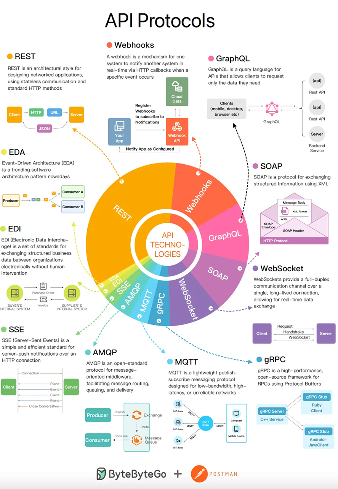

---

#### Architecture Styles, Patterns, and Design Patterns

References: [Milan Milanović - *Are Architecture Styles, Patterns, and Design Patterns Different?*](https://x.com/milan_milanovic/status/1747683090598711725?s=20) | [Gamma, Helm, Johnson, Vlissides - *Design Patterns: Elements of Reusable Object-Oriented Software* (1994)](https://en.wikipedia.org/wiki/Design_Patterns) | [Microsoft - *Azure Architecture Styles*](https://learn.microsoft.com/en-us/azure/architecture/guide/architecture-styles/)

- **Architectural styles**  
    This is the highest level of abstraction, where architectural designs instruct us on structuring our code. The highest level of granularity describes the application's layers and high-level modules and how they relate to and interact with one another. Examples of architectural styles include:  
    
    🔹 Monolith  
    🔹 Layered  
    🔹 Event-driven  
    🔹 Self-contained Systems  
    🔹 Microservices  
    🔹 Space-Based

- **Architectural patterns**  
    These patterns represent a way to implement an architectural style, so we can do this regularly. Some examples are how to separate the user interface (UI) and data, how internal modules interact, and what layers we will use. Patterns answer these types of questions. They usually impact the code base and how to structure the code inside. Examples of architectural patterns include:

    🔹 Model-View-Presenter (MVP): 1:1 Relationship between View and Presenter. e.g., Windows forms  
    🔹 Model-View-Controller (MVC): e.g., Smalltalk, ASP.Net MVC  
    🔹 Model–View–Viewmodel (MVVM): One to Many relationship between View and ViewModel. e.g., Silverlight, WPF, AngularJs:  
    🔹 Domain-Driven Design

- **Design patterns**

    These differ from architectural patterns in that they focus on a smaller code base area and have a smaller influence (focus on a local problem). These include limiting the creation of a class to only one object or notifying all dependent objects when the internal state of an object is changed. These patterns are described in the book "Design Patterns: Elements of Reusable Object-Oriented Software" by Erich Gamma, Richard Helm, Ralph Johnson, and John Vlissides from 1994.

    We have three groups of Design Patterns:

    🔹 Creational: here we have Factory Method, Builder, Singleton, ...  
    🔹 Structural: here we have an Adapter, Bridge, and Decorator, ...  
    🔹 Behavioral: here we have Command, Iterator, State, Strategy, ...  

---

#### Azure vs AWS vs GCP in Cloud Network

References: [Microsoft - *Azure Virtual Network*](https://learn.microsoft.com/en-us/azure/virtual-network/virtual-networks-overview) | [AWS - *VPC User Guide*](https://docs.aws.amazon.com/vpc/latest/userguide/what-is-amazon-vpc.html) | [Google Cloud - *VPC Overview*](https://docs.cloud.google.com/vpc/docs/overview)

🔹**Cloud Network Structures:**

- **AWS:** Region → VPC → Availability Zone → Subnet (public, private)
- **Azure:** Region → Virtual Network (VNet) → Availability Zone → Subnet
- **GCP:** Global → VPC → Subnet (Region-specific)

🔹**Traffic Between VNet or VPC:**

* Requires setup of a VNet/VPC gateway or peering, and appropriate route configuration.
- **Azure**: One VPN Gateway per Virtual Network (used for site-to-site, point-to-site, ExpressRoute). Route tables can be assigned at the **subnet level**.
- **AWS**: Route tables are associated with **subnets**, not just the VPC. Controls intra-VPC and external traffic via routes per subnet.
- **GCP**: Routing is defined at the **VPC level**. Routes apply globally within the VPC and are evaluated based on subnet CIDR.

🔹**Regional Traffic:**

* Use **peering** to enable traffic between VNets/VPCs in the same or different regions.
* Benefits of peering: Lower latency, Higher bandwidth, Reduced cost compared to VPN gateways

🔹**Hybrid Connectivity:**

* Enables on-premises networks to connect securely to cloud networks.
- **AWS:** Direct Connect, VPN Gateway, Transit Gateway
- **Azure:** ExpressRoute, VPN Gateway, Virtual WAN
- **GCP:** Cloud Interconnect, Cloud VPN

🔹**Connectivity Scenarios**

| **Scenario**            | **AWS**                                                        | **Azure**                               | **GCP**                                                                            |
| ----------------------- | -------------------------------------------------------------- | --------------------------------------- | ---------------------------------------------------------------------------------- |
| VNet ↔ VNet / VPC ↔ VPC | VPC Peering, AWS Transit Gateway                               | VNet Peering, Virtual WAN, VNet Gateway | VPC Network Peering, Cloud VPN                                                     |
| On-Prem ↔ VNet/VPC      | Direct Connect, VPN Gateway, Transit Gateway                   | ExpressRoute, VPN Gateway, Virtual WAN  | Cloud Interconnect, Cloud VPN                                                      |
| VNet/VPC ↔ Internet     | Internet Gateway (public subnet), NAT Gateway (private subnet) | Internet Gateway, NAT Gateway           | Cloud Router, Cloud NAT                                                            |
| Subnet Traffic Control  | Network ACLs + Security Groups                                 | Network Security Groups (NSGs)          | 1. Shared VPC with IAM on subnets  <br> 2. Firewall rules at VPC or instance level |

- Azure’s **Virtual WAN** is conceptually similar to **AWS Transit Gateway**.  
- Azure and GCP do **not** have a strict public/private subnet designation—this is controlled through IP assignment, routes, and firewall/NSG configurations.

🔹**Gateway Types in Azure:**

- **VNet Gateway** types: 
    - **VPN Gateway:** For site-to-site and point-to-site connections
    - **ExpressRoute Gateway:** For private MPLS-style connections to Azure
* Connection modes:
    - **Point-to-site:** Device-to-cloud
    - **Site-to-site:** Network-to-network
    - **VNet-to-VNet:** Secure private communication between VNets

🔹**Public IP vs Private IP**

- **Private IP:** `192.168.1.4` – Not routable on the internet
- **Public IP:** `34.207.152.137` – Routable on the public internet

🔹**Cloud Resource Hierarchy**

| **Level**             | **AWS**                  | **Azure**        | **GCP**      |
| --------------------- | ------------------------ | ---------------- | ------------ |
| 1. Organization Level | Organization             | Management Group | Organization |
| 2. Grouping Level     | Organizational Unit (OU) | Subscription     | Folder       |
| 3. IAM/Billing Unit   | Account                  | Resource Group   | Project      |
| 4. Resource Level     | Resources                | Resources        | Resources    |

🔹**Subnet Comparison**

| **Feature**              | **AWS**                                | **Azure**                           | **GCP**                                |
| ------------------------ | -------------------------------------- | ----------------------------------- | -------------------------------------- |
| **Subnet Scope**         | AZ-scoped                              | Region-scoped                       | Region-scoped                          |
| **Public/Private Setup** | Via route table + Internet Gateway     | Via route + NSG                     | Via route + firewall + external IP     |
| **Firewall Controls**    | Security Groups + NACLs (subnet-level) | NSGs (subnet or NIC level)          | Firewall rules (VPC or instance level) |
| **Secondary IP Ranges**  | ❌ Not supported                        | ❌ Not supported                     | ✅ Alias IPs supported                  |
| **HA / Kubernetes Fit**  | Multi-AZ subnet design required        | Simplified with region-wide subnets | Best for GKE (regional + alias IPs)    |

---

#### B-Tree vs LSM Tree vs Bloom Filter

References: [Martin Kleppmann - *Designing Data-Intensive Applications* (Ch. 3 Storage and Retrieval)](https://dataintensive.net/) | [Burton H. Bloom - *Space/Time Trade-offs in Hash Coding with Allowable Errors* (CACM, 1970)](https://dl.acm.org/doi/10.1145/362686.362692) | [O'Neil et al. - *The Log-Structured Merge-Tree (LSM-Tree)*](https://www.cs.umb.edu/~poneil/lsmtree.pdf)

🔹 **B-Tree:** Balanced tree for fast reads and range queries; used in RDBMS and file systems.  
🔹 **LSM Tree:** Write-optimized structure with batched disk writes; used in NoSQL databases.  
🔹 **Bloom Filter:** is a probabilistic data structure used to quickly check whether an element might be in a set. It's extremely space-efficient and fast but allows false positives (wrongly saying an item exists) while guaranteeing no false negatives (never says an existing item is missing).

---

#### Cloud Design Patterns

References: [Milan Milanović - *Main Cloud Design Patterns*](https://newsletter.techworld-with-milan.com/p/what-are-the-main-cloud-design-patterns) | [Microsoft - *Azure Architecture Center: Cloud Design Patterns*](https://learn.microsoft.com/en-us/azure/architecture/patterns/)

1. **Data Management** 📊  
    🔹**Cache-Aside**: Cache frequently used data for performance.  
    🔹**CQRS**: Separate reads/writes for scalability.  
    🔹**Event Sourcing**: Record full data change history.  
    🔹**Materialized View**: Precompute query results for speed.  
    🔹**Sharding**: Partition data to scale storage.
2. **Design and Implementation** 🛠️  
    🔹 **Strangler Fig**: Gradually migrate legacy systems.  
    🔹 **Anti-Corruption Layer**: Isolate new systems from old ones.  
    🔹 **Bulkhead**: Prevent failure spread across components.  
    🔹 **Sidecar**: Add functionality without changing the core.  
    🔹 **BFF**: Tailor backend for different clients.
3. **Messaging** 📨  
    🔹 **Queue-Based Load Leveling**: Buffer requests for smooth load handling.  
    🔹 **Publisher-Subscriber**: Broadcast messages to multiple consumers.  
    🔹 **Competing Consumers**: Process messages in parallel for scalability.  
    🔹 **Message Broker**: Route messages via intermediary.  
    🔹 **Pipes and Filters**: Sequentially process data through components.
4. **Security** 🔒  
    🔹 **Valet Key**: Provide secure temporary access.  
    🔹 **Gatekeeper**: Filter requests to protect backends.  
    🔹 **Federated Identity**: Use third-party login credentials.  
    🔹 **Secret Store**: Secure sensitive data.  
    🔹 **Validation**: Ensure data input is sanitized.
5. **Reliability** ⚙️  
    🔹 **Retry**: Retry failed operations automatically.  
    🔹 **Circuit Breaker**: Stop repeated failing operations.  
    🔹 **Throttling**: Limit resource usage via request control.  
    🔹 **Health Endpoint Monitoring**: Expose health checks for monitoring.

---

#### Compiler Framework: LLVM vs GCC

References: [LLVM Project](https://llvm.org/) | [GCC - GNU Compiler Collection](https://gcc.gnu.org/) | [Lattner & Adve - *LLVM: A Compilation Framework for Lifelong Program Analysis & Transformation* (CGO 2004)](https://llvm.org/pubs/2004-01-30-CGO-LLVM.html)

🔹**GCC** (GNU Compiler Collection): Originally released in 1987, GCC translates C code to RTL (Register Transfer Language), then to machine code. It supports many languages, including C, C++, Fortran, and more. Licensed under the GPL, GCC is known for its robust optimizations and is widely used for system-level programming and cross-platform compilation. 
`C code ---> GCC's C frontend ---> RTL ---> GCC's x86 backend ---> x86 machine code`  
🔹**LLVM** (Low-Level Virtual Machine): First released in 2003, LLVM uses an Intermediate Representation (IR) and a modular design, translating code to machine code via various backends. It supports a variety of languages, such as C, C++, Swift, Rust, and others. LLVM is Apache 2.0 licensed and is recognized for its flexibility, extensibility, and modern features, including Just-In-Time (JIT) compilation.  

🔹**Key Differences**: LLVM's modularity and permissive licensing foster broader tool integration and extensibility, while GCC is renowned for its mature optimization capabilities.

---

#### Concurrency vs Parallelism

References: [Rob Pike - *Concurrency is not Parallelism*](https://go.dev/blog/waza-talk)

🔹 **Concurrency**: Structuring a system so multiple tasks can make progress over the same period, even if only one runs at any instant through interleaving or scheduling.  
🔹 **Parallelism**: Executing multiple tasks literally at the same time on different CPU cores, machines, or workers.  
🔹 **Rule of thumb**: Concurrency is about coordination; parallelism is about throughput and simultaneous execution.  
🔹 **Example**: An async web server handles many requests concurrently on one core, while data processing on 8 cores runs in parallel.  

---

#### Conway's Law

References: [Melvin Conway - *How Do Committees Invent?* (Datamation, 1968)](https://www.melconway.com/Home/Committees_Paper.html) | [Martin Fowler - *Conway's Law*](https://martinfowler.com/bliki/ConwaysLaw.html)

🔹 Software engineering principle that states that the structure of a system reflects the structure of the organization that designs it.

---

#### CPU 101

References: [cpu.land - *Putting the "You" in CPU*](https://cpu.land/editions/one-pager) | [Andrew S. Tanenbaum - *Modern Operating Systems*](https://www.pearson.com/en-us/subject-catalog/p/modern-operating-systems/P200000003311)

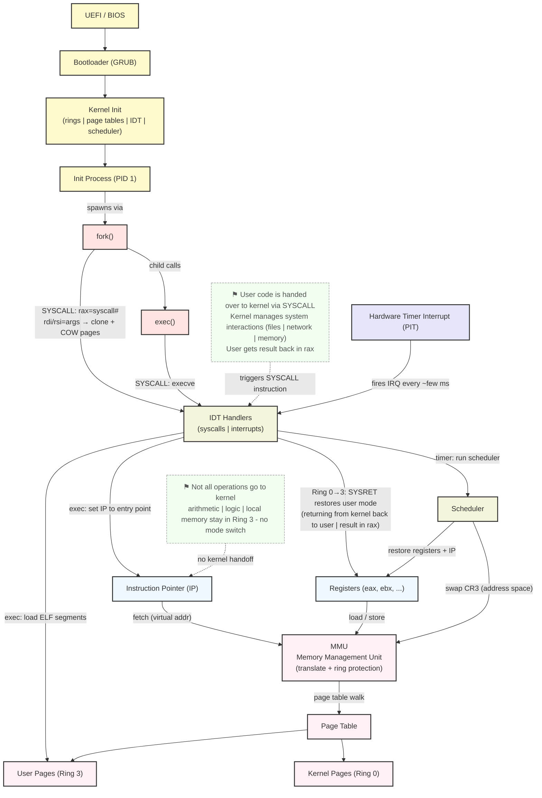
```mermaid
flowchart TD
    %% ── Boot ────────────────────────────────────────────────────
    Firmware["UEFI / BIOS"] --> Bootloader["Bootloader (GRUB)"]
    Bootloader --> KernelInit["Kernel Init<br/>(rings | page tables | IDT | scheduler)"]
    KernelInit --> InitProcess["Init Process (PID 1)"]
    InitProcess -->|"spawns via"| Fork

    %% ── fork + exec ─────────────────────────────────────────────
    Fork["fork()"] -->|"SYSCALL: rax=syscall#<br/>rdi/rsi=args → clone + COW pages"| IDT
    Fork -->|"child calls"| Exec["exec()"]
    Exec -->|"SYSCALL: execve"| IDT
    IDT["IDT Handlers<br/>(syscalls | interrupts)"] -->|"exec: load ELF segments"| UserPages["User Pages (Ring 3)"]
    IDT -->|"exec: set IP to entry point"| IP["Instruction Pointer (IP)"]
    IDT -->|"Ring 0→3: SYSRET restores user mode<br/>(returning from kernel back to user | result in rax)"| Registers["Registers (eax, ebx, ...)"]

    %% ── CPU Fetch-Execute loop ──────────────────────────────────
    %% NOTE: pure computation (math, logic, local memory reads) runs here
    %% directly in Ring 3 - NO syscall needed
    NoteRing3["⚑ Not all operations go to kernel<br/>arithmetic | logic | local memory stay in Ring 3 - no mode switch"]
    NoteRing3 -.->|"no kernel handoff"| IP

    IP -->|"fetch (virtual addr)"| MMU["MMU<br/>Memory Management Unit<br/>(translate + ring protection)"]
    Registers -->|"load / store"| MMU
    MMU -->|"page table walk"| PageTable["Page Table"]
    PageTable --> KernelPages["Kernel Pages (Ring 0)"]
    PageTable --> UserPages

    %% ── Syscall boundary note ───────────────────────────────────
    %% NOTE: syscall only triggered at system resource boundary
    NoteSyscall["⚑ User code is handed over to kernel via SYSCALL<br/>Kernel manages system interactions (files | network | memory)<br/>User gets result back in rax"]
    NoteSyscall -.->|"triggers SYSCALL instruction"| IDT

    %% ── Preemptive Multitasking ─────────────────────────────────
    Timer["Hardware Timer Interrupt (PIT)"] -->|"fires IRQ every ~few ms"| IDT
    IDT -->|"timer: run scheduler"| Scheduler["Scheduler"]
    Scheduler -->|"restore registers + IP"| Registers
    Scheduler -->|"swap CR3 (address space)"| MMU

    %% ── Styling ─────────────────────────────────────────────────
    classDef boot   fill:#fffacd,stroke:#333,stroke-width:2px
    classDef cpu    fill:#f0f8ff,stroke:#333,stroke-width:2px
    classDef mem    fill:#fff0f5,stroke:#333,stroke-width:2px
    classDef kernel fill:#f5f5dc,stroke:#333,stroke-width:2px
    classDef hw     fill:#e6e6fa,stroke:#333,stroke-width:2px
    classDef proc   fill:#ffe4e1,stroke:#333,stroke-width:2px
    classDef note   fill:#f0fff0,stroke:#999,stroke-width:1px,stroke-dasharray:4 2,color:#555

    class Firmware,Bootloader,KernelInit,InitProcess boot
    class IP,Registers cpu
    class MMU,PageTable,KernelPages,UserPages mem
    class IDT,Scheduler kernel
    class Timer hw
    class Fork,Exec proc
    class NoteRing3,NoteSyscall note
```

🔹 **Fetch-Execute Cycle**: The CPU holds an **instruction pointer** (register) pointing into RAM. It endlessly repeats: fetch instruction → execute → advance pointer. Jump instructions alter the pointer; this is how control flow works.

🔹 **Registers**: Small, extremely fast storage buckets inside the CPU (e.g., `eax`, `ebx`). One special register is the instruction pointer. Others control CPU modes and permission levels.

🔹 **Privilege Rings (Kernel vs User mode)**: Modern CPUs have at least two modes.  
- **Kernel mode (Ring 0)**: unrestricted - any instruction, any memory.  
- **User mode (Ring 3)**: limited - no direct I/O, no arbitrary memory access, no changing CPU settings.  
The kernel runs in Ring 0; user programs run in Ring 3. The CPU starts in kernel mode at boot; the OS switches to user mode before running programs.

🔹 **System Calls (Syscalls)**: The only safe way for user-mode code to request kernel services (open file, allocate memory, spawn process, etc.).  
1. OS pre-registers handler addresses in an **Interrupt Descriptor Table (IDT)** at boot.  
2. Program triggers a **software interrupt** (`INT 0x80`) or uses `SYSCALL` / `SYSENTER` instructions.  
3. CPU switches to kernel mode and jumps to the registered handler.  
4. Kernel does the work, then executes `IRET` / `SYSRET` to return to user mode.

🔹 **Paging & Virtual Memory**: Every memory address a program uses is a **virtual address**. The **Memory Management Unit (MMU)** translates it to a physical RAM address using a **page table** (a dictionary stored in RAM, pointed to by a CPU register). Benefits:  
- Each process has its own isolated address space (e.g., two processes can both use `0x400000` pointing to different physical memory).  
- Kernel marks its own pages as ring-0-only, so user-mode code cannot read kernel memory even though kernel addresses are present in the virtual map.  
- **Demand paging**: pages are only loaded into physical RAM when first accessed (page fault → kernel loads the page → retries the instruction).

🔹 **Preemptive Multitasking**: A **timer chip (PIT)** fires a **hardware interrupt** every few milliseconds. The CPU switches to kernel mode, the OS scheduler saves the current process state (registers, instruction pointer) and restores another process - the **context switch**. Timeslices on Linux are typically 0.75 – 6 ms.

🔹 **Boot → Run sequence**:  
`Firmware (UEFI/BIOS)` → `Bootloader (GRUB)` → `Kernel init` → `Page tables set up, interrupts registered` → `init process (PID 1, e.g. systemd)` → `fork/exec` → user programs running

🔹 **fork & exec pattern**:  
- `fork()` - clones the current process; child gets PID 0 return value, parent gets child PID. Memory pages are marked **copy-on-write (COW)**; no physical copy until a write occurs.  
- `exec()` - replaces the current process image with a new program (parsed from an ELF binary: load `.text`, `.data`, `.bss` sections into virtual memory, jump to entry point).  
Every process on Linux traces its ancestry back to PID 1 via fork-exec.

---

#### Cracking Coding Interviews

References: [systemdesign42 - *Coding Interview Patterns*](https://x.com/systemdesign42/status/1776590986837160427) | [NeetCode](https://neetcode.io/) | [Cracking the Coding Interview - Gayle Laakmann McDowell](https://www.crackingthecodinginterview.com/)

🔹**Two Pointers**: Navigating arrays with two indices. [Pluralsight](https://www.pluralsight.com/resources/blog/guides/algorithm-templates-two-pointers-part-2)  
🔹**Intervals**: Working with ranges of values. [Tim Park](https://medium.com/@timpark0807/leetcode-is-easy-the-interval-pattern-d68a7c1c841) | [LeetCode Template](https://leetcode.com/problems/minimum-number-of-arrows-to-burst-balloons/solutions/93735/a-concise-template-for-overlapping-interval-problem/) | [LeetCode Discuss](https://leetcode.com/discuss/general-discussion/794725/General-Pattern-for-greedy-approach-for-Interval-based-problems)  
🔹**Dynamic Programming**: Solving complex problems by breaking them down into simpler subproblems. [YouTube](https://www.youtube.com/watch?v=ZwDDLAeeBM0&t=294s) | [LeetCode Discuss](https://leetcode.com/discuss/general-discussion/651719/how-to-solve-dp-string-template-and-4-steps-to-be-followed)  
🔹**Tree Traversal**: Visiting all nodes in a tree. [Medium](https://medium.com/leetcode-patterns/leetcode-pattern-0-iterative-traversals-on-trees-d373568eb0ec) | [LeetCode](https://leetcode.com/problems/binary-tree-postorder-traversal/solutions/45551/Preorder-Inorder-and-Postorder-Iteratively-Summarization/)  
🔹**DFS-BFS**: Depth-first and breadth-first search algorithms. [LeetCode Matrix Template](https://leetcode.com/problems/pacific-atlantic-water-flow/solutions/438276/Python-beats-98.-DFS-template-for-Matrix/) | [Medium Part 2](https://medium.com/leetcode-patterns/leetcode-pattern-2-dfs-bfs-25-of-the-problems-part-2-a5b269597f52) | [Medium Part 1](https://medium.com/leetcode-patterns/leetcode-pattern-1-bfs-dfs-25-of-the-problems-part-1-519450a84353) | [YouTube](https://www.youtube.com/watch?v=TIbUeeksXcI)  
🔹**Binary Search**: Finding an element in a sorted array. [LeetCode Handbook](https://leetcode.com/problems/binary-search/solutions/423162/Binary-Search-101-The-Ultimate-Binary-Search-Handbook/)  
🔹**Array**: A data structure holding elements. [LeetCode Principles](https://leetcode.com/problems/reverse-pairs/solutions/97268/General-principles-behind-problems-similar-to-%22Reverse-Pairs%22/)  
🔹**Sliding Window**: A subset of data that moves. [Pluralsight](https://www.pluralsight.com/resources/blog/guides/algorithm-templates-two-pointers-part-3) | [Medium](https://medium.com/leetcode-patterns/leetcode-pattern-2-sliding-windows-for-strings-e19af105316b) | [LeetCode Minimum Window](https://leetcode.com/problems/minimum-window-substring/solutions/26808/Here-is-a-10-line-template-that-can-solve-most-'substring'-problems/) | [LeetCode Anagrams](https://leetcode.com/problems/find-all-anagrams-in-a-string/solutions/92007/Sliding-Window-algorithm-template-to-solve-all-the-Leetcode-substring-search-problem./) | [LeetCode Stock Template](https://leetcode.com/problems/best-time-to-buy-and-sell-stock-with-transaction-fee/solutions/108870/Most-consistent-ways-of-dealing-with-the-series-of-stock-problems/)  
🔹**Backtracking**: Trying out all possibilities to find a solution. [LeetCode Summary](https://leetcode.com/problems/permutations/solutions/18284/Backtrack-Summary:-General-Solution-for-10-Questionsh/) | [Medium](https://medium.com/leetcode-patterns/leetcode-pattern-3-backtracking-5d9e5a03dc26) | [LeetCode Combination Sum](https://leetcode.com/problems/combination-sum/solutions/16502/A-general-approach-to-backtracking-questions-in-Java-(Subsets-Permutations-Combination-Sum-Palindrome-Partitioning)/)  
🔹**Combination**: Finding all possible arrangements of elements. [LeetCode Template](https://leetcode.com/problems/combination-sum-iv/solutions/85120/C++-template-for-ALL-Combination-Problem-Set/)  
🔹**Trie**: A tree-like data structure for storing strings. [LeetCode Discuss](https://leetcode.com/discuss/general-discussion/931977/beginner-friendly-guide-to-trie-tutorial-practice-problems)  
🔹**Word Break**: Dividing a string into words. [LeetCode Template](https://leetcode.com/problems/concatenated-words/solutions/836924/Python-Template-Word-Break-I-Word-Break-II-Concatenated-Words/)  
🔹**Bit Manipulation**: Performing operations on binary numbers. [LeetCode Summary](https://leetcode.com/problems/sum-of-two-integers/solutions/84278/A-summary:-how-to-use-bit-manipulation-to-solve-problems-easily-and-efficiently/) | [LeetCode Generalization](https://leetcode.com/problems/single-number-ii/solutions/43295/Detailed-explanation-and-generalization-of-the-bitwise-operation-method-for-single-numbers/)  
🔹**Sum**: Adding numbers together. [LeetCode Megapost](https://leetcode.com/problems/two-sum/solutions/737092/Sum-MegaPost-Python3-Solution-with-a-detailed-explanation/)  
🔹**Monotonic Stack**: A stack keeping elements in an ordered manner. [LeetCode](https://leetcode.com/problems/sum-of-subarray-minimums/solutions/178876/stack-solution-with-very-detailed-explanation-step-by-step/)  
🔹**Big-O-Notation**: [ByteByteGo](https://blog.bytebytego.com/p/ep132-big-o-notation-101-the-secret)  

🔹[Master Graph Algorithms for Coding Interviews](https://blog.algomaster.io/p/master-graph-algorithms-for-coding)  
🔹[20 Patterns to Master Dynamic Programming](https://blog.algomaster.io/p/20-patterns-to-master-dynamic-programming)  
🔹[LeetCode was HARD until I Learned these 15 Patterns](https://blog.algomaster.io/p/15-leetcode-patterns)  
🔹[How I Mastered Data Structures and Algorithms](https://blog.algomaster.io/p/how-i-mastered-data-structures-and-algorithms)

---

#### Data Engineering & Data Scientists Vocab 101

References: [DailyDoseOfDS - *15 DS/ML Cheat Sheets*](https://blog.dailydoseofds.com/p/15-dsml-cheat-sheets) | [GitHub - *Daily Dose of Data Science*](https://github.com/ChawlaAvi/Daily-Dose-of-Data-Science)

🔹 **Data engineering Vocab 101**

References: [SeattleDataGuy - *Data Engineering 101*](https://x.com/SeattleDataGuy/status/1753950189314810358?s=20)

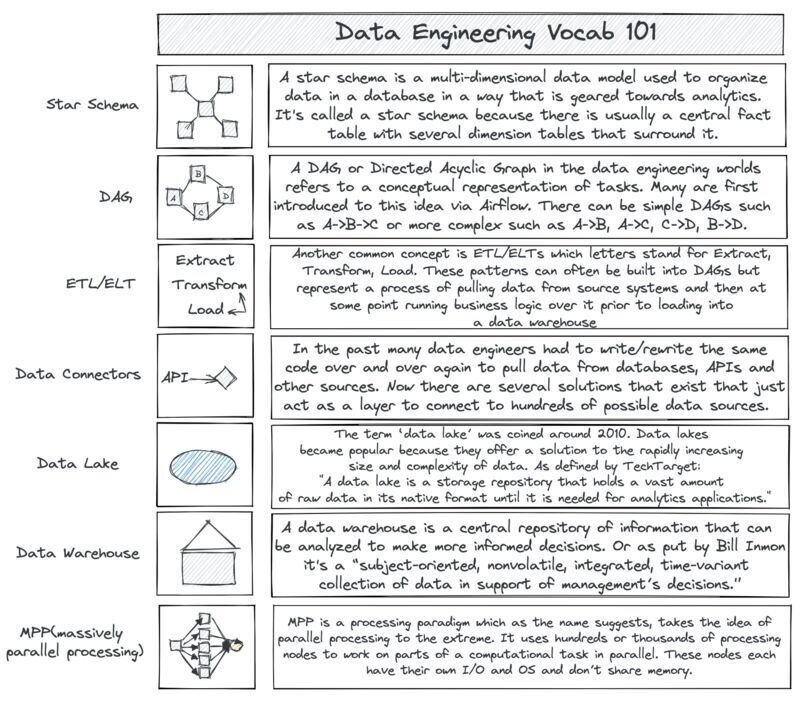

🔹 **75 Key Terms That Data Scientists Remember by Heart** 

References: [DailyDoseOfDS - *75 Key Terms That Data Scientists Remember by Heart*](https://blog.dailydoseofds.com/p/75-key-terms-that-data-scientists)

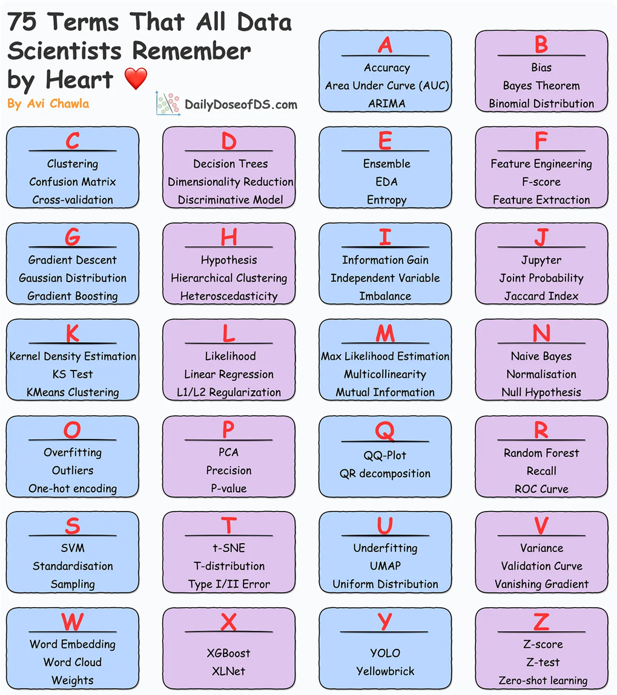

🔹 **A Comprehensive NumPy Cheat Sheet Of 40 Most Used Methods** 

References: [DailyDoseOfDS - *A Comprehensive NumPy Cheat Sheet*](https://blog.dailydoseofds.com/p/a-comprehensive-numpy-cheat-sheet)

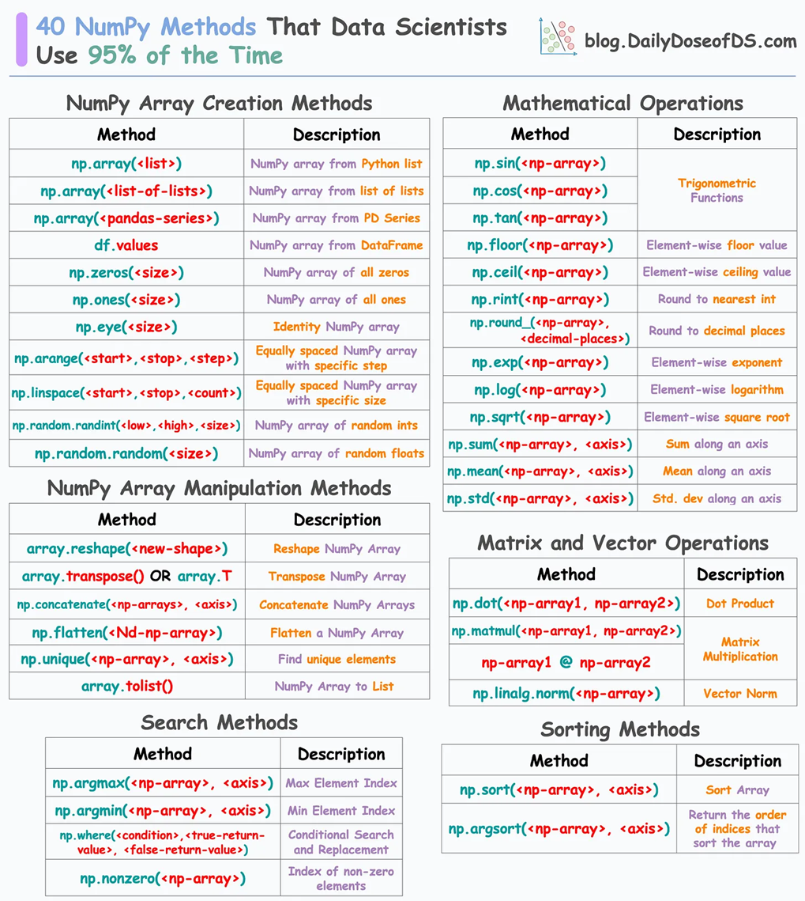

🔹 **15 Pandas ↔ Polars ↔ SQL ↔ PySpark Translations** 

References: [DailyDoseOfDS - *15 Pandas ↔ Polars ↔ SQL ↔ PySpark Translations*](https://blog.dailydoseofds.com/p/15-pandas-polars-sql-pyspark-translations)

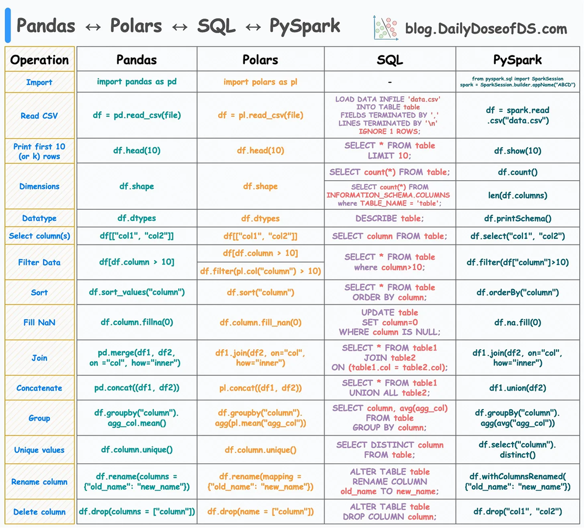

🔹 **11 Key Probability Distributions** 

References: [DailyDoseOfDS - *11 Key Probability Distributions*](https://blog.dailydoseofds.com/p/11-key-probability-distributions)

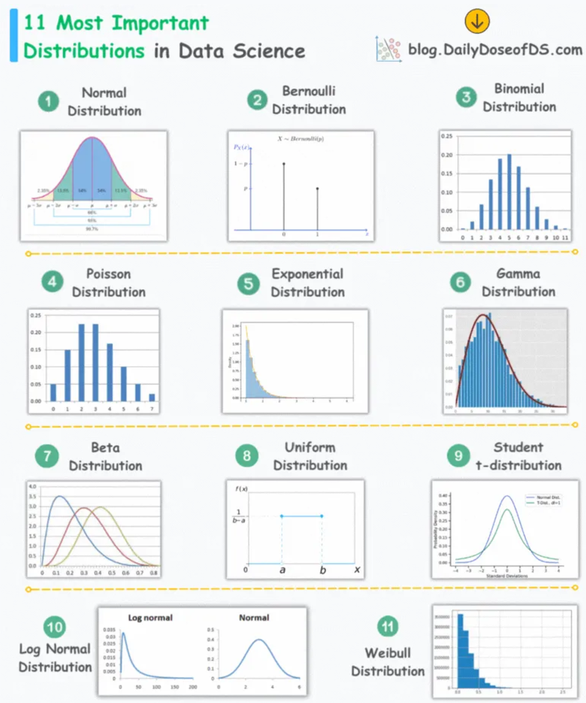

🔹 **6 Must-Know Types of Clustering Algorithms in Machine Learning** 

References: [DailyDoseOfDS - *6 Must-Know Types of Clustering Algorithms*](https://blog.dailydoseofds.com/p/beyond-kmeans-6-must-know-types-of)

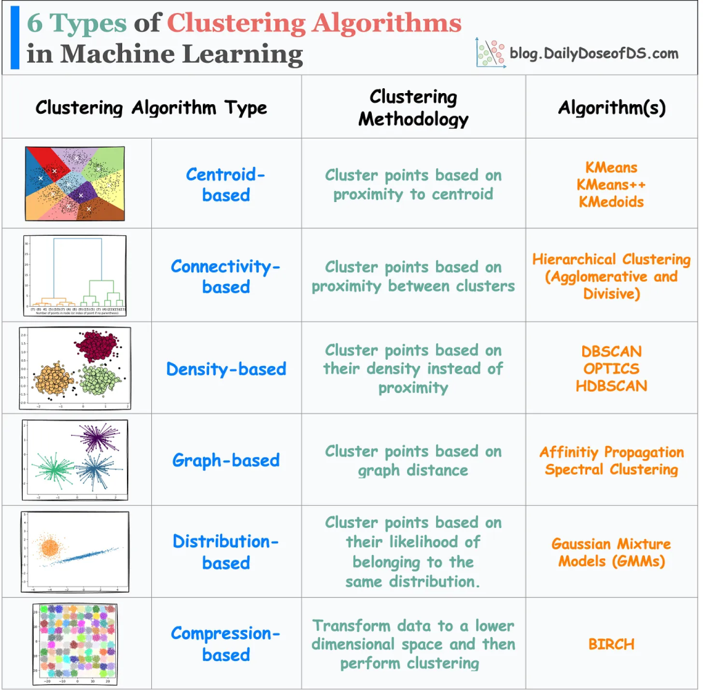

🔹 **25 Most Important Mathematical Definitions in Data Science**

References: [DailyDoseOfDS - *25 Most Important Mathematical Definitions in Data Science*](https://blog.dailydoseofds.com/p/25-most-important-mathematical-definitions)

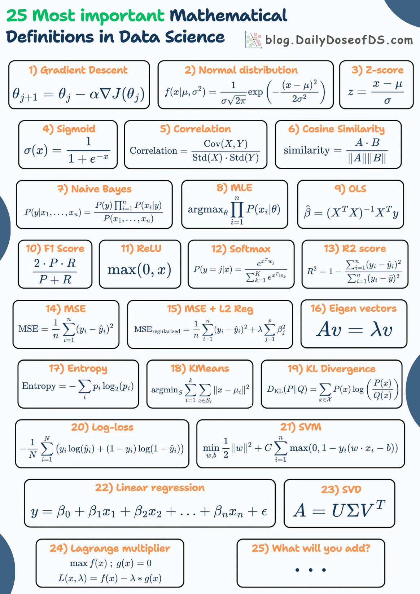

🔹 **10 Regression and Classification Loss Functions**

References: [DailyDoseOfDS - *10 Regression and Classification Loss Functions*](https://blog.dailydoseofds.com/p/10-regression-and-classification)

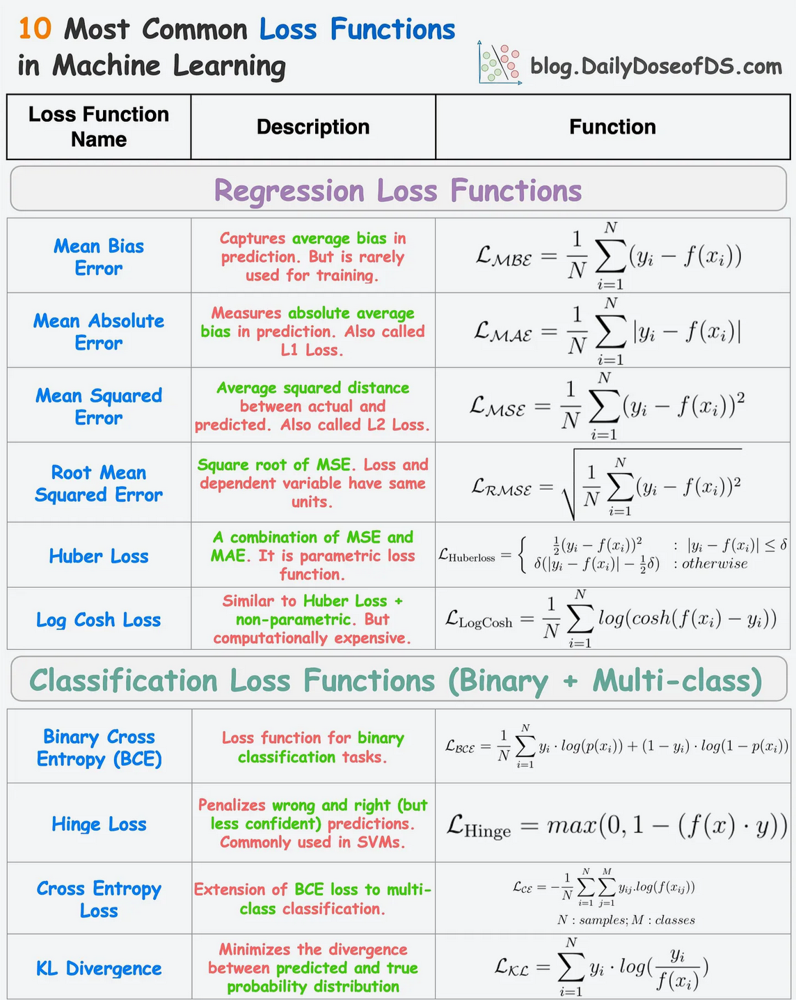

---

#### Data Management in Distributed Systems (Partitioning, Shuffling and Bucketing)

References: [Apache Hive - *Partitioned Tables & Bucketing*](https://cwiki.apache.org/confluence/display/Hive/LanguageManual+DDL+BucketedTables) | [Apache Spark - *Partitioning & Shuffle*](https://spark.apache.org/docs/latest/rdd-programming-guide.html#shuffle-operations)

🔹**Partitioning**: The process of dividing a large dataset into smaller parts, known as partitions. This process splits Hive table's files into multiple files. For example, `../hive/warehouse/sales_table/product_id=P1`.  
🔹**Shuffling**: Shuffling is the process of redistributing data across different partitions. The overhead of operations can be ranked as follows: `orderby` > `join` > `groupby`.  
🔹**Bucketing**: This is the process of decomposing data into manageable parts based on a certain column, thereby improving query performance and storage efficiency. It is best used when there are very few repeating values in a column (for example 1. a primary key column). For instance, Bucket0: `../hive/warehouse/sales_table/product_id=P1/000000_0`, Bucket1: `../hive/warehouse/sales_table/product_id=P1/000001_0`, and so on.

---

#### Data mesh

References: [Zhamak Dehghani - *Data Mesh Principles and Logical Architecture*](https://martinfowler.com/articles/data-mesh-principles.html) | [Zhamak Dehghani - *Data Mesh* (O'Reilly)](https://www.oreilly.com/library/view/data-mesh/9781492092384/)

🔹 **Data mesh**: A socio-technical approach that treats data as a product and distributes ownership to the business domains that know the data best.  
🔹 **Four principles**: Domain-oriented ownership, data as a product, self-serve data platform, and federated computational governance.  
🔹 **Why teams adopt it**: It reduces central bottlenecks in large organizations where one platform team cannot model and govern every dataset alone.  
🔹 **Trade-off**: It improves scalability of ownership, but only if standards, discoverability, and platform tooling are strong enough to prevent data silos.  

---

#### Database Normalization

References: [E. F. Codd - *A Relational Model of Data for Large Shared Data Banks* (CACM, 1970)](https://dl.acm.org/doi/10.1145/362384.362685) | [Microsoft - *Description of the database normalization basics*](https://learn.microsoft.com/en-us/office/troubleshoot/access/database-normalization-description)

Database Normalization

| **Normalization Stage**   | **What It Means**                                                        | **Simple Example (with More Detail)**                                                                                                                                                                                                                                     |
| ------------------------- | ------------------------------------------------------------------------ | ------------------------------------------------------------------------------------------------------------------------------------------------------------------------------------------------------------------------------------------------------------------------- |
| **1st Normal Form (1NF)** | Don't put multiple values in one cell!                                   | 📛 **Bad Example:** <br> `Name: John` , `Phone: 123-4567, 987-6543` <br> ✔️ **Good Example:** <br> Row 1: `Name: John`, `Phone: 123-4567` <br> Row 2: `Name: John`, `Phone: 987-6543`                                                                                     |
| **2nd Normal Form (2NF)** | Don't define other values using part of the primary key!                 | Suppose the **Primary Key** is `(StudentID, Course)` <br> 📛 **Bad Example:** <br> `StudentID → Major` included in same table <br> ✔️ **Good Example:** <br> Move `StudentID → Major` to a separate `Student` table, only `(StudentID, Course)` stays in enrollment table |
| **3rd Normal Form (3NF)** | Don't let non-key values depend on each other!                           | 📛 **Bad Example:** <br> In `Student` table: <br> `DepartmentCode → DepartmentName` <br> Both stored together <br> ✔️ **Good Example:** <br> `Department` info in separate table <br> Student table only keeps `DepartmentCode`                                           |
| **BCNF**                  | Even if it looks normal, make sure every determinant is a candidate key! | 📛 **Bad Example:** <br> `Course → Instructor` <br> But `Course` is not a candidate key (multiple sections exist) <br> ✔️ **Good Example:** <br> Have a table: `(Course, Section)` as key, with Instructor info based on full key only                                    |

---

#### Deployment Styles: Blue/Green, Canary, and A/B

References: [Martin Fowler - *BlueGreenDeployment*](https://martinfowler.com/bliki/BlueGreenDeployment.html) | [Martin Fowler - *CanaryRelease*](https://martinfowler.com/bliki/CanaryRelease.html) | [Google - *SRE Workbook: Canarying Releases*](https://sre.google/workbook/canarying-releases/)

🔹**Blue/Green Deployment**: Two identical environments, "Blue" and "Green". Deploy new version in inactive environment, test, then switch users to it. For example, AWS supports blue/green deployment strategies including Elastic Beanstalk, OpsWorks, CloudFormation, CodeDeploy, and Amazon ECS.  
🔹**Canary Deployment**: Roll out new version to a small group of users, monitor feedback, then do a full-scale release.  
🔹**A/B Testing**: Compare two versions of a webpage or app to see which performs better. A typical example of A/B testing is website usability testing.

---

#### Distributed system 101

References: [systemdesign.one - *Distributed Systems*](https://newsletter.systemdesign.one/p/distributed-systems) | [Martin Kleppmann - *Designing Data-Intensive Applications*](https://dataintensive.net/)

🔹**Core components**
| Category                   | Items                                                                                                                         |
| -------------------------- | ----------------------------------------------------------------------------------------------------------------------------- |
| **Communication**          | TCP, TLS, DNS                                                                                                                 |
| **Coordination**           | Failure Detection, Event Ordering & Timing, Leader Election, Data Replication & Consistency                                   |
| **Scalability Techniques** | Microservices, API Gateway, CQRS, Asynchronous Messaging Patterns, Data Partitioning (Sharding), Replication & Load Balancing |
| **Resiliency Techniques**  | Circuit Breakers, Rate Limiting / Throttling, Health Checks                                                                   |

🔹**Vertical Scaling vs Horizontal Scaling**: Vertical = bigger machine; Horizontal = more machines for scale and fault-tolerance.  
🔹**Failure Detection - Heartbeat mechanism & Gossip protocol**: Heartbeat sends periodic “alive” signals; Gossip spreads membership info randomly for scalable, eventually consistent failure detection.  
🔹**Event Ordering and Timing - Lamport Clocks vs Vector Clocks**: Lamport gives partial order; Vector clocks track causality and detect concurrency.  
🔹**Lamport Clock** = each process keeps a counter (e.g., P1 sends event at time 5 → receiver sets its clock to `max(local, 5) + 1 = 6`), giving a total order but treating concurrent events as ordered;  
🔹**Vector Clock** = each process keeps a vector of counters (e.g., three nodes P1,P2,P3 start at `[0,0,0]`; after two local events P1 has `[2,0,0]`; P1 sends a message to P2 with `[2,0,0]`; P2’s local clock is `[1,3,0]`; on receive P2 merges element-wise max → `max([1,3,0],[2,0,0]) = [2,3,0]` then increments its own index → `[2,4,0]`, and concurrency is detectable because vectors like `[1,0,0]` and `[0,1,0]` are incomparable (neither ≤ other).  
🔹**Leader Election**: Algorithms (Raft, Paxos, Bully) choose one coordinator node to ensure consistent decision-making.
| Algorithm | Political Analogy                 | Why                                                                    |
| --------- | --------------------------------- | ---------------------------------------------------------------------- |
| **Raft**  | Parliamentary majority leadership | Explicit election + continuous confidence/heartbeat.                   |
| **Paxos** | Consensus committee process       | Decisions pass only when enough members agree; leadership is emergent. |
| **Bully** | Leadership by seniority           | Highest “rank” node automatically becomes leader.                      |

🔹**Data Consistency - Linearizability vs Sequential Consistency vs Eventual Consistency**: Linearizable = real-time global order; Sequential = same order but not real-time; Eventual = replicas converge asynchronously.  
🔹**CAP Theorem**: In presence of network partitions (P), a distributed system must choose either Consistency (C) or Availability (A); it cannot guarantee all three simultaneously.  
🔹**CQRS (Command Query Responsibility Segregation)**: Split read and write models to scale independently and reduce contention.  
🔹**Data Partitioning - Range-based partitioning vs Hash-based partitioning vs Consistent hashing**: Range = by key ranges; Hash = even distribution but costly rebalancing; Consistent hashing = minimal data movement on node changes.  
🔹**Replication - Single-leader vs Multi-leader vs Leaderless**: Single-leader = one write node; Multi-leader = multiple writable nodes with conflict handling; Leaderless = any node can write using quorum replication.  

---

#### DNS 101

References: [Cloudflare - *What is DNS?*](https://www.cloudflare.com/learning/dns/what-is-dns/) | [RFC 1034 / 1035 - Domain Names](https://www.rfc-editor.org/rfc/rfc1035) | [Microsoft - *Azure Private DNS*](https://learn.microsoft.com/en-us/azure/dns/private-dns-overview) | [AWS - *Route 53 Private Hosted Zones*](https://docs.aws.amazon.com/Route53/latest/DeveloperGuide/hosted-zones-private.html) | [Google Cloud - *Cloud DNS private zones*](https://docs.cloud.google.com/dns/docs/zones/zones-overview)

🔹 **DNS** translates names such as `example.com` into IP addresses and other routing metadata.  

| Topic | Concise meaning |
| --- | --- |
| **Resolution path** | Client resolver → recursive resolver → authoritative DNS server → answer returned and cached |
| **Common records** | `A` / `AAAA` = IP address, `CNAME` = alias, `MX` = mail route, `TXT` = metadata / verification |
| **TTL** | Controls how long a DNS answer stays cached before clients ask again |
| **Private DNS** | Internal-only DNS for names such as `db.prod.corp.internal`, returning private IPs inside company networks, VNets, or VPCs |
| **Split-horizon DNS** | The same hostname can return a private answer internally and a public answer externally |

🔹 **Private DNS priority rule**

1. **Most specific private suffix wins**: `payments.corp.internal` beats `corp.internal`.  
2. **Private match beats public DNS**: if an internal zone or forwarding rule matches, stay inside private resolution.  
3. **Public DNS is fallback**: only query public DNS when no private rule matches.  

Example: `api.payments.corp.internal` should resolve from `payments.corp.internal`, not from the broader parent zone or public DNS.  

🔹 **Enterprise pattern**: corporate devices usually ask on-prem DNS first; on-prem DNS conditionally forwards cloud-private suffixes to cloud resolvers, and cloud resolvers forward selected on-prem suffixes back over VPN / ExpressRoute / Direct Connect / Interconnect.  

| Cloud | Main services | How private DNS works | Priority behavior |
| --- | --- | --- | --- |
| **Azure** | **Azure Private DNS** + **Azure DNS Private Resolver** | Link private zones to VNets; use resolver inbound/outbound endpoints and forwarding rulesets for hybrid DNS. | Linked private zones are checked first, then forwarding rulesets; if multiple rules match, the **longest suffix** wins; public Azure DNS is fallback. |
| **AWS** | **Route 53 Private Hosted Zones** + **Route 53 Resolver** | Associate private hosted zones with VPCs; use Resolver endpoints and rules for hybrid or multi-account DNS. | VPC-associated private hosted zones answer matching internal names before internet DNS; use the **most specific internal zone** for overlapping namespaces. |
| **GCP** | **Cloud DNS private zones** + **forwarding zones / peering zones** | Authorize private zones for VPCs; use forwarding zones for on-prem / external DNS and peering zones for cross-VPC DNS visibility. | Private / forwarding / peering zones are checked before public zones; overlapping private zones use **longest suffix matching**; a private-zone miss can still return `NXDOMAIN`. |

🔹 **Typical uses**: internal service discovery, private database endpoints, hybrid datacenter-to-cloud apps, and environment-specific names such as `dev`, `staging`, and `prod`.  
🔹 **Design cautions**: avoid overlapping zone ownership, keep forwarding rules explicit, use low TTLs for failover-sensitive records, and never expose internal namespaces publicly.  

---

#### DevOps, Platform Engineering and SRE (site reliability engineering)

References: [Splunk - *SRE vs DevOps vs Platform Engineering*](https://www.splunk.com/en_us/blog/learn/sre-vs-devops-vs-platform-engineering.html) | [Google - *Site Reliability Engineering (SRE) Book*](https://sre.google/sre-book/table-of-contents/) | [Evan Bottcher - *What I Talk About When I Talk About Platforms*](https://martinfowler.com/articles/talk-about-platforms.html)

🔹**DevOps**, **SRE**, and **Platform Engineering** are practices that streamline software development and maintenance. They all involve automation and collaboration.  
🔹**DevOps** covers the entire software development process promoting team collaboration.  
🔹**SRE** focuses on system reliability, including application monitoring and emergency response.  
🔹**Platform Engineering** manages the infrastructure and tools needed for software development and operations.  
🔹DevOps is about the whole development process, SRE emphasizes reliability and scalability, and Platform Engineering is about infrastructure and tool management.

---

#### Domain-Driven Design (DDD)

References: [ByteByteGo - *Domain-Driven Design Demystified*](https://blog.bytebytego.com/p/domain-driven-design-ddd-demystified) | [Eric Evans - *Domain-Driven Design: Tackling Complexity in the Heart of Software*](https://www.domainlanguage.com/ddd/)

🔹 **Focus on the Core Domain:** Identify and model the essential part of the business.  
🔹 **Ubiquitous Language:** Create a shared language between developers and domain experts.  
🔹 **Bounded Contexts:** Divide the system into explicit boundaries where a model applies.  
🔹 **Entities and Value Objects:** Entities have identity; value objects are immutable.  
🔹 **Aggregates:** Group related entities to maintain consistency.  
🔹 **Domain Events:** Capture important business events explicitly.  
🔹 **Repositories:** Provide a way to retrieve and persist domain objects.  
🔹 **Continuous Collaboration:** Domain experts and developers work closely.  

---

#### Flaky Test

References: [Google Testing Blog - *Flaky Tests at Google and How We Mitigate Them*](https://testing.googleblog.com/2016/05/flaky-tests-at-google-and-how-we.html) | [jmicco - *JaSST Tutorial*](https://github.com/jmicco/JaSST_tutorial)

A **Flaky Test** is a test that sometimes passes and sometimes fails, despite no changes in the code. Causes can include poorly written tests, async waits, test order dependency, and concurrency issues. They can slow down CI/CD pipelines and cause issues for end users.

---

#### Gartner's PACE Layered Application Strategy

References: [CIO-Wiki - *Gartner's PACE Layered Application Strategy*](https://cio-wiki.org/wiki/Gartner%27s_PACE_Layered_Application_Strategy) | [Gartner - *PACE-Layered Application Strategy*](https://www.gartner.com/en/information-technology/glossary/pace-layered-application-strategy)

🔹A methodology for categorizing, selecting, managing and governing applications based on their characteristics and the speed of change they require.

---

#### Generic: PECS (Producer Extends, Consumer Super)

References: [Joshua Bloch - *Effective Java* (Item 31: Use bounded wildcards to increase API flexibility)](https://www.pearson.com/en-us/subject-catalog/p/effective-java/P200000000138) | [Oracle - *Generics: Wildcards*](https://docs.oracle.com/javase/tutorial/java/generics/wildcards.html)

Generic: PECS: Producer Extends, Consumer Super

🔹Producer Extends → Covariance → Only Read (you can only read from the collection). `subtype (? extends T)`: **Pepper Cola**: <b>P</b>roducer <b>E</b>xtend <b>CO</b>variance <b>R</b>ead

🔹Consumer Super → Contravariance → Only Add (reading is restricted). `supertype (? super T)`: **Corn Salsa**: <b>CON</b>(travariance|sumer) <b>S</b>uper <b>A</b>dd

```java
// Producer: Extends (covariant), meaning we provide data of a more specific type
public static void produce(List<? extends Shape> shapes) {
    for (Shape shape : shapes) {
        shape.draw();
    }
}

// Consumer: Super (contravariant), meaning we accept data of a more general type
public static void consume(List<? super Shape> shapes) {
    shapes.add(new Circle());   // We can add a Circle, because Shape is the supertype
    shapes.add(new Rectangle()); // We can add a Rectangle, same reason
}
```

---

#### Hadoop Ecosystem

References: [Apache Hadoop - *Documentation*](https://hadoop.apache.org/docs/stable/) | [Tom White - *Hadoop: The Definitive Guide* (O'Reilly)](https://www.oreilly.com/library/view/hadoop-the-definitive/9781491901687/)

🔹 **Hadoop vs Azure, AWS, GCP**  
🔹 1. **HDFS (File Storage)**: Azure Data Lake Storage, Amazon S3, Google Cloud Storage  
🔹 2. **YARN (Resource Management)**: No direct equivalent in Azure, AWS, GCP  
🔹 3. **MapReduce (Data Processing)**: HDInsight, Amazon EMR, Google Cloud Dataproc  
🔹 4. **Spark (Fast Data Processing)**: Databricks, Spark in HDInsight, Azure Synapse Analytics, Amazon EMR, Google Cloud Dataproc  
🔹 5. **PIG, HIVE (Query Data)**: HDInsight, Azure Synapse Analytics, Amazon EMR, Google Cloud Dataproc  
🔹 6. **HBase (NoSQL DB)**: Azure Cosmos DB, HBase on a virtual machine (VM), HBase in Azure HDInsight, Amazon DynamoDB, Google Cloud Bigtable  
🔹 7. **Mahout, Spark MLLib (ML Libraries)**: Databricks, Amazon SageMaker, No direct equivalent in GCP  
🔹 8. **Solar, Lucene (Search/Index)**: Azure Cognitive Search, Amazon CloudSearch, Google Cloud Search  
🔹 9. **Zookeeper (Cluster Management)**: No direct equivalent in Azure, Amazon Managed Apache ZooKeeper, No direct equivalent in GCP  
🔹 10. **Oozie (Job Scheduling)**: Azure Data Factory, AWS Step Functions, Google Cloud Composer

---

#### Idempotent, Backfill

References: [MDN - *Idempotent HTTP methods*](https://developer.mozilla.org/en-US/docs/Glossary/Idempotent) | [Stripe - *Idempotency in the Stripe API*](https://docs.stripe.com/api/idempotent_requests)

🔹 **Idempotent**: An operation that produces the same result regardless of how many times it is applied. For example, a database upsert or an HTTP PUT request. Critical for safe retries in distributed systems.
🔹 **Backfill**: The process of reprocessing or reloading historical data into a system, often used in data pipelines to populate missing or updated records retroactively.

---

#### Jevons paradox

References: [William Stanley Jevons - *The Coal Question* (1865)](https://en.wikipedia.org/wiki/Jevons_paradox)

🔹 **Jevons paradox**: When a technology becomes more efficient, total consumption of the underlying resource can increase rather than decrease because lower cost drives broader adoption.  
🔹 **Classic example**: More efficient steam engines made coal cheaper to use, which increased coal consumption overall.  
🔹 **Software example**: Better cloud efficiency or cheaper inference can increase total compute spend because teams run more workloads, experiments, and user-facing features.  
🔹 **Design implication**: Efficiency gains should be evaluated together with demand growth, not only per-unit savings.  

---

#### JIT vs AOT

References: [Stack Overflow - *When does Ahead-of-Time (AOT) compilation happen?*](https://stackoverflow.com/questions/32653951/when-does-ahead-of-time-aot-compilation-happen) | [.NET docs - *Native AOT deployment*](https://learn.microsoft.com/en-us/dotnet/core/deploying/native-aot/)

🔹**JIT** and **AOT** are two types of compilers that differ in when they convert a program from one language to another, either at run-time or build-time.

---

#### Landing zone

References: [Microsoft - *What is an Azure landing zone?*](https://learn.microsoft.com/en-us/azure/cloud-adoption-framework/ready/landing-zone/) | [AWS - *Landing Zone*](https://docs.aws.amazon.com/controltower/latest/userguide/customize-landing-zone.html)

🔹Abstractly speaking, a landing zone helps you plan for and design an Azure deployment, by conceptualizing a designated area for placement and integration of resources. 1) **platform landing zone**: provides centralized enterprise-scale foundational services for workloads and applications. 2) **application landing zone**: provides services specific to an application or workload.

---

#### Lehman's laws of software evolution

References: [M. M. Lehman - *Programs, Life Cycles, and Laws of Software Evolution* (Proc. IEEE, 1980)](https://ieeexplore.ieee.org/document/1456074)

🔹 **Lehman's laws**: A set of observations about long-lived software systems showing that useful software must continually evolve or it becomes progressively less valuable.  
🔹 **Key ideas**: Systems tend to grow in functionality, increase in complexity unless actively simplified, and require continuous adaptation to their environment.  
🔹 **Practical reading**: If a product stays useful for years, you should expect ongoing maintenance, refactoring, and architecture work rather than a one-time build.  
🔹 **Management implication**: Sustainable delivery needs slack for cleanup, observability, and structural work, not just feature output.  

---

#### LLM Optimization

References: [DailyDoseOfDS - *72 Techniques to Optimize LLMs in Production*](https://www.dailydoseofds.com/) | [vLLM / PagedAttention (Kwon et al., SOSP 2023)](https://arxiv.org/abs/2309.06180) | [FlashAttention (Dao et al., NeurIPS 2022)](https://arxiv.org/abs/2205.14135) | [Speculative Decoding (Leviathan et al., ICML 2023)](https://arxiv.org/abs/2211.17192) | [GPTQ (Frantar et al., ICLR 2023)](https://arxiv.org/abs/2210.17323) | [AWQ (Lin et al., MLSys 2024)](https://arxiv.org/abs/2306.00978) | [LoRA (Hu et al., ICLR 2022)](https://arxiv.org/abs/2106.09685)

🔹 **LLM optimization**: Improving model-backed systems across quality, latency, cost, reliability, and safety rather than maximizing only one metric.  
🔹 **Evaluation loop**: Optimize against a benchmark of real tasks with human-reviewed traces, otherwise prompt changes can look better anecdotally while regressing production behavior.  

🔹**Production optimization stack (9 categories)** - moving from model internals outward to application and routing.

1. **Model Compression** - shrink the model itself.  
    🔹 *Quantization*: INT8 / INT4 / FP8 / Mixed-Precision (FP16 with FP32 fallback), GPTQ (Hessian-based), AWQ (activation-aware), SmoothQuant, GGUF (CPU/edge), QAT (quant-aware training).  
    🔹 *Distillation*: Knowledge Distillation - train a small student from a big teacher.  
    🔹 *Pruning*: Structured (remove whole neurons), Unstructured (zero-out individual weights).  
    🔹 *Adapters*: Multi-LoRA serving - hot-swap task adapters on a shared base model.  
2. **Attention & Architecture** - cut attention cost.  
    🔹 *Memory-efficient kernels*: FlashAttention (IO-aware), PagedAttention (virtual memory for KV).  
    🔹 *Head sharing*: Multi-Query Attn (share KV across heads), Grouped-Query Attn, Multi-Head Latent Attn (compress KV to latent).  
    🔹 *Sparsity/locality*: Sliding Window Attn, Sparse Attention, RadixAttention (dynamic prefix cache tree).  
    🔹 *Capacity routing*: Mixture of Experts (activate experts selectively).  
3. **Decoding** - emit tokens faster.  
    🔹 *Skip work*: Early Exit (skip layers for easy tokens), Constrained Decoding (force valid JSON), Structured Output.  
    🔹 *Draft-and-verify*: Speculative Decoding, Medusa (multi-head), EAGLE (feature-level), Lookahead Decoding (no draft model), Prompt Lookup Decoding (copy from prompt), Multi-Token Prediction.  
4. **KV Cache** - reuse and shrink attention state.  
    🔹 Prefix Caching (reuse shared prefixes), KV Offload to CPU / Disk (tiered cache), KV Cache Quantization, KV Cache Compression (evict low-value tokens), Attention Sinks (preserve initial tokens).  
5. **Batching & Scheduling** - fill the GPU.  
    🔹 Continuous Batching (add requests mid-flight), Dynamic Batching (group within a time window), Chunked Prefill (split long prompts), Prefill-Decode Disaggregation (separate GPU pools), SLO-Aware Scheduling, Autoscaling, Spot GPU Scheduling, Request Deduplication.  
6. **Parallelism & Kernels** - scale across GPUs.  
    🔹 Tensor / Pipeline / Expert / Sequence Parallelism, CUDA Graphs (reduce launch overhead), Kernel Fusion, Torch Compile (graph-level compilation).  
7. **Application Caching** - avoid re-doing work at the app layer.  
    🔹 Prompt Caching (reuse static prefixes), Semantic Caching (embedding-based hits), Exact-Match Caching (hash lookup), Response Caching, Embedding Deflection (answer without the LLM), Batch API (async discounted inference).  
8. **Input / Output Shaping** - send less, return less.  
    🔹 Prompt Compression, Context Pruning (drop irrelevant chunks), System Prompt Optimization (trim static prefixes), Response Length Cap, Few-Shot Pruning, Structured Output (native JSON mode).  
9. **Routing & Cost** - pick the right model, not always the biggest.  
    🔹 Model Routing (pick model by query), Model Cascading (escalate only if needed), Classifier Routing (ML predicts best model), Multi-Provider Failover, QoS Tiers (fast vs quality modes), Task-Specific Fine-Tuning, RAG over Long Context (retrieve instead of stuff), Context Distillation (summarize long contexts), Function Calling (offload logic to tools).  

🔹 **Rule of thumb**: Start at layers 7–9 (caching, shaping, routing) - cheapest, app-level wins. Move down into 4–6 (KV / batching / parallelism) for serving throughput. Touch layers 1–3 (compression, attention, decoding) only when you control the model or the serving stack.  

---

#### Measuring Engineering Productivity (DORA, SPACE, DX Core 4, DevEx)

References: [DORA - *Four Keys Metrics*](https://dora.dev/guides/dora-metrics) | [Forsgren et al. - *The SPACE of Developer Productivity* (ACM Queue)](https://queue.acm.org/detail.cfm?id=3454124) | [DX - *DX Core 4*](https://getdx.com/research/measuring-developer-productivity-with-the-dx-core-4/) | [Noda et al. - *DevEx: What Actually Drives Productivity* (ACM Queue)](https://queue.acm.org/detail.cfm?id=3595878)

A CIO's framework for measuring engineering productivity

🔹**DORA** (DevOps Research and Assessment): Measures software delivery performance using metrics like deployment frequency, lead time, MTTR, and change failure rate.  
🔹**SPACE**: Satisfaction & Wellbeing, Performance, Activity, Communication & Collaboration, and Efficiency & Flow. Developed by Microsoft researchers to measure Developer Productivity.  
🔹**DX Core 4**: Combines DORA, SPACE, and DevEx. DX Core 4 dimensions: Speed, Effectiveness, Quality, Impact.  
🔹**DevEx** (Developer Experience): Enhances developer productivity by improving tools, workflows, and environments, prioritizing satisfaction and efficiency.  

---

#### Medallion Architecture

References: [Databricks - *Medallion Architecture*](https://www.databricks.com/blog/what-is-medallion-architecture)

🔹A data design pattern for lakehouses. It enhances data quality across three layers: bronze (raw), silver (curated), and gold (presentation). This "multi-hop" architecture allows data to transition between layers as required.

---

#### Memory Consistency Model (SC vs TSO vs Relaxed)

References: [Sorin, Hill & Wood - *A Primer on Memory Consistency and Cache Coherence*](https://link.springer.com/book/10.1007/978-3-031-01764-3) | [Lamport - *How to Make a Multiprocessor Computer That Correctly Executes Multiprocess Programs* (Sequential Consistency, 1979)](https://www.microsoft.com/en-us/research/publication/make-multiprocessor-computer-correctly-executes-multiprocess-programs/)

1. Sequential Consistency (**SC**): Operations execute in order as per the program.  
🔹 SC preserves order for two memory operations from the same thread for all four combinations of loads and stores (Load → Load, Load → Store, Store → Store, and Store → Load).  
🔹 MIPS R10000
2. Total Store Order (**TSO**): Reads can happen before preceding writes complete.   
🔹 TSO preserves the first three orders (Load → Load, Load → Store, Store → Store) but not Store → Load order.  
🔹 x86 CPU.
3. **Relaxed** Memory Consistency: Allows more reordering of operations for performance.   
🔹 ARM and RISC-V

---

#### Message Broker Pattern

References: [Gregor Hohpe & Bobby Woolf - *Enterprise Integration Patterns*](https://www.enterpriseintegrationpatterns.com/) | [Microsoft - *Transactional Outbox pattern*](https://learn.microsoft.com/en-us/azure/architecture/databases/guide/transactional-outbox-cosmos)

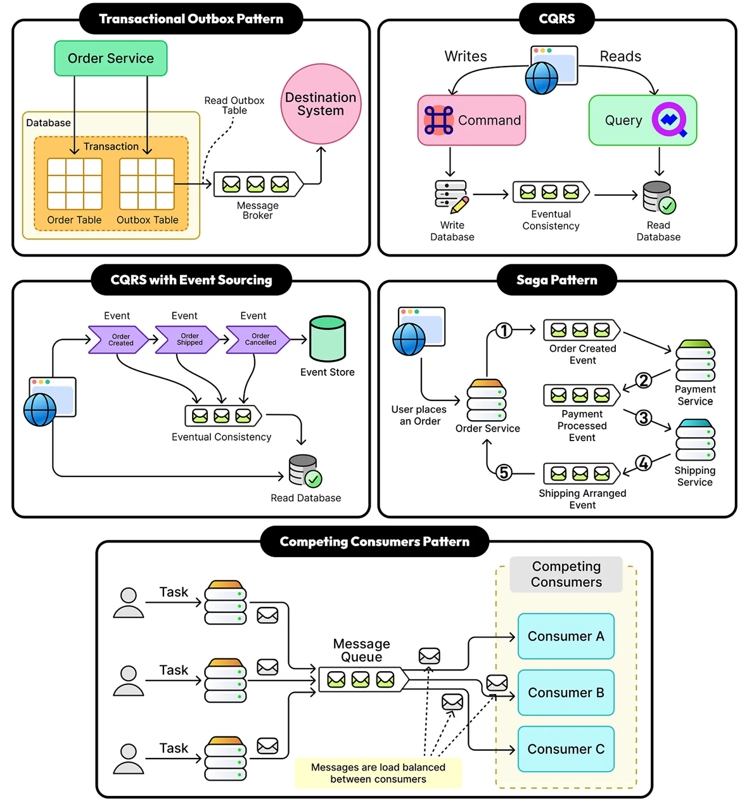

🔹 **Transactional Outbox**: Service writes business data and an outbox message in the same DB transaction → broker later publishes the message → guarantees no data–message mismatch  
🔹 **CQRS**: Commands write data to a write model → queries read from a separate read model → each side scales and optimizes independently
🔹 **CQRS + Event Sourcing**: System stores every change as an immutable event → events are replayed to build read models → full history and auditability preserved  
🔹 **Saga Pattern**: Business process runs as a sequence of steps → each step emits the next → failures trigger compensating actions to undo prior steps  
🔹 **Competing Consumers**: Multiple consumers pull messages from the same queue → each message is processed by one consumer → throughput and fault tolerance increase

---

#### Mixin

References: [Python docs - *Multiple inheritance & MRO*](https://docs.python.org/3/tutorial/classes.html#multiple-inheritance) | [Bracha & Cook - *Mixin-based Inheritance* (OOPSLA 1990)](https://dl.acm.org/doi/10.1145/97945.97982)

**Mixin** = Interface + actual implementation. It is a class that provides reusable methods/behavior to other classes without requiring full inheritance.

---

#### Network Design 101

References: [Cisco - *Networking Basics: Routing Protocols*](https://www.cisco.com/c/en/us/products/ios-nx-os-software/ios-routing-protocols.html) | [RFC 4271 - BGP-4](https://www.rfc-editor.org/rfc/rfc4271) | [RFC 2328 - OSPF v2](https://www.rfc-editor.org/rfc/rfc2328) | [Tanenbaum - *Computer Networks*](https://www.pearson.com/en-us/subject-catalog/p/computer-networks/P200000003152)

🔹**Routing Protocols**

1. Internal routing  
RIPv2 – Distance-vector, small networks  
OSPF – Link-state, fast internal routing  
EIGRP – Cisco hybrid, efficient IGP  
2. External routing  
BGP – Inter-domain routing, policy-based  

🔹**Network Functions / Devices**

NAT – Private ↔ public IP translation  
PAT (NATP) – Many private IPs → one public IP  
L2 Switch – MAC-based forwarding  
L3 Switch – Routing + switching combined  
VLAN – Logical network segmentation  
ICMP – Network error & reachability checks  
SNMP – Device monitoring & alerts  
ARP – IP → MAC address resolution  

🔹**VLAN vs VNET vs VPC**

In classic networking, VLANs are used for internal traffic segmentation, while a virtual network (referred to here as VNet) focuses on subnetting and routing. In public cloud, VPC (AWS/GCP) and VNet (Azure) represent tenant-scoped network, service, and security boundaries. These constructs operate at different abstraction levels and should not be treated as the same object, as they serve different roles in each context.

🔹**E2E Network flow**

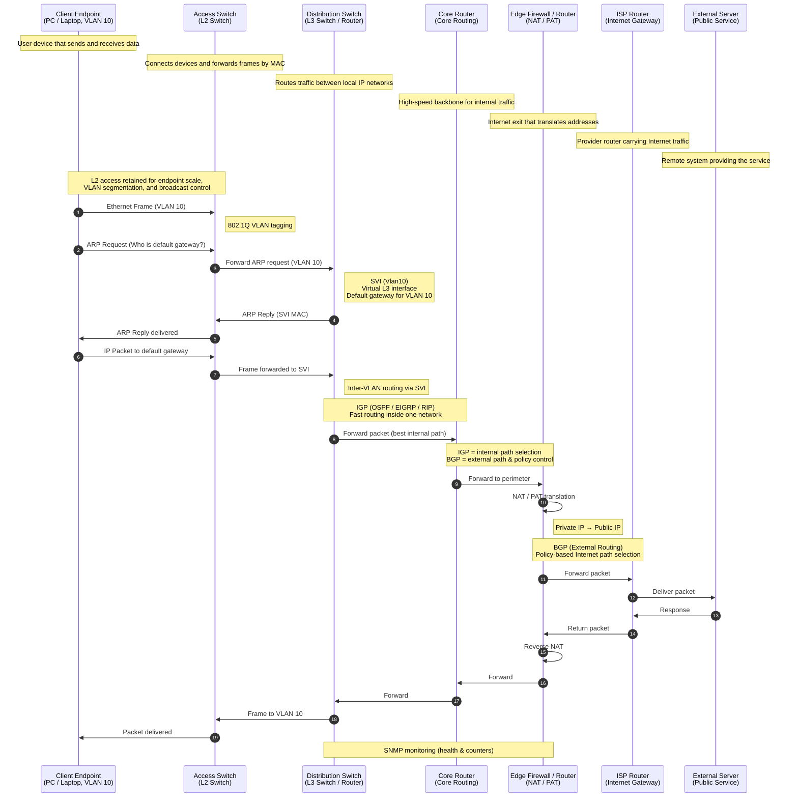
```mermaid
sequenceDiagram
    autonumber

    participant Host as Client Endpoint<br/>(PC / Laptop, VLAN 10)
    participant L2 as Access Switch<br/>(L2 Switch)
    participant L3 as Distribution Switch<br/>(L3 Switch / Router)
    participant Core as Core Router<br/>(Core Routing)
    participant Edge as Edge Firewall / Router<br/>(NAT / PAT)
    participant ISP as ISP Router<br/>(Internet Gateway)
    participant Remote as External Server<br/>(Public Service)

    %% --- Participant Notes (Layman) ---
    Note over Host: User device that sends and receives data
    Note over L2: Connects devices and forwards frames by MAC
    Note over L3: Routes traffic between local IP networks
    Note over Core: High-speed backbone for internal traffic
    Note over Edge: Internet exit that translates addresses
    Note over ISP: Provider router carrying Internet traffic
    Note over Remote: Remote system providing the service

    %% --- Design Rationale ---
    Note over Host,L2: L2 access retained for endpoint scale,<br/>VLAN segmentation, and broadcast control

    %% --- L2 / VLAN / ARP ---
    Host->>L2: Ethernet Frame (VLAN 10)
    Note right of L2: 802.1Q VLAN tagging

    Host->>L2: ARP Request (Who is default gateway?)
    L2->>L3: Forward ARP request (VLAN 10)

    %% --- SVI ---
    Note right of L3: SVI (Vlan10)<br/>Virtual L3 interface<br/>Default gateway for VLAN 10

    L3->>L2: ARP Reply (SVI MAC)
    L2->>Host: ARP Reply delivered

    %% --- L3 Routing ---
    Host->>L2: IP Packet to default gateway
    L2->>L3: Frame forwarded to SVI
    Note right of L3: Inter-VLAN routing via SVI

    %% --- Internal Routing ---
    Note over L3,Core: IGP (OSPF / EIGRP / RIP)<br/>Fast routing inside one network
    L3->>Core: Forward packet (best internal path)

    %% --- IGP vs BGP Explanation ---
    Note over Core,Edge: IGP = internal path selection<br/>BGP = external path & policy control

    %% --- Edge / NAT ---
    Core->>Edge: Forward to perimeter
    Edge->>Edge: NAT / PAT translation
    Note right of Edge: Private IP → Public IP

    %% --- External Routing ---
    Note over Edge,ISP: BGP (External Routing)<br/>Policy-based Internet path selection
    Edge->>ISP: Forward packet
    ISP->>Remote: Deliver packet

    %% --- Return Traffic ---
    Remote->>ISP: Response
    ISP->>Edge: Return packet
    Edge->>Edge: Reverse NAT
    Edge->>Core: Forward
    Core->>L3: Forward
    L3->>L2: Frame to VLAN 10
    L2->>Host: Packet delivered

    %% --- Monitoring ---
    Note over L3,Edge: SNMP monitoring (health & counters)
```

---

#### OKR (From OKR to Work item)

References: [John Doerr - *Measure What Matters*](https://www.whatmatters.com/) | [Google re:Work - OKR guide](https://rework.withgoogle.com/guides/set-goals-with-okrs/) | [Shape Up - *Basecamp*](https://basecamp.com/shapeup) | [SAFe - *PI Planning & Epics*](https://framework.scaledagile.com/epic)

🔹**Core point:** OKRs don’t map directly to tasks. There’s a chain in between.  
🔹**Hierarchy (simplified):**

```
Vision → Strategy → OKR (Objective + Key Results)
→ Initiative → Epic → Story → Task
```

🔹**Key meanings (ultra-brief):**  

* **Objective** = what you want (qualitative)
* **Key Result** = how you measure success (quantitative)
* **Initiative** = major approach to move a KR
* **Epic** = big chunk of work
* **Story** = user-level deliverable
* **Task** = dev-level action

🔹**Example:**

```
KR: Checkout failure rate < 0.8%
  → Initiative: Improve payment reliability
    → Epic: Retry system
      → Story: Auto-retry failed payments
        → Task: Implement backoff logic
```

🔹**Important:**
KRs measure outcomes (e.g., failure rate ↓), not outputs (e.g., “build retry system”).

---

#### OLAP vs OLTP

References: [IBM - *OLAP vs OLTP: What's the difference?*](https://www.ibm.com/think/topics/olap-vs-oltp)

🔹**OLAP**: Used for complex data analysis and business reporting, such as financial analysis and sales forecasting.  
🔹**OLTP**: Used for real-time processing of online transactions, including everyday transactions like ATM withdrawals and in-store purchases.

---

#### Passkey

References: [FIDO Alliance - *Passkeys*](https://fidoalliance.org/passkeys/) | [W3C - *Web Authentication (WebAuthn) Level 3*](https://www.w3.org/TR/webauthn-3/)

**Passkey**: Passwordless authentication using cryptographic key pairs (public/private keys). More secure than passwords—phishing-resistant, no reuse, no shared secrets.  
🔹How it Works: Device generates key pair → Private key stays on device, public key on server → Server sends challenge → Device signs with private key → Server verifies signature  
🔹Key Benefits: Phishing-resistant (domain-bound), unique per account, biometric/PIN authentication, synced across devices  
🔹Technology: FIDO2/WebAuthn standards, public key cryptography  
🔹Implementations: Apple (iCloud Keychain), Google (Password Manager), Microsoft (Windows Hello), 1Password, Dashlane, Bitwarden  

---

#### Popular Enterprise Architecture Frameworks

References: [DZone - *Popular Enterprise Architecture Frameworks*](https://dzone.com/articles/popular-enterprise-architecture-frameworks) | [The Open Group - *TOGAF Standard*](https://www.opengroup.org/togaf) | [Zachman International - *The Zachman Framework*](https://www.zachman.com/about-the-zachman-framework)

🔹TOGAF, Zachman, Federal Enterprise Architecture (FEA), Gartner Enterprise Architecture Framework, Business Architecture Guild's BIZBOK, Department of Defense Architecture Framework (DoDAF), ArchiMate, and Sherwood Applied Business Security Architecture (SABSA).

---

#### Principles & Concepts: YAGNI, KISS, DRY, CAP, PACELC, ACID, BASE

References: [Martin Fowler - *Yagni*](https://martinfowler.com/bliki/Yagni.html) | [Andy Hunt & Dave Thomas - *The Pragmatic Programmer* (DRY)](https://pragprog.com/titles/tpp20/the-pragmatic-programmer-20th-anniversary-edition/) | [Brewer - *CAP Twelve Years Later*](https://www.infoq.com/articles/cap-twelve-years-later-how-the-rules-have-changed/) | [Abadi - *Consistency Tradeoffs in Modern Distributed Database System Design (PACELC)*](https://www.cs.umd.edu/~abadi/papers/abadi-pacelc.pdf)

🔹 **YAGNI (You Aren't Gonna Need It)**: Don’t add features until necessary.  
🔹 **KISS (Keep It Simple, Stupid)**: Keep designs simple.  
🔹 **DRY (Don't Repeat Yourself)**: Avoid code duplication.  
🔹 **CAP Theorem (Consistency, Availability, Partition Tolerance)**: Choose between consistency, availability, and partition tolerance.  
🔹 **PACELC (Partition Tolerance, Availability, Consistency, Else Latency/Consistency)**: Trade-offs exist in availability/consistency and latency/consistency.  
🔹 **ACID (Atomicity, Consistency, Isolation, Durability)**: Properties ensuring reliable database transactions.  
🔹 **BASE (Basically Available, Soft State, Eventually Consistent)**: Prioritizes availability and eventual consistency in distributed systems.  

---

#### Public Cloud Security Services (TCP/IP Model)

References: [Microsoft - *Azure security baseline*](https://learn.microsoft.com/en-us/security/benchmark/azure/) | [AWS - *Security, Identity & Compliance*](https://aws.amazon.com/products/security/) | [Google Cloud - *Security products*](https://cloud.google.com/security)

Public cloud security services mapped to the TCP/IP model

| **TCP/IP Layer**                            | **Azure**                                                                                                                                     | **AWS**                                                                                                                               | **GCP**                                                                                                                                                 |
| ------------------------------------------- | --------------------------------------------------------------------------------------------------------------------------------------------- | ------------------------------------------------------------------------------------------------------------------------------------- | ------------------------------------------------------------------------------------------------------------------------------------------------------- |
| **1. Network Interface (Link)**             | - **VNet/Subnets** <br> - Private Endpoints <br> - NIC configurations                                                                         | - **VPC/Subnets** <br> - PrivateLink <br> - ENI (Elastic Network Interfaces)                                                          | - **VPC/Subnets** <br> - Private Service Connect <br> - VPC Network Interfaces                                                                          |
| **2. Internet Layer (IP & Routing)**        | - NSG (Network Security Groups) <br> - Azure Firewall <br> - Route Tables <br> - VPN Gateway / ExpressRoute                                   | - Security Groups (Inbound/Outbound IP filtering) <br> - AWS Network Firewall <br> - Route Tables <br> - VPN / Direct Connect         | - VPC Firewall Rules <br> - Cloud Armor (IP-based) <br> - Routes <br> - VPN / Interconnect                                                              |
| **3. Transport Layer (Ports, Sessions)**    | - NSG Port-level control <br> - Load Balancer Probes <br> - Azure Firewall Port Rules                                                         | - Security Groups Port filtering <br> - Network Load Balancer Health Checks <br> - Firewall Rules                                     | - Firewall Rules (Port/Protocol) <br> - Load Balancer Health Checks <br> - Cloud Armor (some transport-layer protections)                               |
| **4. Application Layer (Identity, Access)** | - Azure AD <br> - RBAC (Role-Based Access Control) <br> - Conditional Access <br> - Key Vault <br> - API Management <br> - Defender for Cloud | - AWS IAM <br> - Resource Policies <br> - Cognito (Identity) <br> - KMS (Key Management) <br> - API Gateway security <br> - GuardDuty | - Cloud IAM <br> - Resource Policies <br> - Identity-Aware Proxy <br> - Secret Manager / KMS <br> - API Gateway Security <br> - Security Command Center |

---

#### Push & Pull Model in Azure

References: [Microsoft - *Event Grid vs Event Hubs vs Service Bus*](https://learn.microsoft.com/en-us/azure/event-grid/compare-messaging-services) | [Microsoft - *Cosmos DB Change Feed*](https://learn.microsoft.com/en-us/azure/cosmos-db/change-feed)

Push & Pull model in Azure

| Service                 | Push Model                                      | Pull Model                             |
| ----------------------- | ----------------------------------------------- | -------------------------------------- |
| **Cosmos DB**           | Change Feed → Azure Function/Event Grid         | SDK Queries / SQL-like polling         |
| **Azure Blob Storage**  | Event Grid notifications → Function, Logic Apps | Manual polling or listing blobs        |
| **Azure Event Hubs**    | Downstream consumers get real-time events       | Some apps read older offsets on demand |
| **Azure Queue Storage** | Function triggers when new messages arrive      | App polls queue for messages           |
| **Azure Table Storage** | Change detection via Event Grid (limited)       | Query with filters for updates         |
| **SQL Database**        | Change Tracking / CDC with Event Grid triggers  | App polls with timestamp-based queries |
| **Azure Data Lake**     | Event Grid for file events                      | Manual folder scanning via SDK/API     |

---

#### RBAC vs ReBAC

References: [NIST - *Role-Based Access Control (RBAC)*](https://csrc.nist.gov/projects/role-based-access-control) | [Google - *Zanzibar: Google's Consistent, Global Authorization System* (USENIX ATC '19)](https://research.google/pubs/zanzibar-googles-consistent-global-authorization-system)

🔹**RBAC** (Role-Based Access Control) is an authorization model that assigns permissions based on predefined roles. On the other hand,   🔹**ReBAC** (Relationship-Based Access Control) extends RBAC's capabilities by considering relationships between entities.

---

#### Reactive Programming vs Event-Driven Architecture

References: [reactiveweb.org - *Reactive Programming vs Event-Driven: Key Differences*](https://reactiveweb.org/reactive-programming-vs-event-driven-key-differences/) | [*The Reactive Manifesto*](https://www.reactivemanifesto.org/)  
🔹**Event-Driven**: Handles user actions or system events. More general and can be used in any context where an event occurs  
🔹**Reactive**: Data-driven approach. managing data streams and propagating changes, like in a spreadsheet model.

---

#### Real-time Communication and Messaging (MQTT, AMQP and WebSocket)

References: [CloudAMQP - *AMQP vs MQTT*](https://www.cloudamqp.com/blog/amqp-vs-mqtt.html) | [MQTT v5 Spec (OASIS)](https://docs.oasis-open.org/mqtt/mqtt/v5.0/mqtt-v5.0.html) | [AMQP 0-9-1 Spec](https://www.rabbitmq.com/tutorials/amqp-concepts) | [RFC 6455 - WebSocket Protocol](https://www.rfc-editor.org/rfc/rfc6455)  
🔹**MQTT** (Message Queuing Telemetry Transport): Lightweight messaging protocol, uses publish-subscribe model, ideal for IoT and M2M communication. Three levels of Quality of Service (QoS): "At most once" (QoS 0), "At least once" (QoS 1), and "Exactly once" (QoS 2).  
🔹**AMQP** (Advanced Message Queuing Protocol): Open-standard application layer protocol, robust message delivery, routing, and security features. Two qualities of service: "At most once (delivered once or lost)" and "At least once (delivered one or more times.)".  
🔹**WebSocket**: Enables full-duplex communication channels over a single TCP connection

---

#### Scaling a system 101

References: [AlgoMaster - *Scaling a System from 0 to 10 Million Users*](https://blog.algomaster.io/p/scaling-a-system-from-0-to-10-million-users) | [AWS - *Web Application Hosting: Scaling*](https://docs.aws.amazon.com/wellarchitected/latest/framework)

| Stage | Users | Strategic Focus | Architecture | Primary Bottleneck | Key Techniques | Core Takeaway |
|-------|-------|-----------------|--------------|-------------------|----------------|---------------|
| **1 – Single Server** | 0 – 100 | Ship fast | Everything on one VM | Dev speed, no load yet | Monolith, single VM + DB (e.g. $20–50/mo VPS), reverse proxy (Nginx) | Optimize for iteration speed, not scalability. Don't over-engineer. |
| **2 – Separate DB** | 100 – 1K | Stabilize | App server + dedicated DB | App & DB compete for same CPU/memory | Move DB to its own server (managed: RDS/Supabase), connection pooling (PgBouncer) | Isolate DB resource contention; use managed services to save ops time. |
| **3 – Load Balancer + Horizontal Scale** | 1K – 10K | Handle burst | Stateless app tier behind LB | Single app server is a SPOF | Add load balancer, 2+ stateless app servers, shared session store (Redis), auto-scaling group | Make app tier stateless so any server can handle any request. |
| **4 – Caching + CDN** | 10K – 100K | Protect DB | Read-heavy architecture | DB read saturation | CDN for static assets, cache-aside with Redis/Memcached, read replicas, DB query optimization | 80–90%+ of reads can be served from cache; CDN removes static load entirely. |
| **5 – Async + Queues** | 100K – 1M | Automate | Stateless + event-driven | Traffic spikes, slow write paths | Message queues (SQS/RabbitMQ), async workers (Celery/Sidekiq), rate limiting, auto-scaling policies | Decouple slow/heavy work from the request path; absorb traffic spikes via queues. |
| **6 – Microservices + CQRS** | 1M – 10M | Reliability | Service-oriented + CQRS | Monolith deployment risk, DB write contention | Break into microservices, CQRS (separate read/write models), event sourcing, per-service DBs | Enables independent deployments and scaling; adds operational complexity. |
| **7 – Multi-region + Sharding** | 10M+ | Global resilience | Distributed global systems | Latency, cross-region reliability, single-DB limits | Multi-region deployment (active-active/active-passive), DB sharding, global CDN, data locality policies | Shift focus from performance → reliability & user-perceived latency by geography. |

---

#### Security Words 101

References: [Microsoft - *Security documentation*](https://learn.microsoft.com/en-us/security/) | [NIST - *Cybersecurity Framework*](https://www.nist.gov/cyberframework) | [OWASP - *Top Ten*](https://owasp.org/www-project-top-ten/)

- **Identity and Access Management**  
🔹 **MIM/PAM**: Microsoft Identity Manager / Privileged Access Management  
🔹 **PAW**: Privileged Account Workstations  
🔹 **AADIS**: Azure Active Directory Implementation Services  
🔹 **DIAD**: Design and Implementation for Azure Active Directory  
🔹 **LAPS/SLAM**: Local Administrator Password Solution / Security Lifecycle Automation & Management  
🔹 **IAM**: Identity and Access Management  
🔹 **SSO**: Single Sign-On  
🔹 **MFA**: Multi-Factor Authentication  
🔹 **SSPR**: Self-Service Password Reset  

- **Threat Detection and Response**  
🔹 **ATA**: Advanced Threat Analytics  
🔹 **PADS**: Persistent Advisory Detection Service  
🔹 **IR&R**: Incident Response & Recovery  
🔹 **ATP**: Advanced Threat Protection  
🔹 **OMS**: Operations Management Suite  
🔹 **ETD**: Enterprise Threat Detection  
🔹 **SIEM**: Security Information and Event Management  
🔹 **EDR**: Endpoint Detection and Response  
🔹 **XDR**: Extended Detection and Response  
🔹 **SCEP**: System Center Endpoint Protection (Microsoft Defender for Endpoint)  

- **Information Protection**  
🔹 **AIP**: Azure Information Protection (=AD RMS+On-premise files)  
🔹 **AD RMS**: Active Directory Rights Management Services  
🔹 **WIP**: Windows Information Protection  
🔹 **DLP**: Data Loss Prevention  
🔹 **IRM**: Information Rights Management  

- **Security Development and Assessment**  
🔹 **SDL**: Security Development Lifecycle  
🔹 **MSRA**: Microsoft Security Risk Assessment  
🔹 **DIF**: Dynamic Identity Framework  
🔹 **OAWSS**: Offline Assessment for Windows Server Security  
🔹 **OAADS**: Offline Assessment for Active Directory Security  
🔹 **SAST**: Static Application Security Testing  
🔹 **DAST**: Dynamic Application Security Testing  

- **Security Management**  
🔹 **ESAE**: Enhanced Security Administrative Environment  
🔹 **SCCM**: System Center Configuration Manager  
🔹 **EMS**: Enterprise Mobility Suite  
🔹 **SCOM/ACS**: System Center Operations Manager / Audit Collection Services  
🔹 **GRC**: Governance, Risk, and Compliance  
🔹 **SOC**: Security Operations Center  
🔹 **CSPM**: Cloud Security Posture Management  
🔹 **CIEM**: Cloud Infrastructure Entitlement Management  

---

#### SLA, SLO, and SLI

References: [Google - *SRE Book: Service Level Objectives*](https://sre.google/sre-book/service-level-objectives/)

🔹**SLA** (Service Level Agreement): A contract defining the expected level of service. `99.9% uptime`  
🔹**SLO** (Service Level Objective): A measure of service performance agreed upon in an SLA. `200ms response`  
🔹**SLI** (Service Level Indicator): A quantitative measure of a specific aspect of the level of service. `Query latency`

---

#### Slowly Changing Dimensions (SCD)

References: [Ralph Kimball - *The Data Warehouse Toolkit*](https://www.kimballgroup.com/data-warehouse-business-intelligence-resources/books/data-warehouse-dw-toolkit/)

**Slowly Changing Dimensions** change over time, but at a slow pace and unpredictably. For example, a customer's address in a retail business.

| Type | Strategy | Description | Trade-off |
| ---- | -------- | ----------- | --------- |
| **SCD Type 0** | Retain original | Dimension values never change; original value is always preserved. | No history; ignores real-world changes. |
| **SCD Type 1** | Overwrite | Old value is replaced with the new value; no history kept. | Simple to implement; history is lost. |
| **SCD Type 2** | Add new row | A new row is inserted for each change; old row is marked inactive (with `start_date` / `end_date` or `is_current` flag). | Full history preserved; table can grow large. |
| **SCD Type 3** | Add new column | A new column stores the previous value alongside the current value. | Limited history (only one prior value). |

---

#### Software Defined Networking (SDN)

References: [ONF - *Software-Defined Networking Definition*](https://opennetworking.org/sdn-definition/) | [McKeown et al. - *OpenFlow: Enabling Innovation in Campus Networks* (SIGCOMM CCR, 2008)](https://dl.acm.org/doi/10.1145/1355734.1355746)

🔹Northbound vs Southbound  

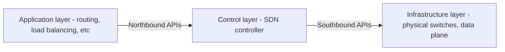
```mermaid
graph LR
    A[Application layer - routing, load balancing, etc] -->|Northbound APIs| B[Control layer - SDN controller]
    B -->|Southbound APIs| C[Infrastructure layer - physical switches, data plane]
```

🔹The **Controller** is the SDN network's brain, directing traffic flows.  
🔹 The **Southbound Interface** communicates the controller's decisions to the switches using protocols like OpenFlow.  
🔹**SDN Switches** direct traffic based on the controller's instructions.  
🔹**Network Devices** (servers, routers, etc.) send and receive data flows as directed by the SDN switches.  
🔹The **Northbound Interface** uses APIs to exchange data between the controller and applications.  
🔹**SDN Applications** use network data to perform tasks, communicating their needs to the controller.

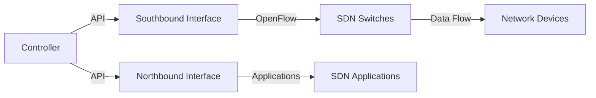
```mermaid
graph LR
A[Controller] -- API --> B[Southbound Interface]
B -- OpenFlow --> C[SDN Switches]
C -- Data Flow --> D[Network Devices]
A -- API --> E[Northbound Interface]
E -- Applications --> F[SDN Applications]
```

---

#### Space-Based Architecture vs Cell-Based Architecture

References: [Mark Richards - *Software Architecture Patterns* (O'Reilly)](https://www.oreilly.com/library/view/software-architecture-patterns/9781491971437/) | [AWS - *Reducing the Scope of Impact with Cell-Based Architecture*](https://docs.aws.amazon.com/wellarchitected/latest/reducing-scope-of-impact-with-cell-based-architecture/reducing-scope-of-impact-with-cell-based-architecture.html)

🔹 **Space-Based Architecture** (SBA): Removing the database and instead using a shared memory (memory grids) model  
🔹 **Cell-based architecture**: multiple isolated workload instances (cells) for fault isolation and handling subsets of workload requests

---

#### SSG: Static site generator list

References: [Jamstack - *Site Generators*](https://jamstack.org/generators/) | [Netlify - *What is a Static Site Generator?*](https://www.netlify.com/blog/2020/04/14/what-is-a-static-site-generator-and-3-ways-to-find-the-best-one/)

🔹A tool that generates a full static HTML website based on raw data and a set of templates.

---

#### SSO (Single Sign-On)

References: [OAuth 2.0 - RFC 6749](https://www.rfc-editor.org/rfc/rfc6749) | [OpenID Connect Core 1.0](https://openid.net/specs/openid-connect-core-1_0.html) | [SAML 2.0 (OASIS)](https://docs.oasis-open.org/security/saml/v2.0/saml-core-2.0-os.pdf)

**SSO**: an authentication scheme that allows a user to log in with a single ID and password to any of several related, yet independent, software systems.

🔹 **SSO workflow, Types of SSO, SSO Implementations**  

🔹SSO workflow: Identity Provider (IdP), Service Provider (SP), SSO Server
- IdP: Central Authentication server e.g., Google
- SP: Individual Applications rely on SSO e.g, Trello
- SSO Server: Bridge between IdP and SPs

🔹Types of SSO: SAML, OAuth (Open Authorization) 2.0, Open ID Connect (OIDC)

| Protocol | Purpose | Token Format | - |
| --- | --- | --- | --- |
| OAuth 2.0 | Open standard for Authorization | Access Tokens | Temporary access to 3rd party app |
| OpenID Connect (OIDC) | Open standard for Authentication | JSON Web Token (JWT) | Newer type of SSO based on OAuth 2.0, Straightforward protocol than SAML |
| SAML | Authentication, Authorization | XML | Most common, Use SAML Protocol to exchange authentication between SSO server and SP |

🔹Some other Types of SSO: Kerberos, Smart card authentication
- Kerberos: Less suitable for internet-facing SSO due to the shared secret between KDC (Key Distributin Center) and all participants.
- Smart card authentication: Physical card

🔹SSO Implementations: Microsoft Entra ID (FKA Micorsoft Active Directory), Okta, Ping Identity, OneLogin, Auth0

---

#### Star Schema

References: [Microsoft Power BI - *Star schema guidance*](https://learn.microsoft.com/en-us/power-bi/guidance/star-schema) | [Ralph Kimball - *The Data Warehouse Toolkit*](https://www.kimballgroup.com/data-warehouse-business-intelligence-resources/books/data-warehouse-dw-toolkit/)

The **Star Schema** is a data model for data warehouses. It has a central fact table for measurable data and surrounding dimension tables for descriptive data.

---

#### System Design Patterns 101

References: [Martin Kleppmann - *Designing Data-Intensive Applications*](https://dataintensive.net/) | [Microsoft - *Azure Architecture Center: Cloud Design Patterns*](https://learn.microsoft.com/en-us/azure/architecture/patterns/) | [AWS - *Well-Architected Framework*](https://docs.aws.amazon.com/wellarchitected/latest/framework/welcome.html) | [Google - *Site Reliability Engineering (SRE) Book*](https://sre.google/sre-book/table-of-contents/) | [Alex Xu - *System Design Interview*](https://bytebytego.com/) | [Sam Newman - *Building Microservices*](https://samnewman.io/books/building_microservices_2nd_edition/)

> Within a category, patterns are roughly ordered from *simple to complex*. Cross-references (→ see) point to related patterns in other categories. 

🔹**1. Scalability & Traffic Distribution** — *The problem: one server cannot handle the load.*

| Pattern | Problem it solves | Key trade-off | Real usage |
|---|---|---|---|
| **Vertical Scaling** | Simple: buy a bigger machine. Fast first step. | Hard ceiling; single point of failure (SPOF); downtime during upgrade. | Small services, DBs early-stage |
| **Horizontal Scaling** | Add more machines; no ceiling; survives node failures. | Requires stateless app tier; needs a load balancer in front; session state must be externalised (→ Cache). | Every large web service |
| **Load Balancing** | Route requests across multiple instances so no one server is overwhelmed. L4 routes on IP/TCP; L7 routes on HTTP headers, URL, cookie. | L7 adds latency overhead; sticky sessions trade off server-side statefulness for routing complexity. | Nginx, HAProxy, AWS ALB/NLB |
| **Consistent Hashing** | Assign data to nodes on a virtual ring so that when a node joins/leaves, only `k/n` keys move instead of remapping everything. | Virtual nodes add implementation complexity. Must handle hotspots (use vnodes or bounded load). | DynamoDB, Cassandra, CDN routing |
| **Sharding / Partitioning** | Split a huge dataset across many DB nodes by a shard key (range, hash, or directory). Each node owns its slice. | Joins across shards are expensive or impossible; re-sharding live data is painful; shard key choice is permanent. Relates to: Consistent Hashing for assignment. | Instagram user IDs, Uber geohash sharding |
| **Replication** | Copy data to multiple nodes for fault-tolerance and read scale. Leader-follower = one writer, many readers. Multi-leader = multiple writable regions. Leaderless = quorum writes (Dynamo). | Replication lag; conflict resolution for multi-leader; quorum latency vs. availability. Relates to: Consistency & Coordination. | PostgreSQL streaming replication, Cassandra, DynamoDB |

🔹**2. Caching** — *The problem: your database cannot serve every read fast enough.*

> Caching is a read optimisation — it trades consistency risk for latency and throughput gains. The hardest part is cache invalidation.

| Pattern | Problem it solves | Key trade-off |
|---|---|---|
| **Cache-Aside** (lazy load) | App checks cache first; on miss fetches from DB and writes result into cache. Cache is populated only for data that is actually requested. | Cold start miss storm; stale data if DB changes while cache holds old value. TTL or explicit invalidation needed. |
| **Write-Through** | Every DB write also updates the cache synchronously. Cache is always fresh. | Latency on every write; cache fills with data that may never be read. |
| **Write-Back** (write-behind) | Write hits cache only; cache asynchronously flushes to DB. Very low write latency. | Risk of data loss if cache node fails before flush. Only safe with durable cache (Redis AOF). |
| **Write-Around** | Writes go directly to DB, bypassing cache. Cache is filled on next read. | High read-miss rate for newly written data; good for write-heavy, rare-read patterns (e.g., logs). |
| **CDN** | Cache static and semi-static assets at edge nodes close to users, cutting origin load and latency. | Purge/invalidation is slow and complex; dynamic personalised content cannot be cached naïvely. |
| **Eviction policies** | Control what is removed when cache is full. LRU (Least Recently Used) fits general workloads. LFU (Least Frequently Used) fits skewed hot-key patterns. TTL is mandatory for freshness. | Wrong policy causes cache thrashing or stale data. |

> **Relation to other categories**: Cache-Aside + Read Replicas (Data Storage) together serve most read-heavy systems. CQRS read models (Async & Event-Driven) can be thought of as a persistent, queryable cache.

🔹**3. Asynchronous & Event-Driven** — *The problem: synchronous calls couple services tightly and fail together under load spikes.*

> The core idea: the producer does not wait for the consumer. This enables buffering, fan-out, and independent scaling.

| Pattern | Problem it solves | Key trade-off | Relates to |
|---|---|---|---|
| **Message Queue** | Buffer requests from producers; consumers pull at their own pace. Absorbs traffic bursts. | At-least-once delivery means consumers must be idempotent. Message ordering is not guaranteed unless a FIFO queue is used. | Rate Limiting (4), Idempotency Keys (4) |
| **Pub/Sub** | One event fans out to many independent subscribers (e.g., "order placed" triggers billing, inventory, notification services simultaneously). | Subscribers must be robust to out-of-order or duplicate events. Operational complexity: dead-letter queues, schema versioning. | CQRS below |
| **Event Sourcing** | Instead of storing current state, store every state-change event. Replay events to rebuild state at any point in time. Enables full audit log and temporal queries. | Querying current state requires replaying (or building a projection). High event volume; schema evolution is tricky. | CQRS (projections are the read model), Transactional Outbox |
| **CQRS** (Command Query Responsibility Segregation) | Separate the *write* model (commands, business rules) from *read* models (denormalised projections optimised for queries). Each side scales independently. | Eventual consistency between write and read sides — reads may lag slightly behind writes. Adds complexity: two models to maintain. | Event Sourcing (write-side events build the read model), Pub/Sub (events propagate changes) |
| **Saga** | Manage a long-running distributed transaction across multiple services without a global lock. Each step publishes a success event; on failure, compensating transactions undo prior steps. Two flavours: *choreography* (each service reacts to events) vs. *orchestration* (a central coordinator directs). | Compensating transactions can be complex and may not fully undo side effects (e.g., emails already sent). | 2PC vs Saga (Consistency §5) |
| **Transactional Outbox** | When a service writes to its DB and must also publish an event, doing both atomically is impossible across two systems. Write the event to an *outbox* table in the same DB transaction; a relay process publishes it. | Adds an outbox table and a relay/CDC process; slight latency in event delivery. | Event Sourcing, Saga |

🔹**4. Reliability & Resilience** — *The problem: distributed systems fail partially and unexpectedly.*

> These patterns assume downstream calls *will* fail. Goal: contain blast radius and recover gracefully.

| Pattern | Problem it solves | Key trade-off |
|---|---|---|
| **Retry + Exponential Backoff + Jitter** | Transient failures (network blips) are retried automatically. Exponential backoff avoids hammering a recovering service. Jitter randomises retry timing so all clients don't retry simultaneously (thundering herd). | Must not retry non-idempotent operations unless idempotency keys are used. |
| **Circuit Breaker** | When a downstream service is failing, stop sending requests instead of queuing indefinitely. The circuit "opens" after a failure threshold; periodically sends probe requests to detect recovery and "closes" again. | False positives (brief spike) can open the circuit unnecessarily; requires careful threshold tuning. |
| **Bulkhead** | Isolate resource pools (thread pools, connection pools, or entire service instances) per consumer so one misbehaving caller cannot exhaust resources for everyone. Named after ship compartments. | More infrastructure to manage; fine-grained isolation adds latency via context switches. |
| **Timeouts & Deadlines** | Every outbound call must have a timeout. Propagate a *deadline* (absolute timestamp) across service hops so the entire call chain fails fast if the end-to-end budget is exceeded. | Too tight = false failures on slow-but-valid operations. Too loose = cascading slowdowns. |
| **Idempotency Keys** | A client generates a unique key per operation. The server deduplicates using it, so retries are safe even for non-idempotent operations like payments or order placement. | Server must persist seen keys (with TTL); adds storage and lookup overhead. |
| **Rate Limiting & Throttling** | Protect a service from being overwhelmed. *Token Bucket*: allows bursts up to bucket size, refills at a steady rate. *Leaky Bucket*: smooths bursts into constant rate. *Sliding Window*: counts requests in a rolling time window. | Per-user vs. global limits; rate limit storage at distributed scale requires Redis or similar. |
| **Backpressure** | When consumers are slow, instead of queuing requests unboundedly (leading to OOM or latency spikes), the system signals producers to slow down. Common in streaming pipelines. | Requires protocol support (TCP has it built-in; HTTP/2 has flow control; gRPC streams support it). |

> **Relation between patterns**: Retry → needs Idempotency Keys to be safe. Circuit Breaker wraps the Retry to stop pointless retries when the circuit is open. Bulkhead isolates the pool that the Circuit Breaker protects. Backpressure is upstream Rate Limiting by the producer side.

🔹**5. Consistency & Coordination** — *The problem: multiple nodes must agree on state, but networks are unreliable.*

| Pattern | Problem it solves | Key trade-off |
|---|---|---|
| **CAP Theorem** | Under a network **P**artition, choose **C**onsistency (refuse stale reads) or **A**vailability (serve possibly stale reads). You cannot have both simultaneously. | Most real systems choose AP with tunable consistency (e.g., DynamoDB, Cassandra). CP systems: HBase, Zookeeper. |
| **PACELC** | Extends CAP: *Even without* a partition (E), there is a trade-off between **L**atency and **C**onsistency. Lower latency = weaker consistency. | Guides replication design: synchronous replication = strong consistency, high latency; async = low latency, eventual consistency. |
| **ACID** | A single database transaction is Atomic, Consistent, Isolated, and Durable. Guarantees correctness but requires locking/MVCC. | Locking reduces throughput. Hard to achieve across microservices — use Saga instead of distributed ACID. |
| **BASE** | Basically Available, Soft state, Eventually consistent. Deliberately relaxes ACID for scale. Replicas will *converge* over time. | Business logic must tolerate temporary inconsistency (e.g., show slightly stale follower counts). |
| **Quorum (R + W > N)** | In a cluster of N replicas, require W nodes to confirm a write and R nodes to agree on a read. When R + W > N, at least one node overlaps, guaranteeing you see the latest write. | Tunable: strong (R=W=majority), eventual (W=1, R=1), read-optimised (W=N, R=1). |
| **Two-Phase Commit (2PC) vs Saga** | 2PC: coordinator locks all participants until all agree to commit — strong atomicity, but blocking (if coordinator crashes, participants stay locked). Saga: a chain of local transactions with compensations on failure — non-blocking, but only *eventual* correctness. | 2PC is used within a single DB engine or tightly coupled systems. Sagas are used across microservices. |
| **Consensus (Raft / Paxos)** | Elect a leader and replicate a log so all nodes agree on the same sequence of commands. Raft is designed for understandability; Paxos is more general. | Requires a quorum of nodes to be alive; adds write latency for leader roundtrip. |
| **Distributed Locks / Leases** | Ensure only one node executes a critical section at a time across a distributed system. A *lease* is a lock with a TTL, so it auto-expires if the holder crashes. | Redis Redlock has known correctness issues under clock drift; prefer etcd or ZooKeeper for strong guarantees. |

🔹**6. Data Storage Patterns** — *The problem: one storage engine cannot serve all access patterns efficiently.*

| Pattern | Problem it solves | Key trade-off |
|---|---|---|
| **OLTP vs OLAP** | OLTP (row-store, e.g., Postgres): optimised for fast point-reads and writes per transaction. OLAP (column-store, e.g., Redshift, BigQuery): optimised for aggregations across millions of rows. | Running analytical queries on an OLTP DB kills transactional performance. Solution: replicate to a separate OLAP store. |
| **Read Replicas** | Direct all reads to one or more follower replicas, offloading the primary. Enables horizontal read scale. | Replication lag means replicas may serve slightly stale data. Don't use for reads that must be linearisable (e.g., "check balance before debit"). |
| **Materialized Views** | Precompute and persist the result of a complex query so that reads are O(1) lookups instead of expensive joins. | Must be refreshed when source data changes (incremental refresh or full rebuild); adds write-path overhead. |
| **Write-Ahead Log (WAL)** | Before changing data on disk, write the intent to an append-only log. If the system crashes, the log is replayed to restore consistency. This is how virtually every DB achieves durability. | Log compaction is needed to prevent unbounded growth. Also the basis for CDC (Change Data Capture) streaming. |
| **Indexing** | Speed up reads by maintaining auxiliary data structures. B-Tree: balanced tree, good for range scans and point reads (PostgreSQL, MySQL). LSM Tree: write-optimised, high write throughput, merges in background (RocksDB, Cassandra). Inverted index: maps terms to document IDs (Elasticsearch, Lucene). | Every index slows writes and uses storage. Choose index type based on read vs. write ratio and query pattern. |
| **Polyglot Persistence** | Use the best storage engine for each access pattern within the same system: relational DB for transactions, Redis for session/cache, Elasticsearch for full-text search, S3/Blob for files. | Operational complexity; data synchronisation across stores; eventual consistency between them. |

🔹**7. Service Architecture** — *The problem: as systems grow, a monolith becomes a deployment and scaling bottleneck.*

| Pattern | Problem it solves | Key trade-off |
|---|---|---|
| **Monolith → Microservices** | Split a monolith into independently deployable services aligned to bounded contexts (DDD). Each team owns, deploys, and scales their service independently. | Operational overhead multiplies: service discovery, distributed tracing, network latency, distributed transactions. Don't split prematurely. |
| **API Gateway** | Single entry point for all clients. Handles cross-cutting concerns: authentication, rate limiting, SSL termination, request routing, and response aggregation. Clients talk to one endpoint regardless of how many backend services exist. | A gateway can become a bottleneck or SPOF; business logic must not leak into it. |
| **BFF (Backend-for-Frontend)** | Different clients (web, mobile, IoT) have different data shapes and bandwidth constraints. A dedicated backend per client type shapes responses optimally, avoiding over-fetching or under-fetching. | More backends to maintain; logic duplication risk; best when client needs genuinely diverge. |
| **Sidecar** | Inject cross-cutting concerns (mTLS, retries, logging, metrics) as a separate container alongside every service pod instead of implementing them in each service's code. This is the foundation of a service mesh (Envoy/Istio). | Adds per-pod resource overhead; observability complexity; requires orchestration (Kubernetes). |
| **Strangler Fig** | Gradually replace a legacy system by routing traffic to a new implementation piece by piece. The new system "strangles" the old one over time without a big-bang rewrite. | Requires a routing façade in front of both systems; both must run in parallel during migration. |
| **Anti-Corruption Layer (ACL)** | When integrating a new system with a legacy system that has a different domain model, place a translation layer between them. Prevents the legacy model's concepts from "corrupting" the new domain model. | Adds an integration layer to maintain; may become a bottleneck if it does heavy transformation. |

🔹**8. Probabilistic & Approximate Structures** — *The problem: exact answers at massive scale require prohibitive memory or I/O.*

> These structures trade exactness for dramatic memory/speed gains. Acceptable when "probably" or "approximately" is good enough — e.g., "has this user seen this ad?" or "how many unique visitors today?"

| Structure | What it answers | Memory | Error type |
|---|---|---|---|
| **Bloom Filter** | "Is this item definitely NOT in the set?" (or "maybe yes"). Uses k hash functions over a bit array. | O(m) bits — tiny. | False positives only. No false negatives. Used to avoid expensive disk lookups (e.g., Cassandra checks Bloom filter before SSTable read). |
| **HyperLogLog** | "Approximately how many distinct items have I seen?" | ~12 KB for ±2% error across billions of elements. | Cardinality estimate only. Used for daily active users, unique IPs. |
| **Count-Min Sketch** | "Approximately how often has this item appeared?" (frequency). Multiple hash arrays; take minimum across rows. | Sub-linear in number of distinct items. | Over-counts (never under-counts). Used for heavy-hitter detection (top trending URLs, fraud signals). |
| **Merkle Tree** | "Which parts of two large datasets differ?" Hash leaf nodes; combine hashes up the tree. Differ only in subtrees that differ. | O(n) nodes but fast diff: O(log n). | Exact — used for integrity verification. Git commits, DynamoDB anti-entropy, Bitcoin blocks. |

🔹**9. Deployment & Delivery** — *The problem: releasing new code carries risk; fast rollback is essential.*

| Pattern | Problem it solves | Key trade-off |
|---|---|---|
| **Blue/Green** | Run two identical production environments (Blue = current, Green = new). Switch traffic instantly via DNS/LB. Instant full rollback: just switch back. | Requires 2× infra cost during cutover; DB schema changes must be backward-compatible across both versions simultaneously. |
| **Canary Release** | Route a small percentage (e.g., 1–5%) of traffic to the new version. Monitor error rate, latency, and business metrics. Gradually increase if healthy. | Requires traffic-splitting infrastructure and robust monitoring; users in the canary may experience issues. |
| **Rolling Deployment** | Replace instances one-by-one. No extra infrastructure required. | Old and new versions run simultaneously during rollout; API/schema must be backward-compatible. Slower to roll back than Blue/Green. |
| **A/B Testing** | Route different user cohorts to different versions to compare a *business metric* (conversion rate, click-through), not just technical health. | Requires experimentation platform for consistent user assignment and statistical significance; not a release strategy for bug fixes. |
| **Feature Flags** | Decouple code deployment from feature release. Code ships to all users but feature is off by default; enabled per user/segment via config. Enables instant kill-switch. | Flag proliferation; old flag cleanup discipline required; adds conditional code complexity. |
| **Shadow Traffic** | Mirror live production traffic to the new version without serving its responses to users. Compares output and performance before cutover. | Doubles infrastructure cost during shadow period; stateful side effects must be suppressed in the shadow path (no real writes). |

🔹**10. Observability & Operations** — *The problem: distributed systems fail in unexpected ways; you need to understand what happened.*

| Pillar / Pattern | What it gives you | Key practice |
|---|---|---|
| **Metrics** | Aggregated numeric measurements over time (counters, gauges, histograms). Low overhead, high retention. | Instrument with Prometheus/OpenTelemetry. Track the four golden signals: latency, traffic, errors, saturation. |
| **Logs** | Structured or unstructured event records per operation. Rich detail; expensive at high volume. | Use structured JSON logs with correlation IDs so you can join logs to traces. |
| **Distributed Traces** | Track a single request as it travels across multiple services. Each service adds a span; spans form a tree with timing. | Requires trace context propagation (W3C TraceContext / B3). Tools: Jaeger, Zipkin, AWS X-Ray. |
| **SLI / SLO / SLA + Error Budget** | *SLI*: a measured metric (e.g., p99 latency, availability). *SLO*: the target (e.g., 99.9% requests < 200ms). *SLA*: a contractual commitment with financial penalties. *Error Budget* = 100% − SLO; the remaining budget governs how fast you can release. | Error budget policies: if budget is exhausted, freeze new features until reliability recovers. Aligns product and SRE incentives. |
| **Health Endpoint Monitoring** | Services expose `/health/live` (is the process alive?) and `/health/ready` (is it ready to serve traffic?). Orchestrators (k8s) use these for restarts and traffic routing. | Liveness ≠ readiness: a service can be alive but not ready (warming up cache, waiting for DB). Conflating them causes unnecessary restarts. |
| **Chaos Engineering** | Proactively inject failures (kill random pods, introduce latency, partition networks) in a controlled way to validate that resilience patterns (circuit breakers, retries, bulkheads) actually work. | Must have a steady-state hypothesis and automatic abort conditions; dangerous without strong observability in place first. |

---

#### System Design Terminology 101

References: [Neo Kim - *114 System Design Concepts (Part 1)*](https://newsletter.systemdesign.one/p/system-design-concepts) | [Neo Kim - *Part 2*](https://newsletter.systemdesign.one/p/system-design-core-concepts) | [Neo Kim - *Part 3*](https://newsletter.systemdesign.one/p/system-design-fundamentals) | [Ashish Pratap Singh - *30 System Design Concepts*](https://blog.algomaster.io/p/30-system-design-concepts)

> Terms are grouped by topic and kept in the original numbering order. The table columns mirror [System Design Patterns 101](#system-design-patterns-101): what each term addresses, what cost it introduces, and where to read deeper.

🔹**1. Foundations & Architecture** — *The problem: how to structure systems, responsibilities, and interaction boundaries.*

| Term | Problem it solves | Key trade-off | Relates to |
|---|---|---|---|
| **1. Client-Server Architecture** | Separates UI/client responsibilities from server-side processing and data management. | Central server can become a bottleneck or SPOF without scaling. | ↗ [Architecture Styles](#architecture-styles-patterns-and-design-patterns) |
| **2. Monolithic Architecture** | Keeps everything in one deployable unit, which is simpler to build and operate early on. | Harder to scale, isolate failures, and deploy independently as the system grows. | Contrast with #3. ↗ [Architecture Styles](#architecture-styles-patterns-and-design-patterns) |
| **3. Microservices Architecture** | Splits a growing system into independently deployable services aligned to bounded responsibilities. | Adds network, observability, and distributed data complexity. | APIs (#17), message queues (#81), ↗ [Architecture Styles](#architecture-styles-patterns-and-design-patterns) |
| **4. Serverless Architecture** | Removes most server management so teams can focus on event handlers and business logic. | Less infrastructure control; cold starts, vendor lock-in, and execution limits can matter. | Events (#5), APIs (#17) |
| **5. Event-Driven Architecture** | Decouples components through events so they can react asynchronously and scale independently. | Harder debugging, eventual consistency, and more operational choreography. | Message queues (#81), Pub/Sub (#82), ↗ [Reactive Programming vs Event-Driven Architecture](#reactive-programming-vs-event-driven-architecture) |

🔹**2. Networking & Communication Protocols** — *The problem: how systems locate each other and exchange data reliably and securely.*

| Term | Problem it solves | Key trade-off | Relates to |
|---|---|---|---|
| **6. IP Address** | Gives every networked host an address so clients can find and contact servers. | Hard for humans to remember and can change during migrations. | DNS (#7), ↗ [Network Design 101](#network-design-101) |
| **7. DNS (Domain Name System)** | Maps stable, human-readable names to IP addresses (#6). | Adds lookup latency and cache/TTL consistency concerns. | DNS load balancing (#35), ↗ [DNS 101](#dns-101) |
| **8. HTTP/HTTPS** | Standardizes request-response communication for web clients and APIs. | HTTPS improves security but adds certificate and TLS management overhead. | TLS/SSL (#11), APIs (#17), ↗ [Network Design 101](#network-design-101) |
| **9. TCP vs UDP** | Lets designers choose between reliable ordered delivery (TCP) and lower-latency best-effort delivery (UDP). | TCP adds handshake/retransmission overhead; UDP pushes reliability concerns to the app. | WebSockets (#12), WebRTC (#13), ↗ [Network Design 101](#network-design-101) |
| **10. OSI Model** | Provides a mental model for where networking issues and protocols fit in the stack. | Conceptual clarity only; real systems do not always map neatly to the layers. | TCP/UDP (#9), TLS/SSL (#11), ↗ [Network Design 101](#network-design-101) |
| **11. TLS/SSL** | Encrypts traffic and authenticates endpoints so data in transit cannot be read or tampered with easily. | Certificate management and handshake overhead add operational cost. | HTTPS (#8), ↗ [Security Words 101](#security-words-101) |
| **12. WebSockets** | Enables full-duplex, long-lived communication for real-time apps without repeated polling. | Stateful long-lived connections are harder to scale and load balance. | Long Polling (#14), SSE (#15), ↗ [Real-time Communication and Messaging](#real-time-communication-and-messaging-mqtt-amqp-and-websocket) |
| **13. WebRTC (Web Real-Time Communication)** | Enables low-latency peer-to-peer media and data exchange in browsers. | NAT traversal, TURN servers, and debugging make it operationally harder. | TCP/UDP (#9), WebSockets (#12) |
| **14. Long Polling** | Simulates near-real-time updates when the server cannot push directly over a persistent channel. | Inefficient compared with push-based protocols; repeated reconnect overhead. | HTTP/HTTPS (#8), WebSockets (#12) |
| **15. Server-Sent Events (SSE)** | Lets servers push one-way streams of updates over standard HTTP. | One-way only; less flexible than WebSockets for bidirectional use cases. | HTTP/HTTPS (#8), WebSockets (#12) |
| **16. Webhooks** | Eliminates polling by having the source system push an HTTP callback when an event occurs. | Requires a public endpoint, retries, security validation, and duplicate handling. | Long Polling (#14), Idempotency (#79) |

🔹**3. APIs** — *The problem: how clients and services expose capabilities through stable contracts.*

| Term | Problem it solves | Key trade-off | Relates to |
|---|---|---|---|
| **17. API (Application Programming Interface)** | Defines a stable contract so clients can interact with a system without knowing internals. | Contract design and versioning become long-term maintenance concerns. | ↗ [API Protocols](#api-protocols), ↗ [Web Services and APIs](#web-services-and-apis-soap-restapi-graphql-grpc-and-kafka) |
| **18. REST API** | Uses standard HTTP verbs and resource-oriented endpoints for simple, scalable interoperability. | Can over-fetch/under-fetch and require multiple round trips for related data. | HTTP/HTTPS (#8), Caching (#27), ↗ [API Protocols](#api-protocols) |
| **19. GraphQL** | Lets clients request exactly the fields they need in one query. | Harder caching, schema governance, and server-side query cost control. | REST (#18), ↗ [API Protocols](#api-protocols) |
| **20. API Gateway** | Centralizes routing, auth, rate limiting, and protocol mediation in front of many services. | Adds an extra hop and can become a bottleneck or SPOF if poorly designed. | Microservices (#3), Rate Limiting (#33), Logging (#94), ↗ [API Gateway vs Load Balancer](#api-gateway-vs-load-balancer) |

🔹**4. Scalability & Performance** — *The problem: how to handle more users, requests, and data without unacceptable latency or cost.*

| Term | Problem it solves | Key trade-off | Relates to |
|---|---|---|---|
| **21. Scalability** | Describes how a system handles higher load through vertical or horizontal growth. | Horizontal scale improves resilience but increases coordination complexity. | ↗ [Scaling a system 101](#scaling-a-system-101) |
| **22. Latency** | Measures end-to-end delay so teams can reason about responsiveness. | Reducing latency often requires more caching, replication, or geographic distribution. | CDN (#26), Caching (#27) |
| **23. Throughput** | Measures how much work the system can process per time unit. | Optimizing throughput can increase latency or resource usage. | Scalability (#21), Bandwidth (#24) |
| **24. Bandwidth** | Quantifies transfer capacity for moving data over the network. | More bandwidth does not automatically fix latency bottlenecks. | Throughput (#23) |
| **25. Load Balancer** | Spreads requests across many instances so no one server is overwhelmed. | Adds routing complexity; sticky sessions and L7 logic can complicate scaling. | API Gateway (#20), ↗ [API Gateway vs Load Balancer](#api-gateway-vs-load-balancer), ↗ [Scaling a system 101](#scaling-a-system-101) |
| **26. CDN (Content Delivery Network)** | Pushes static or cacheable content closer to users to cut origin load and latency (#22). | Cache invalidation and dynamic personalization are harder. | Caching (#27), Anycast (#36), ↗ [Scaling a system 101](#scaling-a-system-101) |
| **27. Caching** | Avoids repeated slow reads by storing hot data in fast memory. | Staleness, invalidation, and cold-start misses are hard to manage. | Cache invalidation (#28), CDN (#26), ↗ [Scaling a system 101](#scaling-a-system-101) |
| **28. Cache Invalidation** | Keeps cached data (#27) fresh after writes or TTL expiry. | Strong freshness reduces the simplicity and performance gains of caching. | Caching (#27), TTL in #29 |
| **29. Cache Eviction Policies** | Decides what data leaves the cache when memory is full. | Wrong policy causes thrashing or retains less useful data. | Caching (#27) |
| **30. Distributed Cache** | Scales cache capacity and throughput across multiple nodes. | Rebalancing, failover, and partial misses add operational complexity. | Consistent Hashing (#46) |
| **31. Cache Stampede** | Names the failure mode where many concurrent misses overload the database (#37). | Mitigation needs locking, pre-warming, or probabilistic strategies. | Caching (#27), Cache Warming (#32) |
| **32. Cache Warming** | Preloads likely hot data so first-user latency and miss storms are lower. | Requires prediction or maintenance of what will actually be hot. | Caching (#27), Cache Stampede (#31) |
| **33. Rate Limiting** | Protects services and shared resources from overload or abuse. | Poor thresholds can block legitimate traffic or shift pressure elsewhere. | API Gateway (#20), Token/Leaky Bucket in ↗ [Top Leader Election Algorithms](#top-leader-election-algorithms-in-distributed-databases) |
| **34. Proxy / Reverse Proxy** | Adds an intermediary for privacy, routing, TLS termination, or traffic control. | Another network hop and another component to scale and secure. | Load Balancer (#25), ↗ [Network Design 101](#network-design-101) |
| **35. DNS Load Balancing** | Uses DNS answers to distribute traffic across multiple endpoints. | DNS caching weakens fast failover and fine-grained traffic control. | DNS (#7), ↗ [DNS 101](#dns-101) |
| **36. Anycast Routing** | Sends clients to the nearest reachable node using the same advertised IP. | Routing behavior depends on the network; debugging and control are less explicit. | CDN (#26) |

🔹**5. Data & Databases** — *The problem: how to store, retrieve, and scale data for very different access patterns.*

| Term | Problem it solves | Key trade-off | Relates to |
|---|---|---|---|
| **37. Database** | Persists application state with concurrency control and query capabilities. | Becomes a scaling and coupling point if everything depends on one instance. | SQL vs NoSQL (#38) |
| **38. SQL vs NoSQL** | Frames the trade-off between relational consistency and flexible horizontally scalable models. | Choosing one model too early can constrain future performance or correctness needs. | ACID (#39), BASE (#40), ↗ [OLAP vs OLTP](#olap-vs-oltp) |
| **39. ACID** | Defines strong transactional guarantees for correctness in relational-style systems. | Strong guarantees usually reduce write throughput or distribution flexibility. | BASE (#40), ↗ [Principles & Concepts](#principles-concepts-yagni-kiss-dry-cap-pacelc-acid-base) |
| **40. BASE** | Defines looser, availability-first semantics for many distributed NoSQL systems. | Applications must tolerate stale or eventually consistent data. | ACID (#39), Eventual consistency in #59, ↗ [Principles & Concepts](#principles-concepts-yagni-kiss-dry-cap-pacelc-acid-base) |
| **41. Database Indexing** | Speeds up reads by building auxiliary lookup structures over data. | Each index costs storage and slows writes. | B-trees (#110), LSM Trees (#111), ↗ [B-Tree vs LSM Tree vs Bloom Filter](#b-tree-vs-lsm-tree-vs-bloom-filter) |
| **42. Replication** | Improves availability and read scale by copying data across nodes. | Replication lag and conflict handling complicate correctness. | Availability (#105), ↗ [Distributed system 101](#distributed-system-101), ↗ [Scaling a system 101](#scaling-a-system-101) |
| **43. Sharding (Horizontal Partitioning)** | Distributes rows across many machines so one database no longer holds all data. | Cross-shard queries and re-sharding are costly. | Consistent Hashing (#46), ↗ [Data Management in Distributed Systems](#data-management-in-distributed-systems-partitioning-shuffling-and-bucketing) |
| **44. Vertical Partitioning** | Splits a wide table by columns so queries touch less data. | Reconstructing full entities can require more joins and coordination. | Denormalization (#45) |
| **45. Denormalization** | Reduces expensive joins by duplicating related data into read-optimized shapes. | More storage use and harder update consistency. | ↗ [Database Normalization](#database-normalization) |
| **46. Consistent Hashing** | Minimizes data movement when cache or storage nodes are added or removed. | Virtual nodes, hotspot control, and balancing logic add complexity. | Distributed Cache (#30), Sharding (#43), ↗ [Distributed system 101](#distributed-system-101) |
| **47. Blob / Object Storage** | Stores large unstructured files more cheaply and scalably than a relational DB. | Object stores are not a replacement for transactional databases. | Block/File/Object (#48) |
| **48. Block vs File vs Object Storage** | Helps choose the right storage abstraction for raw volumes, shared files, or web-scale objects. | Each abstraction optimizes different workloads and operational models. | Blob/Object Storage (#47) |
| **49. Distributed File Systems** | Shares files across many machines with scale and fault tolerance. | Metadata coordination and consistency across nodes are non-trivial. | MapReduce (#117), ↗ [Hadoop Ecosystem](#hadoop-ecosystem) |
| **50. Data Compression** | Cuts storage size and transfer cost for data at rest or in motion. | Compression and decompression consume CPU and can add latency. | Bandwidth (#24) |
| **51. Connection Pooling** | Reuses DB connections so request handling does not pay setup cost each time. | Pool sizing errors can cause exhaustion or wasted resources. | Database (#37) |
| **52. Materialized Views** | Precomputes expensive query results for faster reads. | Refreshing them introduces write overhead and freshness lag. | CQRS (#84) |
| **53. Query Optimization** | Improves slow queries via indexes, rewrites, and better execution plans. | Tuning can be workload-specific and brittle as data changes. | Indexing (#41) |
| **54. Full-Text Search Engine** | Makes keyword, phrase, and fuzzy search practical at scale. | Separate indexing pipelines and eventual consistency with source data are common. | Denormalization (#45) |
| **55. Time Series Database** | Optimizes storage and queries for timestamped metrics and event streams. | Specialized schema and retention behavior make it less general-purpose. | Metrics (#95) |
| **56. Vector Database** | Supports similarity search over embeddings for semantic retrieval and AI use cases. | Approximate search, indexing, and freshness management add new tuning concerns. | Full-Text Search (#54) |

🔹**6. Distributed Systems Theory** — *The problem: how to keep many unreliable nodes coordinated under failure.*

| Term | Problem it solves | Key trade-off | Relates to |
|---|---|---|---|
| **57. CAP Theorem** | Explains the core trade-off between consistency and availability during a partition. | Frequently oversimplified; still forces real design choices under failure. | Network Partitions (#60), ↗ [Principles & Concepts](#principles-concepts-yagni-kiss-dry-cap-pacelc-acid-base) |
| **58. PACELC Theorem** | Extends CAP by explaining latency vs consistency trade-offs even without partitions. | Better model, but still a simplification of real production systems. | CAP (#57), ↗ [Principles & Concepts](#principles-concepts-yagni-kiss-dry-cap-pacelc-acid-base) |
| **59. Consistency Models** | Gives precise language for how fresh and ordered reads/writes must be. | Stronger guarantees reduce latency or availability. | ACID (#39), BASE (#40) |
| **60. Network Partitions** | Names the failure where nodes cannot communicate reliably across the network. | Handling partitions forces a choice in system behavior and data semantics. | CAP (#57), Split-Brain (#61) |
| **61. Split-Brain Problem** | Explains what happens when multiple nodes act like the leader during a partition. | Avoiding it often means rejecting work or relying on strict quorum rules. | Leader Election (#65) |
| **62. Consensus Algorithms** | Let distributed nodes agree on one leader or one sequence of decisions. | Require quorum and add write coordination latency. | Paxos (#63), Raft (#64), ↗ [Distributed system 101](#distributed-system-101) |
| **63. Paxos** | Solves agreement in unreliable distributed environments. | Correct but hard to understand and implement. | Consensus (#62), ↗ [Top Leader Election Algorithms](#top-leader-election-algorithms-in-distributed-databases) |
| **64. Raft** | Solves consensus with a more understandable leader-driven model. | Simpler than Paxos, but still requires quorum and careful failure handling. | Consensus (#62), ↗ [Top Leader Election Algorithms](#top-leader-election-algorithms-in-distributed-databases) |
| **65. Leader Election** | Picks one coordinator so the cluster can make consistent decisions. | Leader failover and lease timing are subtle under partitions. | Heartbeats (#68), ↗ [Top Leader Election Algorithms](#top-leader-election-algorithms-in-distributed-databases) |
| **66. Quorum** | Defines how many replicas must agree before an operation is considered valid. | Larger quorums increase correctness but hurt latency and availability. | Consensus (#62) |
| **67. Gossip Protocol** | Propagates state and membership information scalably without central coordination. | Eventual convergence means short-term disagreement across nodes is normal. | Heartbeats (#68), ↗ [Distributed system 101](#distributed-system-101) |
| **68. Heartbeats** | Detects failed peers by periodically checking that they are still alive. | False positives happen during pauses or network jitter. | Leader Election (#65) |
| **69. Clock Synchronization** | Highlights why physical time is unreliable for ordering distributed events. | Tight synchronization is expensive and still imperfect. | Logical Clocks (#70) |
| **70. Logical Clocks** | Orders events without relying on physical clock accuracy. | Gives causal ordering, not true wall-clock time. | Lamport (#71), Vector Clocks (#72) |
| **71. Lamport Timestamps** | Provides a lightweight way to establish partial ordering across nodes. | Cannot fully distinguish concurrency. | Logical Clocks (#70) |
| **72. Vector Clocks** | Detects whether events are causally related or concurrent. | Metadata size grows with node count. | Lamport (#71) |
| **73. Distributed Transactions** | Coordinates correctness across services or databases that commit separately. | Global coordination is expensive and failure-prone. | 2PC (#74), 3PC (#75), SAGA (#76), ↗ [Distributed system 101](#distributed-system-101) |
| **74. Two-Phase Commit (2PC)** | Gives atomic commit across participants using prepare then commit phases. | Blocking and coordinator failure make it risky across loosely coupled services. | Distributed Transactions (#73) |
| **75. Three-Phase Commit (3PC)** | Reduces some blocking risk in 2PC by adding a pre-commit phase. | More complex and still weak under real partitions. | 2PC (#74) |
| **76. SAGA Pattern** | Replaces global transactions with local transactions plus compensating actions. | Compensation logic is harder than simple rollback and can leave side effects. | ↗ [Cloud Design Patterns](#cloud-design-patterns), Distributed Transactions (#73) |
| **77. Outbox Pattern** | Keeps DB writes and event publication consistent by persisting events with the local transaction. | Requires relay/CDC infrastructure and introduces small delivery delay. | Change Data Capture (#80), ↗ [System Design Patterns 101](#system-design-patterns-101) |
| **78. Delivery Semantics** | Describes what guarantees a messaging system gives for duplicates or loss. | Stronger semantics cost more coordination and complexity. | Message Queues (#81), Idempotency (#79) |
| **79. Idempotency** | Makes retries safe by ensuring repeated execution has the same effect as one execution. | Needs deduplication keys/state and careful API design. | Delivery Semantics (#78), ↗ [Idempotent, Backfill](#idempotent-backfill) |
| **80. Change Data Capture (CDC)** | Streams database changes so downstream systems can react without polling. | Schema evolution and ordering guarantees can be tricky. | Outbox (#77), Event Sourcing (#85) |

🔹**7. Messaging & Integration** — *The problem: how to decouple producers and consumers while keeping work flowing.*

| Term | Problem it solves | Key trade-off | Relates to |
|---|---|---|---|
| **81. Message Queues** | Buffer work so producers and consumers do not need to run at the same speed. | Ordering, retries, and duplicates move complexity to consumers. | ↗ [Message Broker Pattern](#message-broker-pattern), Async communication (#83) |
| **82. Pub/Sub (Publish-Subscribe)** | Fans one event out to many independent consumers without point-to-point coupling. | Consumers must tolerate out-of-order and duplicate delivery. | ↗ [Message Broker Pattern](#message-broker-pattern), Event-Driven Architecture (#5) |
| **83. Synchronous vs Asynchronous Communication** | Distinguishes whether callers block for responses or hand work off and continue. | Async improves decoupling but weakens immediacy and simplifies neither debugging nor correctness. | HTTP (#8), Message Queues (#81) |

🔹**8. Design Patterns for Distributed Systems** — *The problem: how to structure cross-service workflows, migrations, and operational concerns.*

| Term | Problem it solves | Key trade-off | Relates to |
|---|---|---|---|
| **84. CQRS (Command Query Responsibility Segregation)** | Separates read and write models so each side can scale and optimize independently. | Eventual consistency and duplicated models raise complexity. | Event Sourcing (#85), ↗ [Cloud Design Patterns](#cloud-design-patterns), ↗ [System Design Patterns 101](#system-design-patterns-101) |
| **85. Event Sourcing** | Stores changes as immutable events so history, replay, and audit are built in. | Rebuilding current state and handling schema evolution are harder. | CQRS (#84), ↗ [Cloud Design Patterns](#cloud-design-patterns) |
| **86. Circuit Breaker Pattern** | Stops repeated calls to a failing dependency so resources are not wasted waiting. | Bad thresholds can trip too early or too late. | ↗ [Cloud Design Patterns](#cloud-design-patterns) |
| **87. Bulkhead Pattern** | Isolates resources so one failing component does not exhaust capacity for others. | More pools and partitions mean more complexity and overhead. | ↗ [Cloud Design Patterns](#cloud-design-patterns) |
| **88. Strangler Fig Pattern** | Replaces a legacy system incrementally instead of with a risky big-bang rewrite. | Old and new systems coexist for a while, raising migration complexity. | ↗ [Cloud Design Patterns](#cloud-design-patterns) |
| **89. Backend for Frontend (BFF)** | Tailors backend responses to the needs of a specific frontend. | More services to maintain and potential overlap across clients. | API Gateway (#20) |
| **90. Sidecar Pattern** | Moves cross-cutting concerns out of app code into a colocated helper process. | Adds per-instance resource cost and more moving parts. | Logging (#94), ↗ [Cloud Design Patterns](#cloud-design-patterns) |
| **91. Service Mesh** | Centralizes service-to-service traffic policy, security, and observability without app changes. | Significant operational and cognitive overhead. | Observability (#93), Sidecar (#90), ↗ [Cloud Design Patterns](#cloud-design-patterns) |
| **92. Service Discovery** | Lets services find healthy peer instances dynamically instead of relying on fixed endpoints. | Registry health, staleness, and lookup latency become part of the system. | Microservices (#3) |

🔹**9. Observability** — *The problem: how to understand behavior and failures inside a distributed system.*

| Term | Problem it solves | Key trade-off | Relates to |
|---|---|---|---|
| **93. Observability** | Provides a framework for understanding internal system state through external signals. | Collecting and storing enough telemetry costs money and attention. | Logs (#94), Metrics (#95), Traces (#96), ↗ [DevOps, Platform Engineering and SRE](#devops-platform-engineering-and-sre-site-reliability-engineering) |
| **94. Logging** | Preserves detailed event records for debugging and audit trails. | High-volume logging can be expensive and noisy without structure. | Correlation IDs (#97) |
| **95. Metrics** | Tracks numeric health indicators over time for alerting and trend analysis. | Metrics are cheap but less detailed than logs or traces. | Availability (#105), ↗ [SLA, SLO, and SLI](#sla-slo-and-sli) |
| **96. Distributed Tracing** | Shows how one request moves across many services and where latency is introduced. | Requires instrumentation and context propagation everywhere. | Correlation IDs (#97) |
| **97. Correlation IDs** | Links logs and traces from the same end-to-end request. | IDs must be propagated consistently across all hops. | Logging (#94), Distributed Tracing (#96) |

🔹**10. Security & Authentication** — *The problem: how to prove identity, control access, and protect secrets.*

| Term | Problem it solves | Key trade-off | Relates to |
|---|---|---|---|
| **98. Authentication vs Authorization** | Distinguishes who a user is from what that user is allowed to do. | Mixing the two leads to incorrect security boundaries. | ↗ [Security Words 101](#security-words-101), ↗ [Passkey](#passkey) |
| **99. Session-based vs Token-based Auth** | Helps choose between server-managed state and stateless signed credentials. | Sessions need shared storage; tokens shift revocation and claim freshness problems to the design. | JWT (#101) |
| **100. OAuth / OAuth2 / OpenID Connect** | Standardizes delegated authorization and modern identity-based login flows. | Correct implementation is subtle; scopes, token lifetimes, and identity claims must be handled carefully. | SSO (#102), ↗ [Security Words 101](#security-words-101) |
| **101. JWT (JSON Web Token)** | Packs signed claims into a portable token that can be verified without a DB lookup. | Revocation and stale claims are harder than with centralized session state. | Token-based auth (#99), ↗ [Security Words 101](#security-words-101) |
| **102. Single Sign-On (SSO)** | Lets users authenticate once and access many systems. | Central identity failures have wide blast radius and integration can be complex. | OAuth/OIDC (#100), ↗ [SSO (Single Sign-On)](#sso-single-sign-on) |
| **103. Role-Based Access Control (RBAC)** | Simplifies permission management by assigning permissions to roles instead of users directly. | Role explosion can make large systems hard to reason about. | ↗ [RBAC vs ReBAC](#rbac-vs-rebac) |
| **104. Secrets Management** | Stores API keys, passwords, and certificates more safely than embedding them in code or config. | Requires separate tooling, rotation discipline, and access control policies. | ↗ [Security Words 101](#security-words-101) |

🔹**11. Availability & Reliability** — *The problem: how to keep systems usable and correct when components fail.*

| Term | Problem it solves | Key trade-off | Relates to |
|---|---|---|---|
| **105. Availability** | Measures how often the system is reachable and serving requests. | Higher availability usually costs more redundancy and operational complexity. | ↗ [SLA, SLO, and SLI](#sla-slo-and-sli) |
| **106. Reliability** | Measures whether the system behaves correctly over time, including under failure. | Building strong reliability often slows delivery and adds engineering overhead. | Availability (#105) |
| **107. Single Point of Failure (SPOF)** | Identifies components whose failure can take down the whole system. | Removing SPOFs requires redundancy, failover logic, and more cost. | Replication (#42) |
| **108. High Availability vs Fault Tolerance** | Distinguishes fast recovery from true continued correctness during failure. | Fault tolerance is usually much more expensive than high availability. | Availability (#105), Reliability (#106) |

🔹**12. Data Structures (System Design Context)** — *The problem: how to answer large-scale storage and lookup questions efficiently.*

| Term | Problem it solves | Key trade-off | Relates to |
|---|---|---|---|
| **109. Bloom Filter** | Avoids expensive lookups by cheaply ruling out values that are definitely absent. | Allows false positives, so a positive answer still needs confirmation. | ↗ [B-Tree vs LSM Tree vs Bloom Filter](#b-tree-vs-lsm-tree-vs-bloom-filter) |
| **110. B-trees / B+ trees** | Support efficient point reads and range scans for database indexes (#41). | Great for reads, but not as write-optimized as LSM Trees. | Indexing (#41), ↗ [B-Tree vs LSM Tree vs Bloom Filter](#b-tree-vs-lsm-tree-vs-bloom-filter) |
| **111. LSM Tree (Log-Structured Merge Tree)** | Optimizes high write throughput with append/merge-oriented storage. | Read amplification and compaction overhead are the main costs. | Indexing (#41), ↗ [B-Tree vs LSM Tree vs Bloom Filter](#b-tree-vs-lsm-tree-vs-bloom-filter) |
| **112. Merkle Tree** | Efficiently proves integrity or detects differences across large replicated datasets. | Tree maintenance and hashing overhead add cost. | Checksums (#114) |
| **113. HyperLogLog** | Estimates distinct counts using very little memory. | Approximate only; not suitable when exact counts are required. | Metrics (#95) |
| **114. Checksums** | Detects accidental corruption or tampering during storage or transfer. | Detects integrity issues but does not repair them by itself. | Merkle Tree (#112) |

🔹**13. Data Processing** — *The problem: how to move and transform large volumes of data efficiently.*

| Term | Problem it solves | Key trade-off | Relates to |
|---|---|---|---|
| **115. Batch vs Stream Processing** | Distinguishes scheduled bulk processing from continuous real-time processing. | Batch is simpler but less timely; streaming is more responsive but more complex. | ETL (#116), ↗ [Data Engineering & Data Scientists Vocab 101](#data-engineering-data-scientists-vocab-101) |
| **116. ETL Pipelines (Extract, Transform, Load)** | Standardizes how raw data becomes cleaned, structured downstream data. | Pipelines are brittle without schema and lineage discipline. | Batch vs Stream (#115), ↗ [Data Engineering & Data Scientists Vocab 101](#data-engineering-data-scientists-vocab-101) |
| **117. MapReduce** | Distributes large-scale computation by parallelizing map and reduce stages. | Powerful but rigid compared with newer general-purpose stream/batch engines. | Distributed File Systems (#49), ↗ [Hadoop Ecosystem](#hadoop-ecosystem) |
| **118. Erasure Coding** | Improves durability with less storage overhead than full replication. | Reconstruction and write paths are computationally more expensive. | Replication (#42) |

---

#### Systolic Array in TPU

References: [ByteByteGo - *How Google's Tensor Processing Unit (TPU) Works*](https://blog.bytebytego.com/p/how-googles-tensor-processing-unit) | [Jouppi et al. - *In-Datacenter Performance Analysis of a Tensor Processing Unit* (ISCA 2017)](https://arxiv.org/abs/1704.04760)

A systolic array is like a grid of simple workers passing data along in rhythm - instead of each worker running back and forth to memory.

In a **TPU**, these workers are **tiny math units** arranged in **rows and columns**. They store **weights** and continuously perform **multiply-and-add (MAC)** operations as data flows locally through the grid, enabling fast,energy-efficient matrix math.

---

#### Test-Driven Development

References: [Kent Beck - *Test-Driven Development: By Example*](https://www.pearson.com/en-us/subject-catalog/p/test-driven-development-by-example/P200000009421) | [Dan North - *Introducing BDD*](https://dannorth.net/introducing-bdd/)

🔹**F.I.R.S.T**: A testing principle where tests are Fast, Isolated, Repeatable, Self-validating, and Timely/Thorough.  
🔹**DAMP**: Stands for "Descriptive And Meaningful Phrases" in testing.  
🔹**BDD**: Behavior Driven Development uses "Given-When-Then" format.  
🔹**DRY**: "Don't Repeat Yourself" principle avoids redundancy.  
🔹**TDD**: Test-Driven Development focuses on tests first.  
🔹**Exploratory Testing**: Simultaneous learning, test design, and test execution. It is about exploring the application and finding defects that were not anticipated.  
🔹**Smoke Testing**: A preliminary test to check the basic functionality of an application to ensure that the most crucial functions work.  
🔹**Alpha/Beta Testing**: 🔹Alpha: Initial testing performed by internal staff / 🔹Beta: Testing performed by actual users

---

#### Top 20 System Design Concepts

References: [ByteByteGo - *Top 20 System Design Concepts Every Developer Should Know*](https://bytebytego.com/) | [Alex Xu - *System Design Interview* (Vol. 1 & 2)](https://bytebytego.com/courses/system-design-interview)

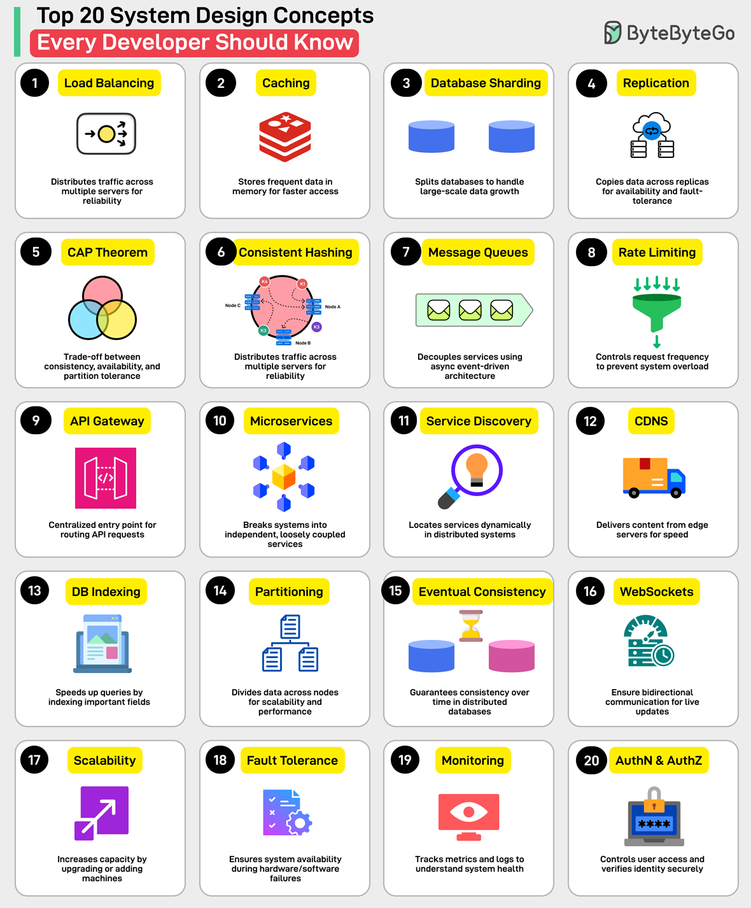

---

#### Top Leader Election Algorithms in Distributed Databases

References: [ByteByteGo - *Top Leader Election Algorithms in Distributed Databases*](https://blog.bytebytego.com/p/top-leader-election-algorithms-in) | [Ongaro & Ousterhout - *In Search of an Understandable Consensus Algorithm (Raft)* (USENIX ATC 2014)](https://raft.github.io/raft.pdf) | [Lamport - *Paxos Made Simple*](https://lamport.azurewebsites.net/pubs/paxos-simple.pdf)

| Algorithm                                                                  | Category / Approach  | Use Case(s)                                 | Description                                                                                                                | Complexity                                       | Usage in Real Systems                                     |
| -------------------------------------------------------------------------- | -------------------- | ------------------------------------------- | -------------------------------------------------------------------------------------------------------------------------- | ------------------------------------------------ | --------------------------------------------------------- |
| [**Geohash**](https://en.wikipedia.org/wiki/Geohash)                       | Spatial indexing     | Location-based services                     | Encodes geographic coordinates into short alphanumeric strings, enabling efficient spatial queries and proximity searches. | O(1) encode/decode; O(log n) search              | Elasticsearch, MongoDB, Redis geospatial queries          |
| [**Quadtree**](https://en.wikipedia.org/wiki/Quadtree)                     | Spatial partitioning | Location-based services, game maps          | Recursively divides 2D space into four quadrants for efficient spatial indexing and collision detection.                   | O(log n) insertion/query                         | Google Maps tiling, GIS databases, game engines           |
| [**Consistent Hashing**](https://en.wikipedia.org/wiki/Consistent_hashing) | Data distribution    | Load balancing in distributed systems       | Distributes data across nodes such that minimal reorganization is required when nodes are added or removed.                | O(1) lookup; O(n) rebalance (worst)              | Amazon DynamoDB, Apache Cassandra, Akamai CDN             |
| [**Leaky Bucket**](https://en.wikipedia.org/wiki/Leaky_bucket)             | Rate limiting        | API request throttling                      | Processes requests at a fixed rate; excess requests are discarded, ensuring steady traffic flow.                           | O(1) per request                                 | Network routers, Nginx rate limiting, payment gateways    |
| [**Token Bucket**](https://en.wikipedia.org/wiki/Token_bucket)             | Rate limiting        | Network traffic shaping, API burst handling | Allows bursts of requests while enforcing an average rate by consuming accumulated tokens.                                 | O(1) per request                                 | Google Cloud APIs, AWS API Gateway, Kubernetes API server |
| [**Trie**](https://en.wikipedia.org/wiki/Trie)                             | String search        | Search autocomplete, spell checking         | Tree-like structure for storing strings, enabling fast prefix-based lookups.                                               | O(m) where m = key length                        | Search engines, DNS resolvers, text editors               |
| [**Rsync**](https://en.wikipedia.org/wiki/Rsync)                           | Delta transfer       | File synchronization                        | Transfers only changed parts of files, reducing bandwidth usage.                                                           | O(n) compare; transfer proportional to diff size | Git, Dropbox, Linux package managers                      |
| [**Raft**](https://en.wikipedia.org/wiki/Raft_%28algorithm%29)             | Consensus algorithm  | Distributed databases, leader election      | Simplifies consensus with leader-based log replication; easier to understand than Paxos.                                   | O(n) message exchanges per term                  | etcd, Consul, RethinkDB                                   |
| [**Paxos**](https://en.wikipedia.org/wiki/Paxos_%28computer_science%29)    | Consensus algorithm  | Distributed databases                       | Achieves consensus in unreliable distributed systems; more complex but widely proven.                                      | O(n²) message exchanges                          | Google Chubby, Apache ZooKeeper                        |

---

#### Transfer Learning, Fine-tuning, Multitask Learning and Federated Learning

References: [DailyDoseOfDS - *Transfer Learning, Fine-tuning, Multitask, Federated Learning*](https://blog.dailydoseofds.com/p/transfer-learning-fine-tuning-multitask) | [McMahan et al. - *Federated Learning* (Google AI)](https://arxiv.org/abs/1602.05629)

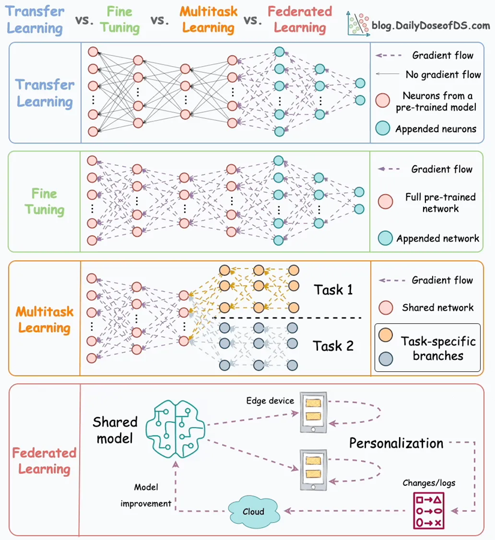

---

#### Web Services and APIs (SOAP, RestAPI, GraphQL, gRPC and Kafka)

References: [Red Hat - *APIs: SOAP vs REST vs GraphQL vs gRPC*](https://www.redhat.com/en/blog/apis-soap-rest-graphql-grpc) | [Roy Fielding - *Architectural Styles and the Design of Network-based Software Architectures* (REST dissertation)](https://ics.uci.edu/~fielding/pubs/dissertation/top.htm) | [GraphQL Spec](https://spec.graphql.org/) | [gRPC.io](https://grpc.io/docs/what-is-grpc/introduction/) | [Apache Kafka - *Documentation*](https://kafka.apache.org/documentation/)  
🔹**SOAP** (Simple Object Access Protocol): XML-based protocol for web services, heavyweight, favored for security and reliability.  
🔹**REST** (Representational State Transfer): Uses HTTP methods, simple and easy to use, but can be resource-heavy.  
🔹**GraphQL**: Allows flexible data queries, reduces data over-fetching.    
🔹**gRPC** (Google Remote Procedure Call): High-performance RPC framework, ideal for connecting microservices. Built on top of HTTP/2 and uses Protocol Buffers for data exchange.  
🔹**Kafka**: Distributed streaming platform, uses publish-subscribe model for message queueing. real-time consistency. "at-least-once" delivery.

---

#### Windows UI Development Frameworks

References: [Microsoft - *Windows App SDK / WinUI 3*](https://learn.microsoft.com/en-us/windows/apps/winui/winui3/) | [Microsoft - *.NET MAUI*](https://learn.microsoft.com/en-us/dotnet/maui/) | [Uno Platform](https://platform.uno/)

🔹**Windows UI Development Frameworks**: WinUI3, Windows Form, WPF, UWP, Win32, .NET MAUI, Uno  
🔹 For new Windows apps, use the Windows App SDK and WinUI instead of UWP, which is no longer actively developed.  
🔹 .NET MAUI is backed by Microsoft, whereas the Uno Platform is supported by nventive.  

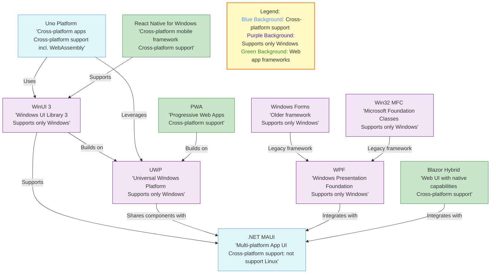
```mermaid
graph TD
    A[WinUI 3 <br/>'Windows UI Library 3 <br/>Supports only Windows'] -->|Builds on| B[UWP <br/>'Universal Windows Platform <br/>Supports only Windows']
    A -->|Supports| E[.NET MAUI <br/>'Multi-platform App UI <br/>Cross-platform support: not support Linux']
    B -->|Shares components with| E
    C[WPF <br/>'Windows Presentation Foundation <br/>Supports only Windows'] -->|Integrates with| E
    D[Windows Forms <br/>'Older framework <br/>Supports only Windows'] -->|Legacy framework| C
    F[Uno Platform <br/>'Cross-platform apps <br/>Cross-platform support incl. WebAssembly'] -->|Uses| A
    F -->|Leverages| B
    G[Win32 MFC <br/>'Microsoft Foundation Classes <br/>Supports only Windows'] -->|Legacy framework| C
    H[PWA <br/>'Progressive Web Apps <br/>Cross-platform support'] -->|Builds on| B
    I[React Native for Windows <br/>'Cross-platform mobile framework <br/>Cross-platform support'] -->|Supports| A
    J[Blazor Hybrid <br/>'Web UI with native capabilities <br/>Cross-platform support'] -->|Integrates with| E

    %% Set styles for the backgrounds
    style A fill:#f3e5f5,stroke:#6a1b9a,stroke-width:2px;  %% WinUI 3 as Windows-only
    style B fill:#f3e5f5,stroke:#6a1b9a,stroke-width:2px;  %% UWP as Windows-only
    style E fill:#e0f7fa,stroke:#4d94ff,stroke-width:2px;  %% Cross-platform
    style F fill:#e0f7fa,stroke:#4d94ff,stroke-width:2px;  %% Cross-platform
    
    style C fill:#f3e5f5,stroke:#6a1b9a,stroke-width:2px;  %% WPF as Windows-only
    style D fill:#f3e5f5,stroke:#6a1b9a,stroke-width:2px;  %% Windows Forms as Windows-only
    style G fill:#f3e5f5,stroke:#6a1b9a,stroke-width:2px;  %% Win32 MFC as Windows-only

    %% Set styles for web app frameworks
    style H fill:#c8e6c9,stroke:#388e3c,stroke-width:2px;  %% PWA as Cross-platform
    style I fill:#c8e6c9,stroke:#388e3c,stroke-width:2px;  %% React Native for Windows
    style J fill:#c8e6c9,stroke:#388e3c,stroke-width:2px;  %% Blazor Hybrid
    
    %% Add color legend
    K[Legend: <br/> <span style='color:#4d94ff'>Blue Background:</span> Cross-platform support <br/> <span style='color:#6a1b9a'>Purple Background:</span> Supports only Windows <br/> <span style='color:#388e3c'>Green Background:</span> Web app frameworks] 
    
    %% Set styles for the legend background
    style K fill:#fff9c4,stroke:#f57f17,stroke-width:2px;

    %% Comments
    click A "https://docs.microsoft.com/en-us/windows/apps/winui/winui3/" "WinUI 3: Modern UI framework for Windows apps."
    click B "https://docs.microsoft.com/en-us/windows/uwp/" "UWP: Build universal apps for all Windows devices."
    click C "https://docs.microsoft.com/en-us/dotnet/desktop/wpf/" "WPF: Rich desktop applications with advanced graphics."
    click D "https://docs.microsoft.com/en-us/dotnet/desktop/winforms/" "Windows Forms: Simplified desktop app development."
    click E "https://docs.microsoft.com/en-us/dotnet/maui/" ".NET MAUI: Cross-platform UI framework for mobile and desktop."
    click F "https://platform.uno/" "Uno Platform: Build cross-platform apps using WinUI."
    click G "https://learn.microsoft.com/en-us/cpp/mfc/overview-of-mfc?view=msvc-160" "Win32 MFC: C++ framework for Windows desktop applications."
    click H "https://learn.microsoft.com/en-us/microsoft-edge/progressive-web-apps-chromium/" "PWA: Build web apps that behave like native apps."
    click I "https://microsoft.github.io/react-native-windows/" "React Native for Windows: Build cross-platform apps using React Native."
    click J "https://docs.microsoft.com/en-us/aspnet/core/client-side/blazor/hybrid?view=aspnetcore-7.0" "Blazor Hybrid: Build web UIs with native capabilities."
```

---

#### Zanzibar

References: [Pang et al. - *Zanzibar: Google's Consistent, Global Authorization System* (USENIX ATC 2019)](https://research.google/pubs/zanzibar-googles-consistent-global-authorization-system) | [OpenFGA (CNCF)](https://openfga.dev/) | [Authzed - *SpiceDB*](https://authzed.com/spicedb) | [Ory Keto](https://www.ory.com/keto)

**Zanzibar** is Google's global authorization system (published 2019) that underpins access control for Google Drive, YouTube, Maps, and other services.

🔹 **Tuple-based approach**: Permissions are stored as relationship tuples `(object#relation@user)`, e.g., `doc:readme#owner@user:alice`. This makes relationships explicit and queryable.  
🔹 **Zookie**: A consistency token returned on each write. Clients pass it back on subsequent reads to guarantee "read-your-writes" consistency without requiring full global linearizability on every read.  
🔹 **Configuration language**: A schema DSL defines object types, relations, and permission inheritance rules (e.g., "viewer inherits from editor"), making access policies auditable and reusable.  
🔹 **Leopard**: An indexing subsystem inside Zanzibar that pre-computes and caches transitive group membership, optimizing large fan-out permission checks.  
🔹 **Spanner**: Zanzibar uses Google Spanner as its underlying storage, providing globally distributed, externally consistent transactions via TrueTime.  
🔹 **External consistency**: Reads and writes are globally ordered using Spanner's TrueTime API, ensuring no stale permission grants across distributed replicas.  
🔹 **Open-source adoptions**: OpenFGA (CNCF), SpiceDB (Authzed), and Ory Keto are popular open-source implementations inspired by Zanzibar.  

**[`^        back to top        ^`](#index)**
