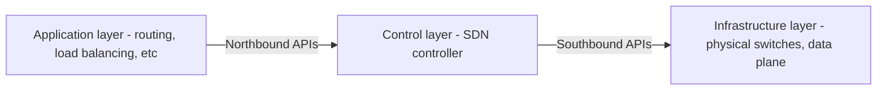
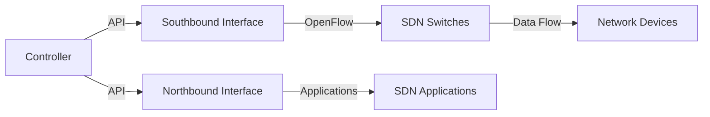
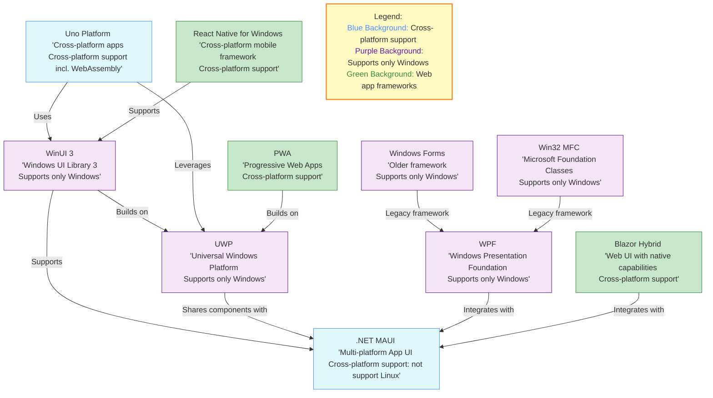

# Software Architecture Glossary

#### Index

1. [9 Clean Code Principles](#9-clean-code-principles)
1. [API Gateway vs Load Balancer](#api-gateway-vs-load-balancer)
1. [API Protocols](#api-protocols)
1. [Architecture Styles, Patterns, and Design Patterns](#architecture-styles-patterns-and-design-patterns)
1. [Azure vs AWS vs GCP in Cloud Network](#azure-vs-aws-vs-gcp-in-cloud-network)
1. [B-Tree vs LSM Tree vs Bloom Filter](#b-tree-vs-lsm-tree-vs-bloom-filter)
1. [Cloud Design Patterns](#cloud-design-patterns)
1. [Compiler Framework: LLVM vs GCC](#compiler-framework-llvm-vs-gcc)
1. [Conway's Law](#conways-law)
1. [CPU 101](#cpu-101)
1. [Cracking Coding Interviews](#cracking-coding-interviews)
1. [Data Engineering & Data Scientists Vocab 101](#data-engineering-data-scientists-vocab-101)
1. [Data Management in Distributed Systems (Partitioning, Shuffling and Bucketing)](#data-management-in-distributed-systems-partitioning-shuffling-and-bucketing)
1. [Database Normalization](#database-normalization)
1. [Deployment Styles: Blue/Green, Canary, and A/B](#deployment-styles-blue-green-canary-and-a-b)
1. [DevOps, Platform Engineering and SRE (site reliability engineering)](#devops-platform-engineering-and-sre-site-reliability-engineering)
1. [Distributed system 101](#distributed-system-101)
1. [Domain-Driven Design (DDD)](#domain-driven-design-ddd)
1. [Flaky Test](#flaky-test)
1. [Gartner's PACE Layered Application Strategy](#gartners-pace-layered-application-strategy)
1. [Generic: PECS (Producer Extends, Consumer Super)](#generic-pecs-producer-extends-consumer-super)
1. [Hadoop Ecosystem](#hadoop-ecosystem)
1. [Idempotent, Backfill](#idempotent-backfill)
1. [JIT vs AOT](#jit-vs-aot)
1. [Measuring Engineering Productivity (DORA, SPACE, DX Core 4, DevEx)](#measuring-engineering-productivity-dora-space-dx-core-4-devex)
1. [Medallion Architecture](#medallion-architecture)
1. [Memory Consistency Model (SC vs TSO vs Relaxed)](#memory-consistency-model-sc-vs-tso-vs-relaxed)
1. [Message Broker Pattern](#message-broker-pattern)
1. [Mixin](#mixin)
1. [Network Design 101](#network-design-101)
1. [OLAP vs OLTP](#olap-vs-oltp)
1. [Passkey](#passkey)
1. [Popular Enterprise Architecture Frameworks](#popular-enterprise-architecture-frameworks)
1. [Principles & Concepts: YAGNI, KISS, DRY, CAP, PACELC, ACID, BASE](#principles-concepts-yagni-kiss-dry-cap-pacelc-acid-base)
1. [Public Cloud Security Services (TCP/IP Model)](#public-cloud-security-services-tcp-ip-model)
1. [Push & Pull Model in Azure](#push-pull-model-in-azure)
1. [RBAC vs ReBAC](#rbac-vs-rebac)
1. [Reactive Programming vs Event-Driven Architecture](#reactive-programming-vs-event-driven-architecture)
1. [Real-time Communication and Messaging (MQTT, AMQP and WebSocket)](#real-time-communication-and-messaging-mqtt-amqp-and-websocket)
1. [Scaling a system 101](#scaling-a-system-101)
1. [Security Words 101](#security-words-101)
1. [SLA, SLO, and SLI](#sla-slo-and-sli)
1. [Slowly Changing Dimensions (SCD)](#slowly-changing-dimensions-scd)
1. [Software Defined Networking (SDN)](#software-defined-networking-sdn)
1. [Space-Based Architecture vs Cell-Based Architecture](#space-based-architecture-vs-cell-based-architecture)
1. [SSG: Static site generator list](#ssg-static-site-generator-list)
1. [SSO (Single Sign-On)](#sso-single-sign-on)
1. [Star Schema](#star-schema)
1. [Systolic Array in TPU](#systolic-array-in-tpu)
1. [Test-Driven Development](#test-driven-development)
1. [Top 20 System Design Concepts](#top-20-system-design-concepts)
1. [Top Leader Election Algorithms in Distributed Databases](#top-leader-election-algorithms-in-distributed-databases)
1. [Transfer Learning, Fine-tuning, Multitask Learning and Federated Learning](#transfer-learning-fine-tuning-multitask-learning-and-federated-learning)
1. [Web Services and APIs (SOAP, RestAPI, GraphQL, gRPC and Kafka)](#web-services-and-apis-soap-restapi-graphql-grpc-and-kafka)
1. [Windows UI Development Frameworks](#windows-ui-development-frameworks)
1. [Zanzibar](#zanzibar)

#### 9 Clean Code Principles
<a id="9-clean-code-principles-2"></a>

[ref](https://blog.bytebytego.com/p/ep162-9-clean-code-principles-to)

🔹 **Meaningful Names:** Use clear, descriptive names.  
🔹 **Small Functions:** Functions should do one thing well.  
🔹 **Avoid Duplicates:** **DRY** (Don’t Repeat Yourself).   
🔹 **Readable Code:** Code should be easy to read and understand.  
🔹 **Single Responsibility Principle:** One class or function should have only one reason to change.  
🔹 **Consistent Formatting:** Use a uniform style for indentation, spacing, etc.  
🔹 **Error Handling:** Handle errors gracefully and explicitly.  
🔹 **Write Tests:** Tests improve code reliability.  
🔹 **Refactor Regularly:** Keep improving code to avoid decay.  

---

#### API Gateway vs Load Balancer
<a id="api-gateway-vs-load-balancer-2"></a>
🔹 **API Gateway**: Manages access to backend services, handles tasks like rate-limiting, authentication, logging, and security policies.  
🔹 **Load Balancer**: Distributes network traffic across multiple servers for high availability and even load distribution.  

---

#### API Protocols
<a id="api-protocols-2"></a>
**API Protocols** (ref. ByteByteGo)


---

#### Architecture Styles, Patterns, and Design Patterns
<a id="architecture-styles-patterns-and-design-patterns-2"></a>
🔹[Are Architecture Styles, Patterns, and Design Patterns Different?](https://x.com/milan_milanovic/status/1747683090598711725?s=20)

- **Architectural styles**  
    This is the highest level of abstraction, where architectural designs instruct us on structuring our code. The highest level of granularity describes the application's layers and high-level modules and how they relate to and interact with one another. Examples of architectural styles include:  
    
    🔹 Monolith  
    🔹 Layered  
    🔹 Event-driven  
    🔹 Self-contained Systems  
    🔹 Microservices  
    🔹 Space-Based

- **Architectural patterns**  
    These patterns represent a way to implement an architectural style, so we can do this regularly. Some examples are how to separate the user interface (UI) and data, how internal modules interact, and what layers we will use. Patterns answer these types of questions. They usually impact the code base and how to structure the code inside. Examples of architectural patterns include:

    🔹 Model-View-Presenter (MVP): 1:1 Relationship between View and Presenter. e.g., Windows forms  
    🔹 Model-View-Controller (MVC): e.g., Smalltalk, ASP.Net MVC  
    🔹 Model–View–Viewmodel (MVVM): One to Many relationship between View and ViewModel. e.g., Silverlight, WPF, AngularJs:  
    🔹 Domain-Driven Design

- **Design patterns**

    These differ from architectural patterns in that they focus on a smaller code base area and have a smaller influence (focus on a local problem). These include limiting the creation of a class to only one object or notifying all dependent objects when the internal state of an object is changed. These patterns are described in the book "Design Patterns: Elements of Reusable Object-Oriented Software" by Erich Gamma, Richard Helm, Ralph Johnson, and John Vlissides from 1994.

    We have three groups of Design Patterns:

    🔹 Creational: here we have Factory Method, Builder, Singleton, ...  
    🔹 Structural: here we have an Adapter, Bridge, and Decorator, ...  
    🔹 Behavioral: here we have Command, Iterator, State, Strategy, ...  

---

#### Azure vs AWS vs GCP in Cloud Network
<a id="azure-vs-aws-vs-gcp-in-cloud-network-2"></a>

🔹**Cloud Network Structures:**

- **AWS:** Region → VPC → Availability Zone → Subnet (public, private)
- **Azure:** Region → Virtual Network (VNet) → Availability Zone → Subnet
- **GCP:** Global → VPC → Subnet (Region-specific)

🔹**Traffic Between VNet or VPC:**

* Requires setup of a VNet/VPC gateway or peering, and appropriate route configuration.
- **Azure**: One VPN Gateway per Virtual Network (used for site-to-site, point-to-site, ExpressRoute). Route tables can be assigned at the **subnet level**.
- **AWS**: Route tables are associated with **subnets**, not just the VPC. Controls intra-VPC and external traffic via routes per subnet.
- **GCP**: Routing is defined at the **VPC level**. Routes apply globally within the VPC and are evaluated based on subnet CIDR.

🔹**Regional Traffic:**

* Use **peering** to enable traffic between VNets/VPCs in the same or different regions.
* Benefits of peering: Lower latency, Higher bandwidth, Reduced cost compared to VPN gateways

🔹**Hybrid Connectivity:**

* Enables on-premises networks to connect securely to cloud networks.
- **AWS:** Direct Connect, VPN Gateway, Transit Gateway
- **Azure:** ExpressRoute, VPN Gateway, Virtual WAN
- **GCP:** Cloud Interconnect, Cloud VPN

🔹**Connectivity Scenarios**

| **Scenario**            | **AWS**                                                        | **Azure**                               | **GCP**                                                                            |
| ----------------------- | -------------------------------------------------------------- | --------------------------------------- | ---------------------------------------------------------------------------------- |
| VNet ↔ VNet / VPC ↔ VPC | VPC Peering, AWS Transit Gateway                               | VNet Peering, Virtual WAN, VNet Gateway | VPC Network Peering, Cloud VPN                                                     |
| On-Prem ↔ VNet/VPC      | Direct Connect, VPN Gateway, Transit Gateway                   | ExpressRoute, VPN Gateway, Virtual WAN  | Cloud Interconnect, Cloud VPN                                                      |
| VNet/VPC ↔ Internet     | Internet Gateway (public subnet), NAT Gateway (private subnet) | Internet Gateway, NAT Gateway           | Cloud Router, Cloud NAT                                                            |
| Subnet Traffic Control  | Network ACLs + Security Groups                                 | Network Security Groups (NSGs)          | 1. Shared VPC with IAM on subnets  <br> 2. Firewall rules at VPC or instance level |

- Azure’s **Virtual WAN** is conceptually similar to **AWS Transit Gateway**.  
- Azure and GCP do **not** have a strict public/private subnet designation—this is controlled through IP assignment, routes, and firewall/NSG configurations.

🔹**Gateway Types in Azure:**

- **VNet Gateway** types: 
    - **VPN Gateway:** For site-to-site and point-to-site connections
    - **ExpressRoute Gateway:** For private MPLS-style connections to Azure
* Connection modes:
    - **Point-to-site:** Device-to-cloud
    - **Site-to-site:** Network-to-network
    - **VNet-to-VNet:** Secure private communication between VNets

🔹**Public IP vs Private IP**

- **Private IP:** `192.168.1.4` – Not routable on the internet
- **Public IP:** `34.207.152.137` – Routable on the public internet

🔹**Cloud Resource Hierarchy**

| **Level**             | **AWS**                  | **Azure**        | **GCP**      |
| --------------------- | ------------------------ | ---------------- | ------------ |
| 1. Organization Level | Organization             | Management Group | Organization |
| 2. Grouping Level     | Organizational Unit (OU) | Subscription     | Folder       |
| 3. IAM/Billing Unit   | Account                  | Resource Group   | Project      |
| 4. Resource Level     | Resources                | Resources        | Resources    |

🔹**Subnet Comparison**

| **Feature**              | **AWS**                                | **Azure**                           | **GCP**                                |
| ------------------------ | -------------------------------------- | ----------------------------------- | -------------------------------------- |
| **Subnet Scope**         | AZ-scoped                              | Region-scoped                       | Region-scoped                          |
| **Public/Private Setup** | Via route table + Internet Gateway     | Via route + NSG                     | Via route + firewall + external IP     |
| **Firewall Controls**    | Security Groups + NACLs (subnet-level) | NSGs (subnet or NIC level)          | Firewall rules (VPC or instance level) |
| **Secondary IP Ranges**  | ❌ Not supported                        | ❌ Not supported                     | ✅ Alias IPs supported                  |
| **HA / Kubernetes Fit**  | Multi-AZ subnet design required        | Simplified with region-wide subnets | Best for GKE (regional + alias IPs)    |

---

#### B-Tree vs LSM Tree vs Bloom Filter
<a id="b-tree-vs-lsm-tree-vs-bloom-filter-2"></a>

🔹 **B-Tree:** Balanced tree for fast reads and range queries; used in RDBMS and file systems.  
🔹 **LSM Tree:** Write-optimized structure with batched disk writes; used in NoSQL databases.  
🔹 **Bloom Filter:** is a probabilistic data structure used to quickly check whether an element might be in a set. It's extremely space-efficient and fast but allows false positives (wrongly saying an item exists) while guaranteeing no false negatives (never says an existing item is missing).

---

#### Cloud Design Patterns
<a id="cloud-design-patterns-2"></a>

[ref](https://newsletter.techworld-with-milan.com/p/what-are-the-main-cloud-design-patterns)

1. **Data Management** 📊  
    🔹**Cache-Aside**: Cache frequently used data for performance.  
    🔹**CQRS**: Separate reads/writes for scalability.  
    🔹**Event Sourcing**: Record full data change history.  
    🔹**Materialized View**: Precompute query results for speed.  
    🔹**Sharding**: Partition data to scale storage.
2. **Design and Implementation** 🛠️  
    🔹 **Strangler Fig**: Gradually migrate legacy systems.  
    🔹 **Anti-Corruption Layer**: Isolate new systems from old ones.  
    🔹 **Bulkhead**: Prevent failure spread across components.  
    🔹 **Sidecar**: Add functionality without changing the core.  
    🔹 **BFF**: Tailor backend for different clients.
3. **Messaging** 📨  
    🔹 **Queue-Based Load Leveling**: Buffer requests for smooth load handling.  
    🔹 **Publisher-Subscriber**: Broadcast messages to multiple consumers.  
    🔹 **Competing Consumers**: Process messages in parallel for scalability.  
    🔹 **Message Broker**: Route messages via intermediary.  
    🔹 **Pipes and Filters**: Sequentially process data through components.
4. **Security** 🔒  
    🔹 **Valet Key**: Provide secure temporary access.  
    🔹 **Gatekeeper**: Filter requests to protect backends.  
    🔹 **Federated Identity**: Use third-party login credentials.  
    🔹 **Secret Store**: Secure sensitive data.  
    🔹 **Validation**: Ensure data input is sanitized.
5. **Reliability** ⚙️  
    🔹 **Retry**: Retry failed operations automatically.  
    🔹 **Circuit Breaker**: Stop repeated failing operations.  
    🔹 **Throttling**: Limit resource usage via request control.  
    🔹 **Health Endpoint Monitoring**: Expose health checks for monitoring.

---

#### Compiler Framework: LLVM vs GCC
<a id="compiler-framework-llvm-vs-gcc-2"></a>

🔹**GCC** (GNU Compiler Collection): Originally released in 1987, GCC translates C code to RTL (Register Transfer Language), then to machine code. It supports many languages, including C, C++, Fortran, and more. Licensed under the GPL, GCC is known for its robust optimizations and is widely used for system-level programming and cross-platform compilation. 
`C code ---> GCC's C frontend ---> RTL ---> GCC's x86 backend ---> x86 machine code`  
🔹**LLVM** (Low-Level Virtual Machine): First released in 2003, LLVM uses an Intermediate Representation (IR) and a modular design, translating code to machine code via various backends. It supports a variety of languages, such as C, C++, Swift, Rust, and others. LLVM is Apache 2.0 licensed and is recognized for its flexibility, extensibility, and modern features, including Just-In-Time (JIT) compilation.  

🔹**Key Differences**: LLVM's modularity and permissive licensing foster broader tool integration and extensibility, while GCC is renowned for its mature optimization capabilities.

---

#### Conway's Law
<a id="conways-law-2"></a>
Software engineering principle that states that the structure of a system reflects the structure of the organization that designs it.

---

#### CPU 101
<a id="cpu-101-2"></a>

[ref](https://cpu.land/editions/one-pager)

```mermaid
flowchart TD
    %% ── Boot ────────────────────────────────────────────────────
    Firmware["UEFI / BIOS"] --> Bootloader["Bootloader (GRUB)"]
    Bootloader --> KernelInit["Kernel Init<br/>(rings · page tables · IDT · scheduler)"]
    KernelInit --> InitProcess["Init Process (PID 1)"]
    InitProcess -->|"spawns via"| Fork

    %% ── fork + exec ─────────────────────────────────────────────
    Fork["fork()"] -->|"SYSCALL: rax=syscall#<br/>rdi/rsi=args → clone + COW pages"| IDT
    Fork -->|"child calls"| Exec["exec()"]
    Exec -->|"SYSCALL: execve"| IDT
    IDT["IDT Handlers<br/>(syscalls · interrupts)"] -->|"exec: load ELF segments"| UserPages["User Pages (Ring 3)"]
    IDT -->|"exec: set IP to entry point"| IP["Instruction Pointer (IP)"]
    IDT -->|"Ring 0→3: SYSRET restores user mode<br/>(returning from kernel back to user · result in rax)"| Registers["Registers (eax, ebx, ...)"]

    %% ── CPU Fetch-Execute loop ──────────────────────────────────
    %% NOTE: pure computation (math, logic, local memory reads) runs here
    %% directly in Ring 3 — NO syscall needed
    NoteRing3["⚑ Not all operations go to kernel<br/>arithmetic · logic · local memory stay in Ring 3 — no mode switch"]
    NoteRing3 -.->|"no kernel handoff"| IP

    IP -->|"fetch (virtual addr)"| MMU["MMU<br/>Memory Management Unit<br/>(translate + ring protection)"]
    Registers -->|"load / store"| MMU
    MMU -->|"page table walk"| PageTable["Page Table"]
    PageTable --> KernelPages["Kernel Pages (Ring 0)"]
    PageTable --> UserPages

    %% ── Syscall boundary note ───────────────────────────────────
    %% NOTE: syscall only triggered at system resource boundary
    NoteSyscall["⚑ User code is handed over to kernel via SYSCALL<br/>Kernel manages system interactions (files · network · memory)<br/>User gets result back in rax"]
    NoteSyscall -.->|"triggers SYSCALL instruction"| IDT

    %% ── Preemptive Multitasking ─────────────────────────────────
    Timer["Hardware Timer Interrupt (PIT)"] -->|"fires IRQ every ~few ms"| IDT
    IDT -->|"timer: run scheduler"| Scheduler["Scheduler"]
    Scheduler -->|"restore registers + IP"| Registers
    Scheduler -->|"swap CR3 (address space)"| MMU

    %% ── Styling ─────────────────────────────────────────────────
    classDef boot   fill:#fffacd,stroke:#333,stroke-width:2px
    classDef cpu    fill:#f0f8ff,stroke:#333,stroke-width:2px
    classDef mem    fill:#fff0f5,stroke:#333,stroke-width:2px
    classDef kernel fill:#f5f5dc,stroke:#333,stroke-width:2px
    classDef hw     fill:#e6e6fa,stroke:#333,stroke-width:2px
    classDef proc   fill:#ffe4e1,stroke:#333,stroke-width:2px
    classDef note   fill:#f0fff0,stroke:#999,stroke-width:1px,stroke-dasharray:4 2,color:#555

    class Firmware,Bootloader,KernelInit,InitProcess boot
    class IP,Registers cpu
    class MMU,PageTable,KernelPages,UserPages mem
    class IDT,Scheduler kernel
    class Timer hw
    class Fork,Exec proc
    class NoteRing3,NoteSyscall note
```



🔹 **Fetch-Execute Cycle**: The CPU holds an **instruction pointer** (register) pointing into RAM. It endlessly repeats: fetch instruction → execute → advance pointer. Jump instructions alter the pointer; this is how control flow works.

🔹 **Registers**: Small, extremely fast storage buckets inside the CPU (e.g., `eax`, `ebx`). One special register is the instruction pointer. Others control CPU modes and permission levels.

🔹 **Privilege Rings (Kernel vs User mode)**: Modern CPUs have at least two modes.  
- **Kernel mode (Ring 0)**: unrestricted — any instruction, any memory.  
- **User mode (Ring 3)**: limited — no direct I/O, no arbitrary memory access, no changing CPU settings.  
The kernel runs in Ring 0; user programs run in Ring 3. The CPU starts in kernel mode at boot; the OS switches to user mode before running programs.

🔹 **System Calls (Syscalls)**: The only safe way for user-mode code to request kernel services (open file, allocate memory, spawn process, etc.).  
1. OS pre-registers handler addresses in an **Interrupt Descriptor Table (IDT)** at boot.  
2. Program triggers a **software interrupt** (`INT 0x80`) or uses `SYSCALL` / `SYSENTER` instructions.  
3. CPU switches to kernel mode and jumps to the registered handler.  
4. Kernel does the work, then executes `IRET` / `SYSRET` to return to user mode.

🔹 **Paging & Virtual Memory**: Every memory address a program uses is a **virtual address**. The **Memory Management Unit (MMU)** translates it to a physical RAM address using a **page table** (a dictionary stored in RAM, pointed to by a CPU register). Benefits:  
- Each process has its own isolated address space (e.g., two processes can both use `0x400000` pointing to different physical memory).  
- Kernel marks its own pages as ring-0-only, so user-mode code cannot read kernel memory even though kernel addresses are present in the virtual map.  
- **Demand paging**: pages are only loaded into physical RAM when first accessed (page fault → kernel loads the page → retries the instruction).

🔹 **Preemptive Multitasking**: A **timer chip (PIT)** fires a **hardware interrupt** every few milliseconds. The CPU switches to kernel mode, the OS scheduler saves the current process state (registers, instruction pointer) and restores another process — the **context switch**. Timeslices on Linux are typically 0.75 – 6 ms.

🔹 **Boot → Run sequence**:  
`Firmware (UEFI/BIOS)` → `Bootloader (GRUB)` → `Kernel init` → `Page tables set up, interrupts registered` → `init process (PID 1, e.g. systemd)` → `fork/exec` → user programs running

🔹 **fork & exec pattern**:  
- `fork()` — clones the current process; child gets PID 0 return value, parent gets child PID. Memory pages are marked **copy-on-write (COW)**; no physical copy until a write occurs.  
- `exec()` — replaces the current process image with a new program (parsed from an ELF binary: load `.text`, `.data`, `.bss` sections into virtual memory, jump to entry point).  
Every process on Linux traces its ancestry back to PID 1 via fork-exec.

---

#### Cracking Coding Interviews
<a id="cracking-coding-interviews-2"></a>
🔹[ref](https://x.com/systemdesign42/status/1776590986837160427)  
🔹Two Pointers: Navigating arrays with two indices. [ref](https://www.pluralsight.com/resources/blog/guides/algorithm-templates-two-pointers-part-2)  
🔹Intervals: Working with ranges of values. [ref](https://medium.com/@timpark0807/leetcode-is-easy-the-interval-pattern-d68a7c1c841) / [ref](https://leetcode.com/problems/minimum-number-of-arrows-to-burst-balloons/solutions/93735/a-concise-template-for-overlapping-interval-problem/) / [ref](https://leetcode.com/discuss/general-discussion/794725/General-Pattern-for-greedy-approach-for-Interval-based-problems)  
🔹Dynamic Programming: Solving complex problems by breaking them down into simpler subproblems. [ref](https://www.youtube.com/watch?v=ZwDDLAeeBM0&t=294s) / [ref](https://leetcode.com/discuss/general-discussion/651719/how-to-solve-dp-string-template-and-4-steps-to-be-followed)  
🔹Tree Traversal: Visiting all nodes in a tree. [ref](https://medium.com/leetcode-patterns/leetcode-pattern-0-iterative-traversals-on-trees-d373568eb0ec) / [ref](https://leetcode.com/problems/binary-tree-postorder-traversal/solutions/45551/Preorder-Inorder-and-Postorder-Iteratively-Summarization/)  
🔹DFS-BFS: Depth-first and breadth-first search algorithms. [ref](https://leetcode.com/problems/pacific-atlantic-water-flow/solutions/438276/Python-beats-98.-DFS-template-for-Matrix/) / [ref](https://medium.com/leetcode-patterns/leetcode-pattern-2-dfs-bfs-25-of-the-problems-part-2-a5b269597f52) / [ref](https://medium.com/leetcode-patterns/leetcode-pattern-1-bfs-dfs-25-of-the-problems-part-1-519450a84353) / [ref](https://www.youtube.com/watch?v=TIbUeeksXcI)  
🔹Binary Search: Finding an element in a sorted array. [ref](https://leetcode.com/problems/binary-search/solutions/423162/Binary-Search-101-The-Ultimate-Binary-Search-Handbook/)  
🔹Array: A data structure holding elements. [ref](https://leetcode.com/problems/reverse-pairs/solutions/97268/General-principles-behind-problems-similar-to-%22Reverse-Pairs%22/)  
🔹Sliding Window: A subset of data that moves. [ref](https://www.pluralsight.com/resources/blog/guides/algorithm-templates-two-pointers-part-3) / [ref](https://medium.com/leetcode-patterns/leetcode-pattern-2-sliding-windows-for-strings-e19af105316b) / [ref](https://leetcode.com/problems/minimum-window-substring/solutions/26808/Here-is-a-10-line-template-that-can-solve-most-'substring'-problems/) / [ref](https://leetcode.com/problems/find-all-anagrams-in-a-string/solutions/92007/Sliding-Window-algorithm-template-to-solve-all-the-Leetcode-substring-search-problem./) / [ref](https://leetcode.com/problems/best-time-to-buy-and-sell-stock-with-transaction-fee/solutions/108870/Most-consistent-ways-of-dealing-with-the-series-of-stock-problems/)  
🔹Backtracking: Trying out all possibilities to find a solution. [ref](https://leetcode.com/problems/permutations/solutions/18284/Backtrack-Summary:-General-Solution-for-10-Questionsh/) / [ref](https://medium.com/leetcode-patterns/leetcode-pattern-3-backtracking-5d9e5a03dc26) / [ref](https://leetcode.com/problems/combination-sum/solutions/16502/A-general-approach-to-backtracking-questions-in-Java-(Subsets-Permutations-Combination-Sum-Palindrome-Partitioning)/)  
🔹Combination: Finding all possible arrangements of elements. [ref](https://leetcode.com/problems/combination-sum-iv/solutions/85120/C++-template-for-ALL-Combination-Problem-Set/)  
🔹Trie: A tree-like data structure for storing strings. [ref](https://leetcode.com/discuss/general-discussion/931977/beginner-friendly-guide-to-trie-tutorial-practice-problems)  
🔹Word Break: Dividing a string into words. [ref](https://leetcode.com/problems/concatenated-words/solutions/836924/Python-Template-Word-Break-I-Word-Break-II-Concatenated-Words/)  
🔹Bit Manipulation: Performing operations on binary numbers. [ref](https://leetcode.com/problems/sum-of-two-integers/solutions/84278/A-summary:-how-to-use-bit-manipulation-to-solve-problems-easily-and-efficiently/) / [ref](https://leetcode.com/problems/single-number-ii/solutions/43295/Detailed-explanation-and-generalization-of-the-bitwise-operation-method-for-single-numbers/)  
🔹Sum: Adding numbers together. [ref](https://leetcode.com/problems/two-sum/solutions/737092/Sum-MegaPost-Python3-Solution-with-a-detailed-explanation/)  
🔹Monotonic Stack: A stack keeping elements in an ordered manner. [ref](https://leetcode.com/problems/sum-of-subarray-minimums/solutions/178876/stack-solution-with-very-detailed-explanation-step-by-step/)  
🔹Big-O-Notation: [ref](https://blog.bytebytego.com/p/ep132-big-o-notation-101-the-secret)  

🔹[ref](https://blog.algomaster.io)  
🔹[Master Graph Algorithms for Coding Interviews](https://blog.algomaster.io/p/master-graph-algorithms-for-coding)  
🔹[20 Patterns to Master Dynamic Programming](https://blog.algomaster.io/p/20-patterns-to-master-dynamic-programming)  
🔹[LeetCode was HARD until I Learned these 15 Patterns](https://blog.algomaster.io/p/15-leetcode-patterns)  
🔹[How I Mastered Data Structures and Algorithms](https://blog.algomaster.io/p/how-i-mastered-data-structures-and-algorithms)

---

#### Data Engineering & Data Scientists Vocab 101
<a id="data-engineering-data-scientists-vocab-101-2"></a>
[ref](https://x.com/SeattleDataGuy/status/1753950189314810358?s=20) | [15 DS/ML Cheat Sheets](https://blog.dailydoseofds.com/p/15-dsml-cheat-sheets) | [git](https://github.com/ChawlaAvi/Daily-Dose-of-Data-Science)

🔹 Data engineering Vocab 101

[ref](https://x.com/SeattleDataGuy/status/1753950189314810358?s=20)


🔹 75 Key Terms That Data Scientists Remember by Heart 

[ref](https://www.blog.dailydoseofds.com/p/75-key-terms-that-data-scientists)


🔹 A Comprehensive NumPy Cheat Sheet Of 40 Most Used Methods 

[ref](https://www.blog.dailydoseofds.com/p/a-comprehensive-numpy-cheat-sheet)


🔹 15 Pandas ↔ Polars ↔ SQL ↔ PySpark Translations 

[ref](https://www.blog.dailydoseofds.com/p/15-pandas-polars-sql-pyspark-translations)


🔹 11 Key Probability Distributions 

[ref](https://www.blog.dailydoseofds.com/p/11-key-probability-distributions)


🔹 6 Must-Know Types of Clustering Algorithms in Machine Learning 

[ref](https://blog.dailydoseofds.com/p/beyond-kmeans-6-must-know-types-of)


🔹 25 Most Important Mathematical Definitions in Data Science

[ref](https://blog.dailydoseofds.com/p/25-most-important-mathematical-definitions)


🔹 10 Regression and Classification Loss Functions

[ref](https://blog.dailydoseofds.com/p/10-regression-and-classification)


---

#### Data Management in Distributed Systems (Partitioning, Shuffling and Bucketing)
<a id="data-management-in-distributed-systems-partitioning-shuffling-and-bucketing-2"></a>

🔹**Partitioning**: The process of dividing a large dataset into smaller parts, known as partitions. This process splits Hive table's files into multiple files. For example, `../hive/warehouse/sales_table/product_id=P1`.  
🔹**Shuffling**: Shuffling is the process of redistributing data across different partitions. The overhead of operations can be ranked as follows: `orderby` > `join` > `groupby`.  
🔹**Bucketing**: This is the process of decomposing data into manageable parts based on a certain column, thereby improving query performance and storage efficiency. It is best used when there are very few repeating values in a column (for example 1. a primary key column). For instance, Bucket0: `../hive/warehouse/sales_table/product_id=P1/000000_0`, Bucket1: `../hive/warehouse/sales_table/product_id=P1/000001_0`, and so on.

---

#### Database Normalization
<a id="database-normalization-2"></a>

Database Normalization

| **Normalization Stage**   | **What It Means**                                                        | **Simple Example (with More Detail)**                                                                                                                                                                                                                                     |
| ------------------------- | ------------------------------------------------------------------------ | ------------------------------------------------------------------------------------------------------------------------------------------------------------------------------------------------------------------------------------------------------------------------- |
| **1st Normal Form (1NF)** | Don't put multiple values in one cell!                                   | 📛 **Bad Example:** <br> `Name: John` , `Phone: 123-4567, 987-6543` <br> ✔️ **Good Example:** <br> Row 1: `Name: John`, `Phone: 123-4567` <br> Row 2: `Name: John`, `Phone: 987-6543`                                                                                     |
| **2nd Normal Form (2NF)** | Don't define other values using part of the primary key!                 | Suppose the **Primary Key** is `(StudentID, Course)` <br> 📛 **Bad Example:** <br> `StudentID → Major` included in same table <br> ✔️ **Good Example:** <br> Move `StudentID → Major` to a separate `Student` table, only `(StudentID, Course)` stays in enrollment table |
| **3rd Normal Form (3NF)** | Don't let non-key values depend on each other!                           | 📛 **Bad Example:** <br> In `Student` table: <br> `DepartmentCode → DepartmentName` <br> Both stored together <br> ✔️ **Good Example:** <br> `Department` info in separate table <br> Student table only keeps `DepartmentCode`                                           |
| **BCNF**                  | Even if it looks normal, make sure every determinant is a candidate key! | 📛 **Bad Example:** <br> `Course → Instructor` <br> But `Course` is not a candidate key (multiple sections exist) <br> ✔️ **Good Example:** <br> Have a table: `(Course, Section)` as key, with Instructor info based on full key only                                    |

---

#### Deployment Styles: Blue/Green, Canary, and A/B
<a id="deployment-styles-blue-green-canary-and-a-b-2"></a>
🔹**Blue/Green Deployment**: Two identical environments, "Blue" and "Green". Deploy new version in inactive environment, test, then switch users to it. For example, AWS supports blue/green deployment strategies including Elastic Beanstalk, OpsWorks, CloudFormation, CodeDeploy, and Amazon ECS.  
🔹**Canary Deployment**: Roll out new version to a small group of users, monitor feedback, then do a full-scale release.  
🔹**A/B Testing**: Compare two versions of a webpage or app to see which performs better. A typical example of A/B testing is website usability testing.

---

#### Distributed system 101
[ref](https://newsletter.systemdesign.one/p/distributed-systems)

🔹**Core components**
| Category                   | Items                                                                                                                         |
| -------------------------- | ----------------------------------------------------------------------------------------------------------------------------- |
| **Communication**          | TCP, TLS, DNS                                                                                                                 |
| **Coordination**           | Failure Detection, Event Ordering & Timing, Leader Election, Data Replication & Consistency                                   |
| **Scalability Techniques** | Microservices, API Gateway, CQRS, Asynchronous Messaging Patterns, Data Partitioning (Sharding), Replication & Load Balancing |
| **Resiliency Techniques**  | Circuit Breakers, Rate Limiting / Throttling, Health Checks                                                                   |

🔹**Vertical Scaling vs Horizontal Scaling**: Vertical = bigger machine; Horizontal = more machines for scale and fault-tolerance.  
🔹**Failure Detection - Heartbeat mechanism & Gossip protocol**: Heartbeat sends periodic “alive” signals; Gossip spreads membership info randomly for scalable, eventually consistent failure detection.  
🔹**Event Ordering and Timing - Lamport Clocks vs Vector Clocks**: Lamport gives partial order; Vector clocks track causality and detect concurrency.  
🔹**Lamport Clock** = each process keeps a counter (e.g., P1 sends event at time 5 → receiver sets its clock to `max(local, 5) + 1 = 6`), giving a total order but treating concurrent events as ordered;  
🔹**Vector Clock** = each process keeps a vector of counters (e.g., three nodes P1,P2,P3 start at `[0,0,0]`; after two local events P1 has `[2,0,0]`; P1 sends a message to P2 with `[2,0,0]`; P2’s local clock is `[1,3,0]`; on receive P2 merges element-wise max → `max([1,3,0],[2,0,0]) = [2,3,0]` then increments its own index → `[2,4,0]`, and concurrency is detectable because vectors like `[1,0,0]` and `[0,1,0]` are incomparable (neither ≤ other).  
🔹**Leader Election**: Algorithms (Raft, Paxos, Bully) choose one coordinator node to ensure consistent decision-making.
| Algorithm | Political Analogy                 | Why                                                                    |
| --------- | --------------------------------- | ---------------------------------------------------------------------- |
| **Raft**  | Parliamentary majority leadership | Explicit election + continuous confidence/heartbeat.                   |
| **Paxos** | Consensus committee process       | Decisions pass only when enough members agree; leadership is emergent. |
| **Bully** | Leadership by seniority           | Highest “rank” node automatically becomes leader.                      |

🔹**Data Consistency - Linearizability vs Sequential Consistency vs Eventual Consistency**: Linearizable = real-time global order; Sequential = same order but not real-time; Eventual = replicas converge asynchronously.  
🔹**CAP Theorem**: In presence of network partitions (P), a distributed system must choose either Consistency (C) or Availability (A); it cannot guarantee all three simultaneously.  
🔹**CQRS (Command Query Responsibility Segregation)**: Split read and write models to scale independently and reduce contention.  
🔹**Data Partitioning - Range-based partitioning vs Hash-based partitioning vs Consistent hashing**: Range = by key ranges; Hash = even distribution but costly rebalancing; Consistent hashing = minimal data movement on node changes.  
🔹**Replication - Single-leader vs Multi-leader vs Leaderless**: Single-leader = one write node; Multi-leader = multiple writable nodes with conflict handling; Leaderless = any node can write using quorum replication.  

---

#### DevOps, Platform Engineering and SRE (site reliability engineering)
<a id="devops-platform-engineering-and-sre-site-reliability-engineering-2"></a>
[ref](https://www.splunk.com/en_us/blog/learn/sre-vs-devops-vs-platform-engineering.html)

🔹**DevOps**, **SRE**, and **Platform Engineering** are practices that streamline software development and maintenance. They all involve automation and collaboration.  
🔹**DevOps** covers the entire software development process promoting team collaboration.  
🔹**SRE** focuses on system reliability, including application monitoring and emergency response.  
🔹**Platform Engineering** manages the infrastructure and tools needed for software development and operations.  
🔹DevOps is about the whole development process, SRE emphasizes reliability and scalability, and Platform Engineering is about infrastructure and tool management.

---

#### Domain-Driven Design (DDD)
<a id="domain-driven-design-ddd-2"></a>

[ref](https://blog.bytebytego.com/p/domain-driven-design-ddd-demystified)

🔹 **Focus on the Core Domain:** Identify and model the essential part of the business.  
🔹 **Ubiquitous Language:** Create a shared language between developers and domain experts.  
🔹 **Bounded Contexts:** Divide the system into explicit boundaries where a model applies.  
🔹 **Entities and Value Objects:** Entities have identity; value objects are immutable.  
🔹 **Aggregates:** Group related entities to maintain consistency.  
🔹 **Domain Events:** Capture important business events explicitly.  
🔹 **Repositories:** Provide a way to retrieve and persist domain objects.  
🔹 **Continuous Collaboration:** Domain experts and developers work closely.  

---

#### Flaky Test
<a id="flaky-test-2"></a>
A **Flaky Test** is a test that sometimes passes and sometimes fails, despite no changes in the code. Causes can include poorly written tests, async waits, test order dependency, and concurrency issues. They can slow down CI/CD pipelines and cause issues for end users. [ref](https://github.com/jmicco/JaSST_tutorial)

---

#### Gartner's PACE Layered Application Strategy
<a id="gartners-pace-layered-application-strategy-2"></a>
🔹[Gartner's PACE Layered Application Strategy](https://cio-wiki.org/wiki/Gartner%27s_PACE_Layered_Application_Strategy): A methodology for categorizing, selecting, managing and governing applications based on their characteristics and the speed of change they require1.

---

#### Generic: PECS (Producer Extends, Consumer Super)
<a id="generic-pecs-producer-extends-consumer-super-2"></a>

Generic: PECS: Producer Extends, Consumer Super

🔹Producer Extends → Covariance → Only Read (you can only read from the collection). `subtype (? extends T)`: **Pepper Cola**: <b>P</b>roducer <b>E</b>xtend <b>CO</b>variance <b>R</b>ead

🔹Consumer Super → Contravariance → Only Add (reading is restricted). `supertype (? super T)`: **Corn Salsa**: <b>CON</b>(travariance|sumer) <b>S</b>uper <b>A</b>dd

```java
// Producer: Extends (covariant), meaning we provide data of a more specific type
public static void produce(List<? extends Shape> shapes) {
    for (Shape shape : shapes) {
        shape.draw();
    }
}

// Consumer: Super (contravariant), meaning we accept data of a more general type
public static void consume(List<? super Shape> shapes) {
    shapes.add(new Circle());   // We can add a Circle, because Shape is the supertype
    shapes.add(new Rectangle()); // We can add a Rectangle, same reason
}
```

---

#### Hadoop Ecosystem
<a id="hadoop-ecosystem-2"></a>
    
🔹 **Hadoop vs Azure, AWS, GCP**  
🔹 1. **HDFS (File Storage)**: Azure Data Lake Storage, Amazon S3, Google Cloud Storage  
🔹 2. **YARN (Resource Management)**: No direct equivalent in Azure, AWS, GCP  
🔹 3. **MapReduce (Data Processing)**: HDInsight, Amazon EMR, Google Cloud Dataproc  
🔹 4. **Spark (Fast Data Processing)**: Databricks, Spark in HDInsight, Azure Synapse Analytics, Amazon EMR, Google Cloud Dataproc  
🔹 5. **PIG, HIVE (Query Data)**: HDInsight, Azure Synapse Analytics, Amazon EMR, Google Cloud Dataproc  
🔹 6. **HBase (NoSQL DB)**: Azure Cosmos DB, HBase on a virtual machine (VM), HBase in Azure HDInsight, Amazon DynamoDB, Google Cloud Bigtable  
🔹 7. **Mahout, Spark MLLib (ML Libraries)**: Databricks, Amazon SageMaker, No direct equivalent in GCP  
🔹 8. **Solar, Lucene (Search/Index)**: Azure Cognitive Search, Amazon CloudSearch, Google Cloud Search  
🔹 9. **Zookeeper (Cluster Management)**: No direct equivalent in Azure, Amazon Managed Apache ZooKeeper, No direct equivalent in GCP  
🔹 10. **Oozie (Job Scheduling)**: Azure Data Factory, AWS Step Functions, Google Cloud Composer

---

#### Idempotent, Backfill
<a id="idempotent-backfill-2"></a>

🔹 **Idempotent**: An operation that produces the same result regardless of how many times it is applied. For example, a database upsert or an HTTP PUT request. Critical for safe retries in distributed systems.
🔹 **Backfill**: The process of reprocessing or reloading historical data into a system, often used in data pipelines to populate missing or updated records retroactively.

---

#### JIT vs AOT
<a id="jit-vs-aot-2"></a>
🔹[JIT vs AOT](https://stackoverflow.com/questions/32653951/when-does-ahead-of-time-aot-compilation-happen): **JIT** and **AOT** are two types of compilers that differ in when they convert a program from one language to another, either at run-time or build-time.

---

#### Measuring Engineering Productivity (DORA, SPACE, DX Core 4, DevEx)
<a id="measuring-engineering-productivity-dora-space-dx-core-4-devex-2"></a>

A CIO's framework for measuring engineering productivity

🔹**DORA** (DevOps Research and Assessment): Measures software delivery performance using metrics like deployment frequency, lead time, MTTR, and change failure rate.  [ref](https://dora.dev/guides/dora-metrics-four-keys/)  
🔹**SPACE**: Satisfaction & Wellbeing, Performance, Activity, Communication & Collaboration, and Efficiency & Flow. Developed by Microsoft researchers to measure Developer Productivity. [ref](https://queue.acm.org/detail.cfm?id=3454124)  
🔹**DX Core 4**: Combines DORA, SPACE, and DevEx. DX Core 4 dimensions: Speed, Effectiveness, Quality, Impact.  [ref](https://getdx.com/research/measuring-developer-productivity-with-the-dx-core-4/)  
🔹**DevEx** (Developer Experience): Enhances developer productivity by improving tools, workflows, and environments, prioritizing satisfaction and efficiency. [ref](https://queue.acm.org/detail.cfm?id=3595878)  

---

#### Medallion Architecture
<a id="medallion-architecture-2"></a>
A data design pattern for lakehouses. It enhances data quality across three layers: bronze (raw), silver (curated), and gold (presentation). This "multi-hop" architecture allows data to transition between layers as required. [ref](https://www.databricks.com/glossary/medallion-architecture)

---

#### Memory Consistency Model (SC vs TSO vs Relaxed)
<a id="memory-consistency-model-sc-vs-tso-vs-relaxed-2"></a>
Memory consistency model: [A Primer on Memory Consistency and Cache Coherence](https://link.springer.com/book/10.1007/978-3-031-01764-3)

1. Sequential Consistency (**SC**): Operations execute in order as per the program.  
🔹 SC preserves order for two memory operations from the same thread for all four combinations of loads and stores (Load → Load, Load → Store, Store → Store, and Store → Load).  
🔹 MIPS R10000
2. Total Store Order (**TSO**): Reads can happen before preceding writes complete.   
🔹 TSO preserves the first three orders (Load → Load, Load → Store, Store → Store) but not Store → Load order.  
🔹 x86 CPU.
3. **Relaxed** Memory Consistency: Allows more reordering of operations for performance.   
🔹 ARM and RISC-V

---

#### Message Broker Pattern
<a id="msg-broker-pattern-2"></a>


🔹 **Transactional Outbox**: Service writes business data and an outbox message in the same DB transaction → broker later publishes the message → guarantees no data–message mismatch  
🔹 **CQRS**: Commands write data to a write model → queries read from a separate read model → each side scales and optimizes independently
🔹 **CQRS + Event Sourcing**: System stores every change as an immutable event → events are replayed to build read models → full history and auditability preserved  
🔹 **Saga Pattern**: Business process runs as a sequence of steps → each step emits the next → failures trigger compensating actions to undo prior steps  
🔹 **Competing Consumers**: Multiple consumers pull messages from the same queue → each message is processed by one consumer → throughput and fault tolerance increase

---

#### Mixin
<a id="mixin-2"></a>

**Mixin** = Interface + actual implementation. It is a class that provides reusable methods/behavior to other classes without requiring full inheritance.

---

#### Network Design 101
<a id="network-design-101-2"></a>

###### Routing Protocols
1. Internal routing  
RIPv2 – Distance-vector, small networks  
OSPF – Link-state, fast internal routing  
EIGRP – Cisco hybrid, efficient IGP  
2. External routing  
BGP – Inter-domain routing, policy-based  

###### Network Functions / Devices
NAT – Private ↔ public IP translation  
PAT (NATP) – Many private IPs → one public IP  
L2 Switch – MAC-based forwarding  
L3 Switch – Routing + switching combined  
VLAN – Logical network segmentation  
ICMP – Network error & reachability checks  
SNMP – Device monitoring & alerts  
ARP – IP → MAC address resolution  

###### VLAN vs VNET vs VPC
In classic networking, VLANs are used for internal traffic segmentation, while a virtual network (referred to here as VNet) focuses on subnetting and routing. In public cloud, VPC (AWS/GCP) and VNet (Azure) represent tenant-scoped network, service, and security boundaries. These constructs operate at different abstraction levels and should not be treated as the same object, as they serve different roles in each context.

###### E2E Network flow

```mermaid
sequenceDiagram
    autonumber

    participant Host as Client Endpoint<br/>(PC / Laptop, VLAN 10)
    participant L2 as Access Switch<br/>(L2 Switch)
    participant L3 as Distribution Switch<br/>(L3 Switch / Router)
    participant Core as Core Router<br/>(Core Routing)
    participant Edge as Edge Firewall / Router<br/>(NAT / PAT)
    participant ISP as ISP Router<br/>(Internet Gateway)
    participant Remote as External Server<br/>(Public Service)

    %% --- Participant Notes (Layman) ---
    Note over Host: User device that sends and receives data
    Note over L2: Connects devices and forwards frames by MAC
    Note over L3: Routes traffic between local IP networks
    Note over Core: High-speed backbone for internal traffic
    Note over Edge: Internet exit that translates addresses
    Note over ISP: Provider router carrying Internet traffic
    Note over Remote: Remote system providing the service

    %% --- Design Rationale ---
    Note over Host,L2: L2 access retained for endpoint scale,<br/>VLAN segmentation, and broadcast control

    %% --- L2 / VLAN / ARP ---
    Host->>L2: Ethernet Frame (VLAN 10)
    Note right of L2: 802.1Q VLAN tagging

    Host->>L2: ARP Request (Who is default gateway?)
    L2->>L3: Forward ARP request (VLAN 10)

    %% --- SVI ---
    Note right of L3: SVI (Vlan10)<br/>Virtual L3 interface<br/>Default gateway for VLAN 10

    L3->>L2: ARP Reply (SVI MAC)
    L2->>Host: ARP Reply delivered

    %% --- L3 Routing ---
    Host->>L2: IP Packet to default gateway
    L2->>L3: Frame forwarded to SVI
    Note right of L3: Inter-VLAN routing via SVI

    %% --- Internal Routing ---
    Note over L3,Core: IGP (OSPF / EIGRP / RIP)<br/>Fast routing inside one network
    L3->>Core: Forward packet (best internal path)

    %% --- IGP vs BGP Explanation ---
    Note over Core,Edge: IGP = internal path selection<br/>BGP = external path & policy control

    %% --- Edge / NAT ---
    Core->>Edge: Forward to perimeter
    Edge->>Edge: NAT / PAT translation
    Note right of Edge: Private IP → Public IP

    %% --- External Routing ---
    Note over Edge,ISP: BGP (External Routing)<br/>Policy-based Internet path selection
    Edge->>ISP: Forward packet
    ISP->>Remote: Deliver packet

    %% --- Return Traffic ---
    Remote->>ISP: Response
    ISP->>Edge: Return packet
    Edge->>Edge: Reverse NAT
    Edge->>Core: Forward
    Core->>L3: Forward
    L3->>L2: Frame to VLAN 10
    L2->>Host: Packet delivered

    %% --- Monitoring ---
    Note over L3,Edge: SNMP monitoring (health & counters)
```


---

#### OLAP vs OLTP
<a id="olap-vs-oltp-2"></a>
🔹**OLAP**: Used for complex data analysis and business reporting, such as financial analysis and sales forecasting.  
🔹**OLTP**: Used for real-time processing of online transactions, including everyday transactions like ATM withdrawals and in-store purchases.

---

#### Passkey
<a id="passkey-2"></a>

**Passkey**: Passwordless authentication using cryptographic key pairs (public/private keys). More secure than passwords—phishing-resistant, no reuse, no shared secrets.  
🔹How it Works: Device generates key pair → Private key stays on device, public key on server → Server sends challenge → Device signs with private key → Server verifies signature  
🔹Key Benefits: Phishing-resistant (domain-bound), unique per account, biometric/PIN authentication, synced across devices  
🔹Technology: FIDO2/WebAuthn standards, public key cryptography  
🔹Implementations: Apple (iCloud Keychain), Google (Password Manager), Microsoft (Windows Hello), 1Password, Dashlane, Bitwarden  

---

#### Popular Enterprise Architecture Frameworks
<a id="popular-enterprise-architecture-frameworks-2"></a>

🔹[Popular Enterprise Architecture Frameworks](https://dzone.com/articles/popular-enterprise-architecture-frameworks): TOGAF, Zachman, Federal Enterprise Architecture (FEA), Gartner Enterprise Architecture Framework, Business Architecture Guild's BIZBOK, Department of Defense Architecture Framework (DoDAF), ArchiMate, and Sherwood Applied Business Security Architecture (SABSA).

---

#### Principles & Concepts: YAGNI, KISS, DRY, CAP, PACELC, ACID, BASE
<a id="principles-concepts-yagni-kiss-dry-cap-pacelc-acid-base-2"></a>

🔹 **YAGNI (You Aren't Gonna Need It)**: Don’t add features until necessary.  
🔹 **KISS (Keep It Simple, Stupid)**: Keep designs simple.  
🔹 **DRY (Don't Repeat Yourself)**: Avoid code duplication.  
🔹 **CAP Theorem (Consistency, Availability, Partition Tolerance)**: Choose between consistency, availability, and partition tolerance.  
🔹 **PACELC (Partition Tolerance, Availability, Consistency, Else Latency/Consistency)**: Trade-offs exist in availability/consistency and latency/consistency.  
🔹 **ACID (Atomicity, Consistency, Isolation, Durability)**: Properties ensuring reliable database transactions.  
🔹 **BASE (Basically Available, Soft State, Eventually Consistent)**: Prioritizes availability and eventual consistency in distributed systems.  

---

#### Public Cloud Security Services (TCP/IP Model)
<a id="public-cloud-security-services-tcp-ip-model-2"></a>

Public cloud security services mapped to the TCP/IP model

| **TCP/IP Layer**                            | **Azure**                                                                                                                                     | **AWS**                                                                                                                               | **GCP**                                                                                                                                                 |
| ------------------------------------------- | --------------------------------------------------------------------------------------------------------------------------------------------- | ------------------------------------------------------------------------------------------------------------------------------------- | ------------------------------------------------------------------------------------------------------------------------------------------------------- |
| **1. Network Interface (Link)**             | - **VNet/Subnets** <br> - Private Endpoints <br> - NIC configurations                                                                         | - **VPC/Subnets** <br> - PrivateLink <br> - ENI (Elastic Network Interfaces)                                                          | - **VPC/Subnets** <br> - Private Service Connect <br> - VPC Network Interfaces                                                                          |
| **2. Internet Layer (IP & Routing)**        | - NSG (Network Security Groups) <br> - Azure Firewall <br> - Route Tables <br> - VPN Gateway / ExpressRoute                                   | - Security Groups (Inbound/Outbound IP filtering) <br> - AWS Network Firewall <br> - Route Tables <br> - VPN / Direct Connect         | - VPC Firewall Rules <br> - Cloud Armor (IP-based) <br> - Routes <br> - VPN / Interconnect                                                              |
| **3. Transport Layer (Ports, Sessions)**    | - NSG Port-level control <br> - Load Balancer Probes <br> - Azure Firewall Port Rules                                                         | - Security Groups Port filtering <br> - Network Load Balancer Health Checks <br> - Firewall Rules                                     | - Firewall Rules (Port/Protocol) <br> - Load Balancer Health Checks <br> - Cloud Armor (some transport-layer protections)                               |
| **4. Application Layer (Identity, Access)** | - Azure AD <br> - RBAC (Role-Based Access Control) <br> - Conditional Access <br> - Key Vault <br> - API Management <br> - Defender for Cloud | - AWS IAM <br> - Resource Policies <br> - Cognito (Identity) <br> - KMS (Key Management) <br> - API Gateway security <br> - GuardDuty | - Cloud IAM <br> - Resource Policies <br> - Identity-Aware Proxy <br> - Secret Manager / KMS <br> - API Gateway Security <br> - Security Command Center |

---

#### Push & Pull Model in Azure
<a id="push-pull-model-in-azure-2"></a>

Push & Pull model in Azure

| Service                 | Push Model                                      | Pull Model                             |
| ----------------------- | ----------------------------------------------- | -------------------------------------- |
| **Cosmos DB**           | Change Feed → Azure Function/Event Grid         | SDK Queries / SQL-like polling         |
| **Azure Blob Storage**  | Event Grid notifications → Function, Logic Apps | Manual polling or listing blobs        |
| **Azure Event Hubs**    | Downstream consumers get real-time events       | Some apps read older offsets on demand |
| **Azure Queue Storage** | Function triggers when new messages arrive      | App polls queue for messages           |
| **Azure Table Storage** | Change detection via Event Grid (limited)       | Query with filters for updates         |
| **SQL Database**        | Change Tracking / CDC with Event Grid triggers  | App polls with timestamp-based queries |
| **Azure Data Lake**     | Event Grid for file events                      | Manual folder scanning via SDK/API     |

---

#### RBAC vs ReBAC
<a id="rbac-vs-rebac-2"></a>
🔹**RBAC** (Role-Based Access Control) is an authorization model that assigns permissions based on predefined roles. On the other hand,   🔹**ReBAC** (Relationship-Based Access Control) extends RBAC's capabilities by considering relationships between entities.

---

#### Reactive Programming vs Event-Driven Architecture
<a id="reactive-programming-vs-event-driven-architecture-2"></a>
[ref](https://reactiveweb.org/reactive-programming-vs-event-driven-key-differences/)  
🔹**Event-Driven**: Handles user actions or system events. More general and can be used in any context where an event occurs  
🔹**Reactive**: Data-driven approach. managing data streams and propagating changes, like in a spreadsheet model.

---

#### Real-time Communication and Messaging (MQTT, AMQP and WebSocket)
<a id="real-time-communication-and-messaging-mqtt-amqp-and-websocket-2"></a>
[ref](https://www.cloudamqp.com/blog/amqp-vs-mqtt.html)  
🔹**MQTT** (Message Queuing Telemetry Transport): Lightweight messaging protocol, uses publish-subscribe model, ideal for IoT and M2M communication. Three levels of Quality of Service (QoS): "At most once" (QoS 0), "At least once" (QoS 1), and "Exactly once" (QoS 2).  
🔹**AMQP** (Advanced Message Queuing Protocol): Open-standard application layer protocol, robust message delivery, routing, and security features. Two qualities of service: "At most once (delivered once or lost)" and "At least once (delivered one or more times.)".  
🔹**WebSocket**: Enables full-duplex communication channels over a single TCP connection

---

#### Scaling a system 101
<a id="scaling-a-system-101-2"></a>

[ref](https://blog.algomaster.io/p/scaling-a-system-from-0-to-10-million-users)

| Stage | Users | Strategic Focus | Architecture | Primary Bottleneck | Key Techniques | Core Takeaway |
|-------|-------|-----------------|--------------|-------------------|----------------|---------------|
| **1 – Single Server** | 0 – 100 | Ship fast | Everything on one VM | Dev speed, no load yet | Monolith, single VM + DB (e.g. $20–50/mo VPS), reverse proxy (Nginx) | Optimize for iteration speed, not scalability. Don't over-engineer. |
| **2 – Separate DB** | 100 – 1K | Stabilize | App server + dedicated DB | App & DB compete for same CPU/memory | Move DB to its own server (managed: RDS/Supabase), connection pooling (PgBouncer) | Isolate DB resource contention; use managed services to save ops time. |
| **3 – Load Balancer + Horizontal Scale** | 1K – 10K | Handle burst | Stateless app tier behind LB | Single app server is a SPOF | Add load balancer, 2+ stateless app servers, shared session store (Redis), auto-scaling group | Make app tier stateless so any server can handle any request. |
| **4 – Caching + CDN** | 10K – 100K | Protect DB | Read-heavy architecture | DB read saturation | CDN for static assets, cache-aside with Redis/Memcached, read replicas, DB query optimization | 80–90%+ of reads can be served from cache; CDN removes static load entirely. |
| **5 – Async + Queues** | 100K – 1M | Automate | Stateless + event-driven | Traffic spikes, slow write paths | Message queues (SQS/RabbitMQ), async workers (Celery/Sidekiq), rate limiting, auto-scaling policies | Decouple slow/heavy work from the request path; absorb traffic spikes via queues. |
| **6 – Microservices + CQRS** | 1M – 10M | Reliability | Service-oriented + CQRS | Monolith deployment risk, DB write contention | Break into microservices, CQRS (separate read/write models), event sourcing, per-service DBs | Enables independent deployments and scaling; adds operational complexity. |
| **7 – Multi-region + Sharding** | 10M+ | Global resilience | Distributed global systems | Latency, cross-region reliability, single-DB limits | Multi-region deployment (active-active/active-passive), DB sharding, global CDN, data locality policies | Shift focus from performance → reliability & user-perceived latency by geography. |

---

#### Security Words 101
<a id="security-words-101-2"></a>

- **Identity and Access Management**  
🔹 **MIM/PAM**: Microsoft Identity Manager / Privileged Access Management  
🔹 **PAW**: Privileged Account Workstations  
🔹 **AADIS**: Azure Active Directory Implementation Services  
🔹 **DIAD**: Design and Implementation for Azure Active Directory  
🔹 **LAPS/SLAM**: Local Administrator Password Solution / Security Lifecycle Automation & Management  
🔹 **IAM**: Identity and Access Management  
🔹 **SSO**: Single Sign-On  
🔹 **MFA**: Multi-Factor Authentication  
🔹 **SSPR**: Self-Service Password Reset  

- **Threat Detection and Response**  
🔹 **ATA**: Advanced Threat Analytics  
🔹 **PADS**: Persistent Advisory Detection Service  
🔹 **IR&R**: Incident Response & Recovery  
🔹 **ATP**: Advanced Threat Protection  
🔹 **OMS**: Operations Management Suite  
🔹 **ETD**: Enterprise Threat Detection  
🔹 **SIEM**: Security Information and Event Management  
🔹 **EDR**: Endpoint Detection and Response  
🔹 **XDR**: Extended Detection and Response  
🔹 **SCEP**: System Center Endpoint Protection (Microsoft Defender for Endpoint)  

- **Information Protection**  
🔹 **AIP**: Azure Information Protection (=AD RMS+On-premise files)  
🔹 **AD RMS**: Active Directory Rights Management Services  
🔹 **WIP**: Windows Information Protection  
🔹 **DLP**: Data Loss Prevention  
🔹 **IRM**: Information Rights Management  

- **Security Development and Assessment**  
🔹 **SDL**: Security Development Lifecycle  
🔹 **MSRA**: Microsoft Security Risk Assessment  
🔹 **DIF**: Dynamic Identity Framework  
🔹 **OAWSS**: Offline Assessment for Windows Server Security  
🔹 **OAADS**: Offline Assessment for Active Directory Security  
🔹 **SAST**: Static Application Security Testing  
🔹 **DAST**: Dynamic Application Security Testing  

- **Security Management**  
🔹 **ESAE**: Enhanced Security Administrative Environment  
🔹 **SCCM**: System Center Configuration Manager  
🔹 **EMS**: Enterprise Mobility Suite  
🔹 **SCOM/ACS**: System Center Operations Manager / Audit Collection Services  
🔹 **GRC**: Governance, Risk, and Compliance  
🔹 **SOC**: Security Operations Center  
🔹 **CSPM**: Cloud Security Posture Management  
🔹 **CIEM**: Cloud Infrastructure Entitlement Management  

---

#### SLA, SLO, and SLI
<a id="sla-slo-and-sli-2"></a>
🔹**SLA** (Service Level Agreement): A contract defining the expected level of service. `99.9% uptime`  
🔹**SLO** (Service Level Objective): A measure of service performance agreed upon in an SLA. `200ms response`  
🔹**SLI** (Service Level Indicator): A quantitative measure of a specific aspect of the level of service. `Query latency`

---

#### Slowly Changing Dimensions (SCD)
<a id="slowly-changing-dimensions-scd-2"></a>
**Slowly Changing Dimensions** change over time, but at a slow pace and unpredictably. For example, a customer's address in a retail business.

| Type | Strategy | Description | Trade-off |
| ---- | -------- | ----------- | --------- |
| **SCD Type 0** | Retain original | Dimension values never change; original value is always preserved. | No history; ignores real-world changes. |
| **SCD Type 1** | Overwrite | Old value is replaced with the new value; no history kept. | Simple to implement; history is lost. |
| **SCD Type 2** | Add new row | A new row is inserted for each change; old row is marked inactive (with `start_date` / `end_date` or `is_current` flag). | Full history preserved; table can grow large. |
| **SCD Type 3** | Add new column | A new column stores the previous value alongside the current value. | Limited history (only one prior value). |

---

#### Software Defined Networking (SDN)
<a id="software-defined-networking-sdn-2"></a>

🔹Northbound vs Southbound  



🔹The **Controller** is the SDN network's brain, directing traffic flows.  
🔹 The **Southbound Interface** communicates the controller's decisions to the switches using protocols like OpenFlow.  
🔹**SDN Switches** direct traffic based on the controller's instructions.  
🔹**Network Devices** (servers, routers, etc.) send and receive data flows as directed by the SDN switches.  
🔹The **Northbound Interface** uses APIs to exchange data between the controller and applications.  
🔹**SDN Applications** use network data to perform tasks, communicating their needs to the controller.



---

#### Space-Based Architecture vs Cell-Based Architecture
<a id="space-based-architecture-vs-cell-based-architecture-2"></a>
🔹 **Space-Based Architecture** (SBA): Removing the database and instead using a shared memory (memory grids) model  
🔹 **Cell-based architecture**: multiple isolated workload instances (cells) for fault isolation and handling subsets of workload requests

---

#### SSG: Static site generator list
<a id="ssg-static-site-generator-list-2"></a>
🔹[SSG: Static site generator list](https://jamstack.org/generators/): A tool that generates a full static HTML website based on raw data and a set of templates.

---

#### SSO (Single Sign-On)
<a id="sso-single-sign-on-2"></a>
**SSO**: an authentication scheme that allows a user to log in with a single ID and password to any of several related, yet independent, software systems.

🔹 **SSO workflow, Types of SSO, SSO Implementations**  

🔹SSO workflow: Identity Provider (IdP), Service Provider (SP), SSO Server
- IdP: Central Authentication server e.g., Google
- SP: Individual Applications rely on SSO e.g, Trello
- SSO Server: Bridge between IdP and SPs

🔹Types of SSO: SAML, OAuth (Open Authorization) 2.0, Open ID Connect (OIDC)

| Protocol | Purpose | Token Format | - |
| --- | --- | --- | --- |
| OAuth 2.0 | Open standard for Authorization | Access Tokens | Temporary access to 3rd party app |
| OpenID Connect (OIDC) | Open standard for Authentication | JSON Web Token (JWT) | Newer type of SSO based on OAuth 2.0, Straightforward protocol than SAML |
| SAML | Authentication, Authorization | XML | Most common, Use SAML Protocol to exchange authentication between SSO server and SP |

🔹Some other Types of SSO: Kerberos, Smart card authentication
- Kerberos: Less suitable for internet-facing SSO due to the shared secret between KDC (Key Distributin Center) and all participants.
- Smart card authentication: Physical card

🔹SSO Implementations: Microsoft Entra ID (FKA Micorsoft Active Directory), Okta, Ping Identity, OneLogin, Auth0

---

#### Star Schema
The **Star Schema** is a data model for data warehouses. It has a central fact table for measurable data and surrounding dimension tables for descriptive data. [ref](https://learn.microsoft.com/en-us/power-bi/guidance/star-schema)

---

#### Systolic Array in TPU
<a id="systolic-array-2"></a>
A systolic array is like a grid of simple workers passing data along in rhythm — instead of each worker running back and forth to memory.

In a **TPU**, these workers are **tiny math units** arranged in **rows and columns**. They store **weights** and continuously perform **multiply-and-add (MAC)** operations as data flows locally through the grid, enabling fast,energy-efficient matrix math. [ref](https://blog.bytebytego.com/p/how-googles-tensor-processing-unit)

---

#### Test-Driven Development
<a id="test-driven-development-2"></a>
🔹**F.I.R.S.T**: A testing principle where tests are Fast, Isolated, Repeatable, Self-validating, and Timely/Thorough.  
🔹**DAMP**: Stands for "Descriptive And Meaningful Phrases" in testing.  
🔹**BDD**: Behavior Driven Development uses "Given-When-Then" format.  
🔹**DRY**: "Don't Repeat Yourself" principle avoids redundancy.  
🔹**TDD**: Test-Driven Development focuses on tests first.  
🔹**Exploratory Testing**: Simultaneous learning, test design, and test execution. It is about exploring the application and finding defects that were not anticipated.  
🔹**Smoke Testing**: A preliminary test to check the basic functionality of an application to ensure that the most crucial functions work.  
🔹**Alpha/Beta Testing**: 🔹Alpha: Initial testing performed by internal staff / 🔹Beta: Testing performed by actual users

---

#### Top 20 System Design Concepts
<a id="top-20-system-design-concepts-2"></a>


---

#### Top Leader Election Algorithms in Distributed Databases
<a id="top-leader-election-algorithms-in-distributed-databases-2"></a>

- [ref](https://blog.bytebytego.com/p/top-leader-election-algorithms-in)

| Algorithm                                                                  | Category / Approach  | Use Case(s)                                 | Description                                                                                                                | Complexity                                       | Usage in Real Systems                                     |
| -------------------------------------------------------------------------- | -------------------- | ------------------------------------------- | -------------------------------------------------------------------------------------------------------------------------- | ------------------------------------------------ | --------------------------------------------------------- |
| [**Geohash**](https://en.wikipedia.org/wiki/Geohash)                       | Spatial indexing     | Location-based services                     | Encodes geographic coordinates into short alphanumeric strings, enabling efficient spatial queries and proximity searches. | O(1) encode/decode; O(log n) search              | Elasticsearch, MongoDB, Redis geospatial queries          |
| [**Quadtree**](https://en.wikipedia.org/wiki/Quadtree)                     | Spatial partitioning | Location-based services, game maps          | Recursively divides 2D space into four quadrants for efficient spatial indexing and collision detection.                   | O(log n) insertion/query                         | Google Maps tiling, GIS databases, game engines           |
| [**Consistent Hashing**](https://en.wikipedia.org/wiki/Consistent_hashing) | Data distribution    | Load balancing in distributed systems       | Distributes data across nodes such that minimal reorganization is required when nodes are added or removed.                | O(1) lookup; O(n) rebalance (worst)              | Amazon DynamoDB, Apache Cassandra, Akamai CDN             |
| [**Leaky Bucket**](https://en.wikipedia.org/wiki/Leaky_bucket)             | Rate limiting        | API request throttling                      | Processes requests at a fixed rate; excess requests are discarded, ensuring steady traffic flow.                           | O(1) per request                                 | Network routers, Nginx rate limiting, payment gateways    |
| [**Token Bucket**](https://en.wikipedia.org/wiki/Token_bucket)             | Rate limiting        | Network traffic shaping, API burst handling | Allows bursts of requests while enforcing an average rate by consuming accumulated tokens.                                 | O(1) per request                                 | Google Cloud APIs, AWS API Gateway, Kubernetes API server |
| [**Trie**](https://en.wikipedia.org/wiki/Trie)                             | String search        | Search autocomplete, spell checking         | Tree-like structure for storing strings, enabling fast prefix-based lookups.                                               | O(m) where m = key length                        | Search engines, DNS resolvers, text editors               |
| [**Rsync**](https://en.wikipedia.org/wiki/Rsync)                           | Delta transfer       | File synchronization                        | Transfers only changed parts of files, reducing bandwidth usage.                                                           | O(n) compare; transfer proportional to diff size | Git, Dropbox, Linux package managers                      |
| [**Raft**](https://en.wikipedia.org/wiki/Raft_%28algorithm%29)             | Consensus algorithm  | Distributed databases, leader election      | Simplifies consensus with leader-based log replication; easier to understand than Paxos.                                   | O(n) message exchanges per term                  | etcd, Consul, RethinkDB                                   |
| [**Paxos**](https://en.wikipedia.org/wiki/Paxos_%28computer_science%29)    | Consensus algorithm  | Distributed databases                       | Achieves consensus in unreliable distributed systems; more complex but widely proven.                                      | O(n²) message exchanges                          | Google Chubby, Apache ZooKeeper                        |

---

#### Transfer Learning, Fine-tuning, Multitask Learning and Federated Learning
<a id="transfer-learning-fine-tuning-multitask-learning-and-federated-learning-2"></a>
[ref](https://blog.dailydoseofds.com/p/transfer-learning-fine-tuning-multitask)


---

#### Web Services and APIs (SOAP, RestAPI, GraphQL, gRPC and Kafka)
<a id="web-services-and-apis-soap-restapi-graphql-grpc-and-kafka-2"></a>
[ref](https://www.redhat.com/architect/apis-soap-rest-graphql-grpc)  
🔹**SOAP** (Simple Object Access Protocol): XML-based protocol for web services, heavyweight, favored for security and reliability.  
🔹**REST** (Representational State Transfer): Uses HTTP methods, simple and easy to use, but can be resource-heavy.  
🔹**GraphQL**: Allows flexible data queries, reduces data over-fetching.    
🔹**gRPC** (Google Remote Procedure Call): High-performance RPC framework, ideal for connecting microservices. Built on top of HTTP/2 and uses Protocol Buffers for data exchange.  
🔹**Kafka**: Distributed streaming platform, uses publish-subscribe model for message queueing. real-time consistency. "at-least-once" delivery.

---

#### Windows UI Development Frameworks
<a id="windows-ui-development-frameworks-2"></a>

🔹**Windows UI Development Frameworks**: WinUI3, Windows Form, WPF, UWP, Win32, .NET MAUI, Uno  
🔹 For new Windows apps, use the Windows App SDK and WinUI instead of UWP, which is no longer actively developed.  
🔹 .NET MAUI is backed by Microsoft, whereas the Uno Platform is supported by nventive.  



**[`^        back to top        ^`](#index)**

---

#### Zanzibar
<a id="zanzibar-2"></a>

**Zanzibar** is Google's global authorization system (published 2019) that underpins access control for Google Drive, YouTube, Maps, and other services.

🔹 **Tuple-based approach**: Permissions are stored as relationship tuples `(object#relation@user)`, e.g., `doc:readme#owner@user:alice`. This makes relationships explicit and queryable.  
🔹 **Zookie**: A consistency token returned on each write. Clients pass it back on subsequent reads to guarantee "read-your-writes" consistency without requiring full global linearizability on every read.  
🔹 **Configuration language**: A schema DSL defines object types, relations, and permission inheritance rules (e.g., "viewer inherits from editor"), making access policies auditable and reusable.  
🔹 **Leopard**: An indexing subsystem inside Zanzibar that pre-computes and caches transitive group membership, optimizing large fan-out permission checks.  
🔹 **Spanner**: Zanzibar uses Google Spanner as its underlying storage, providing globally distributed, externally consistent transactions via TrueTime.  
🔹 **External consistency**: Reads and writes are globally ordered using Spanner's TrueTime API, ensuring no stale permission grants across distributed replicas.  
🔹 **Open-source adoptions**: OpenFGA (CNCF), SpiceDB (Authzed), and Ory Keto are popular open-source implementations inspired by Zanzibar.  

**[`^        back to top        ^`](#index)**
