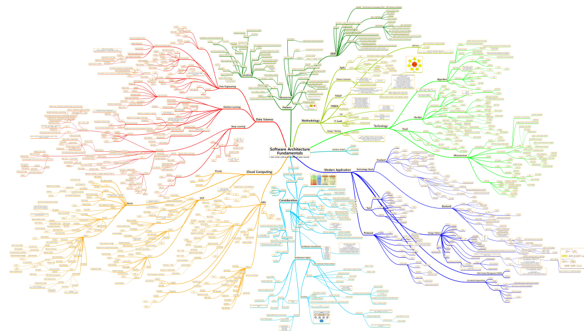
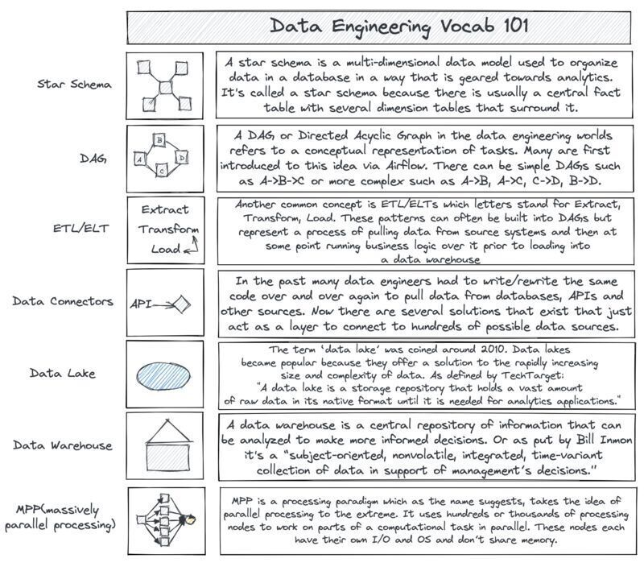
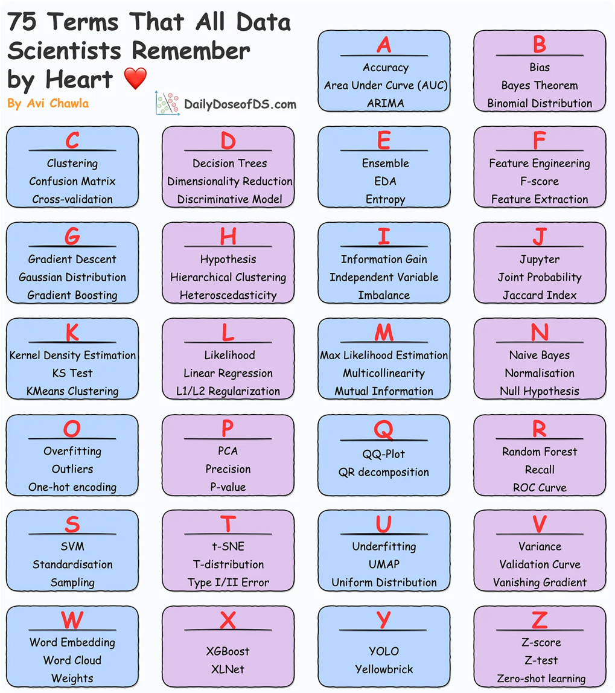
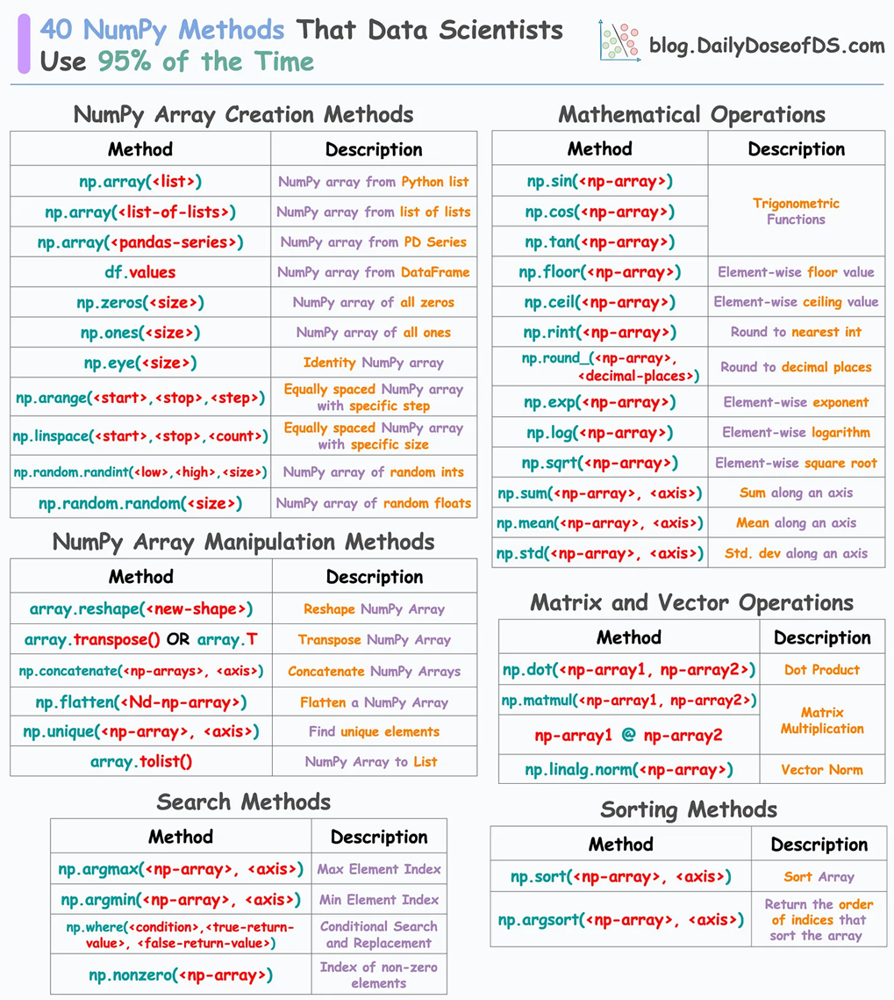
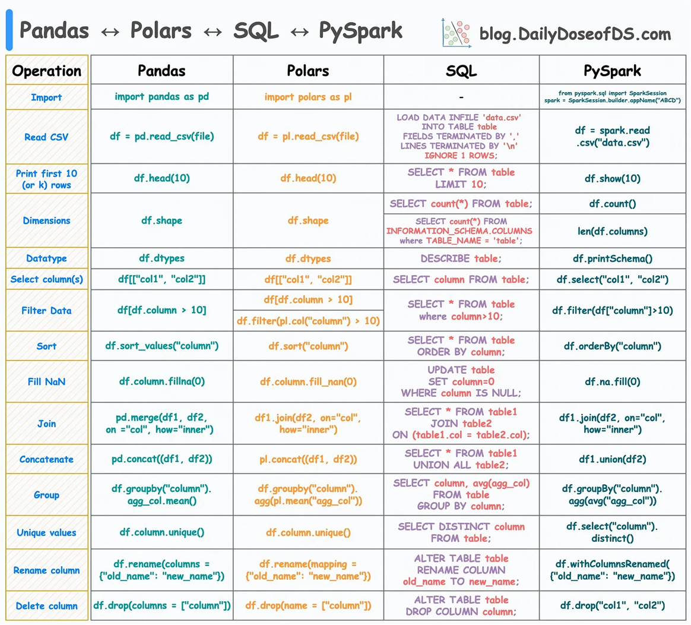
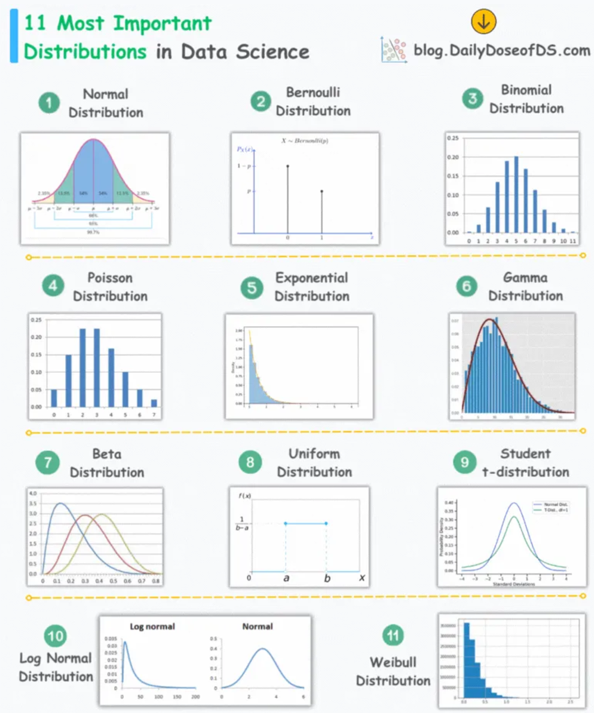
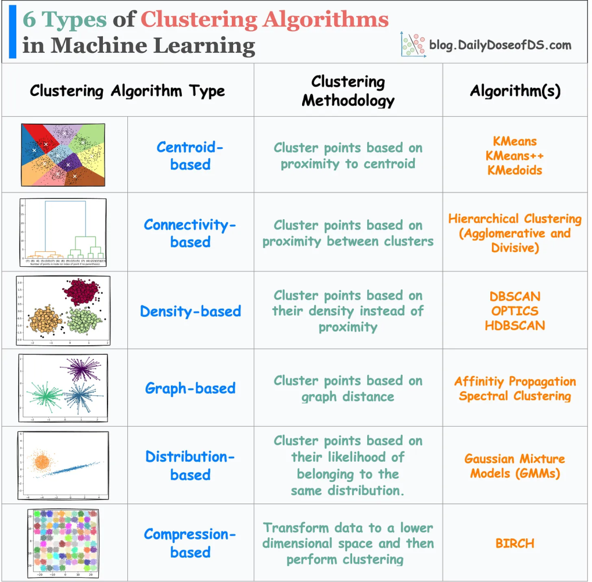

# Software Architecture Mindmap

Software terminologies and concepts, software architecture overview

Summarized the keywords and solutions have faced in my learning and experience.



- Full Version

`Software_Architecture_Mindmap.png`

Three main pillars upon software architecture

- Modern Application Development

- Cloud Computing (AWS/Azure/GCP)

- Data Science (ML/NN)

and

Numerous technologies and methodologies.

ⓒ 2022. (https://github.com/kimtth) all rights reserved.

This mindmap created by `https://app.mindmapmaker.org/`

---

## Software Architecture Reference

- [System Design 101](https://github.com/ByteByteGoHq/system-design-101): ByteByteGo
- [Awesome Lists](https://github.com/sindresorhus/awesome): 😎 Awesome lists about all kinds of interesting topics / `awesome.re` / [github topic](https://github.com/topics/awesome)
- [Awesome Software Architecture (simskij)](https://github.com/simskij/awesome-software-architecture)
- [Awesome Software Architecture](https://github.com/mehdihadeli/awesome-software-architecture): A curated list of awesome articles, videos, and other resources to learn and practice software architecture, patterns, and principles
- [Software Architecture Books](https://github.com/mhadidg/software-architecture-books): A comprehensive list of books on Software Architecture
- [System Design](https://github.com/karanpratapsingh/system-design): Learn how to design systems at scale and prepare for system design interviews
- [Microsoft .NET Application Architecture - Reference Apps](https://github.com/dotnet-architecture/eShopOnWeb)
- [Software Architecture Books](https://github.com/mhadidg/software-architecture-books)
- [System Design Fight Club](https://github.com/systemdesignfightclub/SDFC)
- [System Design - Neo Kim](https://github.com/systemdesign42/system-design)
- [Awesome System Design Resources](https://github.com/ashishps1/awesome-system-design-resources)

---

- [InfoQ](https://www.infoq.com): News and Articles
- [Dzone](https://dzone.com/): RefCards and Trend Reports
- [Thoughtworks](https://www.thoughtworks.com/radar): Technology Radar
- [Microsoft Learn](https://learn.microsoft.com/en-us/): Documentation and Code samples

---

- [AWS to Azure services comparison](https://learn.microsoft.com/en-us/azure/architecture/aws-professional/services)
- [Google Cloud to Azure services comparison](https://learn.microsoft.com/en-us/azure/architecture/gcp-professional/services)
- [Compare AWS and Azure services to Google Cloud](https://cloud.google.com/docs/get-started/aws-azure-gcp-service-comparison)
- [Microsoft Azure Developer's Cheat Sheet](https://github.com/milanm/azure-cheat-sheet): Every product, feature and service in the Azure family
- [Algorithm Visualizer](https://github.com/algorithm-visualizer/algorithm-visualizer): Interactive Online Platform that Visualizes Algorithms from Code
- [Azure Cloud Adoption Framework :CAF](https://learn.microsoft.com/en-gb/azure/cloud-adoption-framework/): organization-wide adoption guidance
- [Azure Well-architected Framework :WAF](https://learn.microsoft.com/en-us/azure/well-architected/): workload-focussed design and continuous improvement guidance
- [Azure Architecture Center :AAC](https://learn.microsoft.com/en-us/azure/well-architected/service-guides/?product=popular): architecture patterns and reference architectures
  - [Best practices in cloud applications](https://learn.microsoft.com/en-us/azure/architecture/best-practices/index-best-practices)
  - [Cloud Design Patterns](https://learn.microsoft.com/en-us/azure/architecture/patterns/)
  - [Landing zone](https://learn.microsoft.com/en-us/azure/architecture/landing-zones/azure-virtual-desktop/design-guide?tabs=baseline)
    - Abstractly speaking, a landing zone helps you plan for and design an Azure deployment, by conceptualizing a designated area for placement and integration of resources. There are two types of landing zones:
    1. `platform landing zone`: provides centralized enterprise-scale foundational services for workloads and applications.
    2. `application landing zone`: provides services specific to an application or workload.
- [Google SRE Handbook](https://sre.google/sre-book/monitoring-distributed-systems/#xref_monitoring_golden-signals)
  - `Latency` is the response time of your application, usually expressed in milliseconds
  - `Throughput` is how many transactions per second or minute your application can handle
  - `Errors` is usually measured in a percent of
  - `Saturation` is the ability of your application to use the available CPU and Memory
- [InfoQ minibooks](https://www.infoq.com/minibooks/): Architectures You’ve Always Wondered About .. [2021](./files/minibooks/AYAWA-2021-1635782607730.pdf) / [2023](./files/minibooks/AYAWA-2023-1685636455618.pdf) / [2024](./files/minibooks/AYAWA-2024-1712241257109.pdf)

---

- [Kaggle Solutions and Ideas](https://github.com/faridrashidi/kaggle-solutions): Collection of Kaggle Solutions and Ideas
- [Best-of Machine Learning with Python](https://github.com/ml-tooling/best-of-ml-python): A ranked list of awesome machine learning Python libraries. Updated weekly.

---

- [freeCodeCamp](https://www.freecodecamp.org): Learn to code for free. [youtube](https://www.youtube.com/freecodecamp)
- [Ultimate Collection of 60 YouTube Courses for 21 Programming Languages](https://dev.to/arjuncodess/ultimate-collection-of-60-youtube-courses-for-21-programming-languages-mega-list-47b5)
- [Computer Science courses with video lectures](https://github.com/Developer-Y/cs-video-courses)

---

- [Software Industry Statistics](https://www.statista.com/markets/418/topic/484/software/#overview): Statista Industry Insight
- [Gartner Top Strategic Technology Trends 2024](https://www.gartner.com/en/articles/gartner-top-10-strategic-technology-trends-for-2024)
- [MAD (ML/AI/Data) Landscape](https://mad.firstmark.com/)

---

- [Substack Leaderboard](https://substack.com/browse/technology): Newsletter

---

- [Best Kubernetes Tools](https://bluelight.co/blog/best-kubernetes-tools): Bluelight Consulting

## Engineering blog

- [AWS Architecture Blog](https://aws.amazon.com/blogs/architecture/)
- [Azure Architecture Blog](https://techcommunity.microsoft.com/t5/azure-architecture-blog/bg-p/AzureArchitectureBlog)
- [GCP Cloud Blog](https://cloud.google.com/blog)
- [Netflix TechBlog](https://medium.com/netflix-techblog)
- [Uber Blog](http://eng.uber.com/)
- [The Cloudflare Blog](https://blog.cloudflare.com/)
- [Engineering at Meta](https://engineering.fb.com/)
- [LinkedIn Engineering](https://engineering.linkedin.com/blog)
- [Stripe Blog: Engineering](https://stripe.com/blog/engineering)
- [Discord Blog: Engineering & Developers](https://discord.com/category/engineering)
- [Slack Engineering](https://slack.engineering/)
- [79 Engineering Blogs To Level Up Your System Design Skills](https://blog.bytebytego.com/p/79-engineering-blogs-to-level-up)

## Computer Science Papers

- [Computer Science Papers Every Developers Should Read](https://x.com/milan_milanovic/status/1747167493553062398?s=20)

1. On the Criteria To Be Used in Decomposing Systems into Modules (1972), D.L. Parnas: [ref](https://win.tue.nl/~wstomv/edu/2ip30/references/criteria_for_modularization.pdf)
2. An Axiomatic Basis for Computer Programming (1969), C.A.R. Hoare: [ref](http://sunnyday.mit.edu/16.355/Hoare-CACM-69.pdf)
3. Time, Clocks, and the Ordering of Events in a Distributed System (1978), L. Lamport: [ref](https://microsoft.com/en-us/research/publication/time-clocks-ordering-events-distributed-system/)
4. Out of the Tar Pit (2006), B. Moseley, P. Marks: [ref](https://curtclifton.net/papers/MoseleyMarks06a.pdf)
5. Dynamo: Amazon’s Highly Available Key-value Store (2007), G. DeCandia et al.: [ref](https://allthingsdistributed.com/files/amazon-dynamo-sosp2007.pdf)
6. MapReduce: Simplified Data Processing on Large Clusters (2004), J. Dean, S. Ghemawat: [ref](https://static.googleusercontent.com/media/research.google.com/en//archive/mapreduce-osdi04.pdf)
7. A Note On Distributed Computing (1994), J. Waldo, G. Wyant, A. Wollrath, S. Kendall: [ref](https://scholar.harvard.edu/files/waldo/files/waldo-94.pdf)
8. A Metrics Suite for Object-Oriented Design (1994), S.R. Chidamber: [ref](https://sites.pitt.edu/~ckemerer/CK%20research%20papers/MetricForOOD_ChidamberKemerer94.pdf)
9. A Relational Model of Data for Large Shared Data Banks (1969), E.F. Codd: [ref](https://dl.acm.org/doi/10.1145/362384.362685)
10. Why Functional Programming Matters (1990), J. Hughes: [ref](https://www.cs.kent.ac.uk/people/staff/dat/miranda/whyfp90.pdf)

- Distributed Systems! Here's a reading list of 70+ Distributed Systems papers *mostly from conferences in just last 2 years*! [70+ Distributed Systems papers](https://docs.google.com/document/d/1XX5ksgLVnkPE-dfeVDZPlv5NMbgxJqWmi13YEQt1t1o/edit) [Jan 2024]

## Data Science (ML/NN)

- src: [#1](https://www.kdnuggets.com/10-github-repositories-to-master-machine-learning?utm_source=rss&utm_medium=rss&utm_campaign=10-github-repositories-to-master-machine-learning) 30 free e-books, [#2](https://newsletter.theaiedge.io/p/30-free-machine-learning-e-books) Github repository

1. [Deep Learning](http://www.deeplearningbook.org/) - Ian Goodfellow, Yoshua Bengio, and Aaron Courville
2. [Mathematics for Machine Learning](https://mml-book.github.io/) - Marc Peter Deisenroth, A. Aldo Faisal, Cheng Soon Ong
3. [An Introduction to Statistical Learning](https://www.statlearning.com/) - Gareth James, Daniela Witten, Trevor Hastie, Robert Tibshirani, Jonathan Taylor
4. [The Elements of Statistical Learning](https://web.stanford.edu/~hastie/ElemStatLearn/) - Jerome H. Friedman, Robert Tibshirani, and Trevor Hastie
5. [Probabilistic Machine Learning: An Introduction](https://probml.github.io/pml-book/) - Kevin Patrick Murphy
6. [Probabilistic Machine Learning: Advanced Topics](https://probml.github.io/pml-book/) - Kevin Patrick Murphy
7. [Understanding Machine Learning](https://www.cs.huji.ac.il/~shais/UnderstandingMachineLearning/) - Shai Shalev-Shwartz and Shai Ben-David
8. [Automated Machine Learning](https://www.automl.org/book/) - Frank Hutter, Lars Kotthoff, Joaquin Vanschoren
9. [Applied Causal Inference](https://www.appliedcausalinference.org/) - Uday Kamath, Kenneth Graham, Mitchell Naylor
10. [Reinforcement Learning: An Introduction](http://incompleteideas.net/book/the-book-2nd.html) - Richard S. Sutton and Andrew G. Barto
11. [The Hundred-Page Machine Learning Book](http://themlbook.com/) - Andriy Burkov
12. [Machine Learning Engineering](http://www.mlebook.com/wiki/doku.php) - Andriy Burkov
13. [Natural Language Processing with Python](https://www.nltk.org/book/) - Steven Bird, Ewan Klein, and Edward Loper
14. [Dive into Deep Learning](https://d2l.ai/) - Aston Zhang, Zachary C. Lipton, Mu Li, Alexander J. Smola
15. [Machine Learning Yearning](https://www.deeplearning.ai/machine-learning-yearning/) - Andrew NG
16. [Machine Learning for Humans](https://vas3k.com/blog/machine_learning/) - Vishal Maini, Samer Sabri
17. [Pattern Recognition and Machine Learning](https://www.microsoft.com/en-us/research/people/cmbishop/#!prml-book) - Christopher M. Bishop
18. [Deep Learning on Graphs](https://www.deeplearningongraphs.com/) - Yao Ma and Jiliang Tang
19. [Approaching (Almost) Any Machine Learning Problem](https://github.com/abhishekkrthakur/approachingalmost) - Abhishek Thakur
20. [Feature Engineering and Selection](https://bookdown.org/max/FES/) - Max Kuhn and Kjell Johnson
21. [Hands-On Machine Learning with R](https://bradleyboehmke.github.io/HOML/) - Bradley Boehmke & Brandon Greenwell
22. [Deep Learning Interviews](https://www.amazon.com/Deep-Learning-Interviews-Solved-Questions/dp/1087810791) - Shlomo Kashani and Amir Ivry
23. [Machine Learning Interpretability](https://learning.oreilly.com/library/view/an-introduction-to/9781098101425/) - Patrick Hall and Navdeep Gill
24. [Interpretable Machine Learning](https://christophm.github.io/interpretable-ml-book/) - Christoph Molnar
25. [Boosting: Foundations and Algorithms](https://mitpress.mit.edu/books/boosting) - Robert E. Schapire, Yoav Freund
26. [A Brief Introduction to Machine Learning for Engineers](https://www.springer.com/gp/book/9783030219417) - Osvaldo Simeone
27. [Speech and Language Processing](https://web.stanford.edu/~jurafsky/slp3/) - Daniel Jurafsky & James Martin
28. [Computer Vision: Models, Learning, and Inference](http://www.computervisionmodels.com/) - Simon J.D. Prince
29. [Information Theory, Inference and Learning Algorithms](http://www.inference.org.uk/mackay/itila/) - David J. C. MacKay
30. [Machine Learning For Dummies](https://www.ibm.com/downloads/cas/GB8ZMQZ3) - Judith Hurwitz and Daniel Kirsch

---

1. [Machine Learning for Beginners](https://github.com/microsoft/ML-For-Beginners)
1. [Machine Learning YouTube Videos](https://github.com/ujjwalkarn/Machine-Learning-Videos)
1. [Mathematics for Machine Learning](https://github.com/mml-book/mml-book.github.io)
1. [Deep Learning Book](https://github.com/janishar/mit-deep-learning-book-pdf)
1. [Machine Learning ZoomCamp](https://github.com/alexeygrigorev/mlbookcamp-code)
1. [Machine Learning Tutorials](https://github.com/ujjwalkarn/Machine-Learning-Tutorials)
1. [Awesome Machine Learning](https://github.com/josephmisiti/awesome-machine-learning)
1. [CS 229 Machine Learning Cheatsheets](https://github.com/afshinea/stanford-cs-229-machine-learning)
1. [Machine Learning Interview Guide](https://github.com/Sroy20/machine-learning-interview-guide)
1. [Awesome Production Machine Learning](https://github.com/EthicalML/awesome-production-machine-learning)
1. [365 Data Science Flashcards](https://365datascience.com/flashcards/)

## Terminology and Comparisons

- [Gartner's PACE Layered Application Strategy](https://cio-wiki.org/wiki/Gartner%27s_PACE_Layered_Application_Strategy): A methodology for categorizing, selecting, managing and governing applications based on their characteristics and the speed of change they require1.
- [JIT vs AOT](https://stackoverflow.com/questions/32653951/when-does-ahead-of-time-aot-compilation-happen): JIT and AOT are two types of compilers that differ in when they convert a program from one language to another, either at run-time or build-time.
- [SSG: Static site generator list](https://jamstack.org/generators/): A tool that generates a full static HTML website based on raw data and a set of templates.
- [Popular Enterprise Architecture Frameworks](https://dzone.com/articles/popular-enterprise-architecture-frameworks): TOGAF, Zachman, Federal Enterprise Architecture (FEA), Gartner Enterprise Architecture Framework, Business Architecture Guild’s BIZBOK, Department of Defense Architecture Framework (DoDAF), ArchiMate, and Sherwood Applied Business Security Architecture (SABSA).
- [Are Architecture Styles, Patterns, and Design Patterns Different?](https://x.com/milan_milanovic/status/1747683090598711725?s=20)

    <details>

    <summary>Architecture Styles vs Patterns vs Design Patterns</summary>

        𝟭. 𝗔𝗿𝗰𝗵𝗶𝘁𝗲𝗰𝘁𝘂𝗿𝗮𝗹 𝘀𝘁𝘆𝗹𝗲𝘀

        This is the highest level of abstraction, where architectural designs instruct us on structuring our code. The highest level of granularity describes the application's layers and high-level modules and how they relate to and interact with one another. Examples of architectural styles include:
        🔹 Monolith
        🔹 Layered
        🔹 Event-driven
        🔹 Self-contained Systems
        🔹 Microservices
        🔹 Space-Based

        𝟮. 𝗔𝗿𝗰𝗵𝗶𝘁𝗲𝗰𝘁𝘂𝗿𝗮𝗹 𝗽𝗮𝘁𝘁𝗲𝗿𝗻𝘀

        These patterns represent a way to implement an architectural style, so we can do this regularly. Some examples are how to separate the user interface (UI) and data, how internal modules interact, and what layers we will use. Patterns answer these types of questions. They usually impact the code base and how to structure the code inside. Examples of architectural patterns include:

        🔹 Model-View-Presenter (MVP): 1:1 Relationship between View and Presenter. e.g., Windows forms
        🔹 Model-View-Controller (MVC): e.g., Smalltalk, ASP.Net MVC
        🔹 Model–View–Viewmodel (MVVM): One to Many relationship between View and ViewModel. e.g., Silverlight, WPF, AngularJs: 
        🔹 Domain-Driven Design

        𝟯. 𝗗𝗲𝘀𝗶𝗴𝗻 𝗽𝗮𝘁𝘁𝗲𝗿𝗻𝘀

        These differ from architectural patterns in that they focus on a smaller code base area and have a smaller influence (focus on a local problem). These include limiting the creation of a class to only one object or notifying all dependent objects when the internal state of an object is changed. These patterns are described in the book "Design Patterns: Elements of Reusable Object-Oriented Software" by Erich Gamma, Richard Helm, Ralph Johnson, and John Vlissides from 1994.

        We have 𝘁𝗵𝗿𝗲𝗲 𝗴𝗿𝗼𝘂𝗽𝘀 𝗼𝗳 𝗗𝗲𝘀𝗶𝗴𝗻 𝗣𝗮𝘁𝘁𝗲𝗿𝗻𝘀:

        🔹 𝗖𝗿𝗲𝗮𝘁𝗶𝗼𝗻𝗮𝗹: here we have Factory Method, Builder, Singleton, ...
        🔹 𝗦𝘁𝗿𝘂𝗰𝘁𝘂𝗿𝗮𝗹: here we have an Adapter, Bridge, and Decorator, ...
        🔹 𝗕𝗲𝗵𝗮𝘃𝗶𝗼𝗿𝗮𝗹: here we have Command, Iterator, State, Strategy, ...
        
    </details>

- Memory consistency model: [A Primer on Memory Consistency and Cache Coherence](https://link.springer.com/book/10.1007/978-3-031-01764-3)

    <details>

    <summary>SC vs TSO vs Relaxed Memory Consistency</summary>

        𝟭. Sequential Consistency (SC): Operations execute in order as per the program.
        🔹 SC preserves order for two memory operations from the same thread for all four combinations of loads and stores (Load → Load, Load → Store, Store → Store, and Store → Load). 
        🔹 MIPS R10000

        𝟮. Total Store Order (TSO): Reads can happen before preceding writes complete. 
        🔹 TSO preserves the first three orders (Load → Load, Load → Store, Store → Store) but not Store → Load order.
        🔹 x86 CPU.
    
        𝟯. Relaxed Memory Consistency: Allows more reordering of operations for performance. 
        🔹 ARM and RISC-V

    </details>

- API Gateway vs Load Balancer
  - API Gateway: Manages access to backend services, handles tasks like rate-limiting, authentication, logging, and security policies.
  - Load Balancer: Distributes network traffic across multiple servers for high availability and even load distribution.

- Data engineering & Data Scientists Vocab 101 [ref](https://x.com/SeattleDataGuy/status/1753950189314810358?s=20)

    <details>

    <summary>Expand</summary>
    🔹 Data engineering Vocab 101

    [ref](https://x.com/SeattleDataGuy/status/1753950189314810358?s=20)

    

    🔹 75 Key Terms That Data Scientists Remember by Heart 
    
    [ref](https://www.blog.dailydoseofds.com/p/75-key-terms-that-data-scientists)

    

    🔹 A Comprehensive NumPy Cheat Sheet Of 40 Most Used Methods 
    
    [ref](https://www.blog.dailydoseofds.com/p/a-comprehensive-numpy-cheat-sheet)

    

    🔹 15 Pandas ↔ Polars ↔ SQL ↔ PySpark Translations 
    
    [ref](https://www.blog.dailydoseofds.com/p/15-pandas-polars-sql-pyspark-translations)

    

    🔹 11 Key Probability Distributions 

    [ref](https://www.blog.dailydoseofds.com/p/11-key-probability-distributions)

    

    🔹 6 Must-Know Types of Clustering Algorithms in Machine Learning 

    [ref](https://blog.dailydoseofds.com/p/beyond-kmeans-6-must-know-types-of)

    

    </details>

- DevOps, Platform engineering and SRE (site reliability engineering) [ref](https://www.splunk.com/en_us/blog/learn/sre-vs-devops-vs-platform-engineering.html)

    <details>

    <summary>SRE vs. DevOps vs. Platform Engineering</summary>

    🔹DevOps, SRE, and Platform Engineering are practices that streamline software development and maintenance. They all involve automation and collaboration.

    🔹DevOps covers the entire software development process promoting team collaboration.

    🔹SRE focuses on system reliability, including application monitoring and emergency response.

    🔹Platform Engineering manages the infrastructure and tools needed for software development and operations.
    
    🔹DevOps is about the whole development process, SRE emphasizes reliability and scalability, and Platform Engineering is about infrastructure and tool management.

    </details>

- Web services and APIs (SOAP, RestAPI, GraphQL, gRPC and Kafka) [ref](https://www.redhat.com/architect/apis-soap-rest-graphql-grpc)

    <details>

    <summary>SOAP, RestAPI, GraphQL, gRPC and Kafka</summary>

    🔹SOAP (Simple Object Access Protocol): XML-based protocol for web services, heayweight, favored for security and reliability.

    🔹REST (Representational State Transfer): Uses HTTP methods, simple and easy to use, but can be resource-heavy.

    🔹GraphQL: Allows flexible data queries, reduces data over-fetching.

    🔹gRPC (Google Remote Procedure Call)**: High-performance RPC framework, ideal for connecting microservices. Built on top of HTTP/2 and uses Protocol Buffers for data exchange.

    🔹Kafka: Distributed streaming platform, uses publish-subscribe model for message queueing. real-time consistency. "at-least-once" delivery.
    </details>

- Real-time communication and messaging (MQTT, AMQP and WebSocket) [ref](https://www.cloudamqp.com/blog/amqp-vs-mqtt.html)

    <details>

    <summary>MQTT vs AMQP vs WebSocket</summary>

    🔹MQTT (Message Queuing Telemetry Transport): Lightweight messaging protocol, uses publish-subscribe model, ideal for IoT and M2M communication. Three levels of Quality of Service (QoS): “At most once” (QoS 0), “At least once” (QoS 1), and “Exactly once” (QoS 2).

    🔹AMQP (Advanced Message Queuing Protocol): Open-standard application layer protocol, robust message delivery, routing, and security features. Two qualities of service: “At most once (delivered once or lost)” and “At least once (delivered one or more times.)”.

    🔹WebSocket: Enables full-duplex communication channels over a single TCP connection
    </details>

- Reactive programming vs event-driven architecture [ref](https://reactiveweb.org/reactive-programming-vs-event-driven-key-differences/)
  - Event-Driven: Handles user actions or system events. More general and can be used in any context where an event occurs
  - Reactive: Data-driven approach. managing data streams and propagating changes, like in a spreadsheet model.

- RABC vs ReABC: RBAC (Role-Based Access Control) is an authorization model that assigns permissions based on predefined roles. On the other hand, ReBAC (Relationship-Based Access Control) extends RBAC’s capabilities by considering relationships between entities.
- Conway's law: Software engineering principle that states that the structure of a system reflects the structure of the organization that designs it.
- Data Management in Distributed systems (Partitioning, Shuffling and Bucketing)

    <details>

    <summary>Partitioning vs Shuffling vs Bucketing</summary>

    🔹Partitioning: The process of dividing a large dataset into smaller parts, known as partitions. This process splits Hive table's files into multiple files. For example, `../hive/warehouse/sales_table/product_id=P1`.

    🔹Shuffling: Shuffling is the process of redistributing data across different partitions. The overhead of operations can be ranked as follows: `orderby` > `join` > `groupby`.

    🔹Bucketing: This is the process of decomposing data into manageable parts based on a certain column, thereby improving query performance and storage efficiency. It is best used when there are very few repeating values in a column (for example - a primary key column). For instance, Bucket0: `../hive/warehouse/sales_table/product_id=P1/000000_0`, Bucket1: `../hive/warehouse/sales_table/product_id=P1/000001_0`, and so on.
    </details>

- SSO (Single Sign-On) is an authentication scheme that allows a user to log in with a single ID and password to any of several related, yet independent, software systems.

    <details>

    <summary>SSO workflow, Types of SSO, SSO Implementations</summary>

    🔹SSO workflow: Identity Provider (IdP), Service Provider (SP), SSO Server
    - IdP: Central Authentication server e.g., Google
    - SP: Individual Applications rely on SSO e.g, Trello
    - SSO Server: Bridge between IdP and SPs

    🔹Types of SSO: SAML, OAuth (Open Authorization) 2.0, Open ID Connect (OIDC)

    | Protocol | Purpose | Token Format | - |
    | --- | --- | --- | --- |
    | OAuth 2.0 | Open standard for Authorization | Access Tokens | Temporary access to 3rd party app |
    | OpenID Connect (OIDC) | Open standard for Authentication | JSON Web Token (JWT) | Newer type of SSO based on OAuth 2.0, Straightforward protocol than SAML |
    | SAML | Authentication, Authorization | XML | Most common, Use SAML Protocol to exchange authentication between SSO server and SP |

    🔹Some other Types of SSO: Kerberos, Smart card authentication
    - Kerberos: Less suitable for internet-facing SSO due to the shared secret between KDC (Key Distributin Center) and all participants.
    - Smart card authentication: Physical card

    🔹SSO Implementations: Microsoft Entra ID (FKA Micorsoft Active Directory), Okta, Ping Identity, OneLogin, Auth0

    </details>

- Deployment Styles: Blue/Green, Canary, and A/B

    <details>

    <summary>Blue/Green, Canary, A/B</summary>

    🔹Blue/Green Deployment: Two identical environments, "Blue" and "Green". Deploy new version in inactive environment, test, then switch users to it. For example, AWS supports blue/green deployment strategies including Elastic Beanstalk, OpsWorks, CloudFormation, CodeDeploy, and Amazon ECS.

    🔹Canary Deployment: Roll out new version to a small group of users, monitor feedback, then do a full-scale release.

    🔹A/B Testing: Compare two versions of a webpage or app to see which performs better. A typical example of A/B testing is website usability testing.

    </details>

- Flaky Test: A Flaky Test is a test that sometimes passes and sometimes fails, despite no changes in the code. Causes can include poorly written tests, async waits, test order dependency, and concurrency issues. They can slow down CI/CD pipelines and cause issues for end users. [ref](https://github.com/jmicco/JaSST_tutorial)

- Hadoop Ecosystem
    <details>
    <summary>Hadoop vs Azure, AWS, GCP</summary>

    🔹1. **HDFS (File Storage)**: Azure Data Lake Storage, Amazon S3, Google Cloud Storage

    🔹2. **YARN (Resource Management)**: No direct equivalent in Azure, AWS, GCP

    🔹3. **MapReduce (Data Processing)**: HDInsight, Amazon EMR, Google Cloud Dataproc

    🔹4. **Spark (Fast Data Processing)**: Databricks, Spark in HDInsight, Azure Synapse Analytics, Amazon EMR, Google Cloud Dataproc

    🔹5. **PIG, HIVE (Query Data)**: HDInsight, Azure Synapse Analytics, Amazon EMR, Google Cloud Dataproc

    🔹6. **HBase (NoSQL DB)**: Azure Cosmos DB, HBase on a virtual machine (VM), HBase in Azure HDInsight, Amazon DynamoDB, Google Cloud Bigtable

    🔹7. **Mahout, Spark MLLib (ML Libraries)**: Databricks, Amazon SageMaker, No direct equivalent in GCP

    🔹8. **Solar, Lucene (Search/Index)**: Azure Cognitive Search, Amazon CloudSearch, Google Cloud Search

    🔹9. **Zookeeper (Cluster Management)**: No direct equivalent in Azure, Amazon Managed Apache ZooKeeper, No direct equivalent in GCP

    🔹10. **Oozie (Job Scheduling)**: Azure Data Factory, AWS Step Functions, Google Cloud Composer
    </details>
    
- Software defined Networking(SDN) Northbound vs Southbound
    <details>
    <summary>Expand</summary>

    ```mermaid
    graph TD
        A[Application layer - routing, load balancing, etc] -->|Northbound APIs| B[Control layer - SDN controller]
        B -->|Southbound APIs| C[Infrastructure layer - physical switches, data plane]
    ```

    🔹The **Controller** is the SDN network's brain, directing traffic flows.

    🔹 The **Southbound Interface** communicates the controller's decisions to the switches using protocols like OpenFlow.

    🔹**SDN Switches** direct traffic based on the controller's instructions.

    🔹**Network Devices** (servers, routers, etc.) send and receive data flows as directed by the SDN switches.

    🔹The **Northbound Interface** uses APIs to exchange data between the controller and applications.

    🔹**SDN Applications** use network data to perform tasks, communicating their needs to the controller.

    ```mermaid
    graph LR
    A[Controller] -- API --> B[Southbound Interface]
    B -- OpenFlow --> C[SDN Switches]
    C -- Data Flow --> D[Network Devices]
    A -- API --> E[Northbound Interface]
    E -- Applications --> F[SDN Applications]
    ```
    </details>

- Cracking coding interviews
    <details>
    <summary>Expand</summary>

    🔹**src**: [ref](https://x.com/systemdesign42/status/1776590986837160427)

    🔹Two Pointers: Navigating arrays with two indices. [ref](https://www.pluralsight.com/resources/blog/guides/algorithm-templates-two-pointers-part-2)

    🔹Intervals: Working with ranges of values. [ref](https://medium.com/@timpark0807/leetcode-is-easy-the-interval-pattern-d68a7c1c841) / [ref](https://leetcode.com/problems/minimum-number-of-arrows-to-burst-balloons/solutions/93735/a-concise-template-for-overlapping-interval-problem/) / [ref](https://leetcode.com/discuss/general-discussion/794725/General-Pattern-for-greedy-approach-for-Interval-based-problems)

    🔹Dynamic Programming: Solving complex problems by breaking them down into simpler subproblems. [ref](https://www.youtube.com/watch?v=ZwDDLAeeBM0&t=294s) / [ref](https://leetcode.com/discuss/general-discussion/651719/how-to-solve-dp-string-template-and-4-steps-to-be-followed)

    🔹Tree Traversal: Visiting all nodes in a tree. [ref](https://medium.com/leetcode-patterns/leetcode-pattern-0-iterative-traversals-on-trees-d373568eb0ec) / [ref](https://leetcode.com/problems/binary-tree-postorder-traversal/solutions/45551/Preorder-Inorder-and-Postorder-Iteratively-Summarization/)

    🔹DFS-BFS: Depth-first and breadth-first search algorithms. [ref](https://leetcode.com/problems/pacific-atlantic-water-flow/solutions/438276/Python-beats-98.-DFS-template-for-Matrix/) / [ref](https://medium.com/leetcode-patterns/leetcode-pattern-2-dfs-bfs-25-of-the-problems-part-2-a5b269597f52) / [ref](https://medium.com/leetcode-patterns/leetcode-pattern-1-bfs-dfs-25-of-the-problems-part-1-519450a84353) / [ref](https://www.youtube.com/watch?v=TIbUeeksXcI)

    🔹Binary Search: Finding an element in a sorted array. [ref](https://leetcode.com/problems/binary-search/solutions/423162/Binary-Search-101-The-Ultimate-Binary-Search-Handbook/)

    🔹Array: A data structure holding elements. [ref](https://leetcode.com/problems/reverse-pairs/solutions/97268/General-principles-behind-problems-similar-to-%22Reverse-Pairs%22/)

    🔹Sliding Window: A subset of data that moves. [ref](https://www.pluralsight.com/resources/blog/guides/algorithm-templates-two-pointers-part-3) / [ref](https://medium.com/leetcode-patterns/leetcode-pattern-2-sliding-windows-for-strings-e19af105316b) / [ref](https://leetcode.com/problems/minimum-window-substring/solutions/26808/Here-is-a-10-line-template-that-can-solve-most-'substring'-problems/) / [ref](https://leetcode.com/problems/find-all-anagrams-in-a-string/solutions/92007/Sliding-Window-algorithm-template-to-solve-all-the-Leetcode-substring-search-problem./) / [ref](https://leetcode.com/problems/best-time-to-buy-and-sell-stock-with-transaction-fee/solutions/108870/Most-consistent-ways-of-dealing-with-the-series-of-stock-problems/)

    🔹Backtracking: Trying out all possibilities to find a solution. [ref](https://leetcode.com/problems/permutations/solutions/18284/Backtrack-Summary:-General-Solution-for-10-Questionsh/) / [ref](https://medium.com/leetcode-patterns/leetcode-pattern-3-backtracking-5d9e5a03dc26) / [ref](https://leetcode.com/problems/combination-sum/solutions/16502/A-general-approach-to-backtracking-questions-in-Java-(Subsets-Permutations-Combination-Sum-Palindrome-Partitioning)/)

    🔹Combination: Finding all possible arrangements of elements. [ref](https://leetcode.com/problems/combination-sum-iv/solutions/85120/C++-template-for-ALL-Combination-Problem-Set/)

    🔹Trie: A tree-like data structure for storing strings. [ref](https://leetcode.com/discuss/general-discussion/931977/beginner-friendly-guide-to-trie-tutorial-practice-problems)

    🔹Word Break: Dividing a string into words. [ref](https://leetcode.com/problems/concatenated-words/solutions/836924/Python-Template-Word-Break-I-Word-Break-II-Concatenated-Words/)

    🔹Bit Manipulation: Performing operations on binary numbers. [ref](https://leetcode.com/problems/sum-of-two-integers/solutions/84278/A-summary:-how-to-use-bit-manipulation-to-solve-problems-easily-and-efficiently/) / [ref](https://leetcode.com/problems/single-number-ii/solutions/43295/Detailed-explanation-and-generalization-of-the-bitwise-operation-method-for-single-numbers/)

    🔹Sum: Adding numbers together. [ref](https://leetcode.com/problems/two-sum/solutions/737092/Sum-MegaPost-Python3-Solution-with-a-detailed-explanation/)

    🔹Monotonic Stack: A stack keeping elements in an ordered manner. [ref](https://leetcode.com/problems/sum-of-subarray-minimums/solutions/178876/stack-solution-with-very-detailed-explanation-step-by-step/)
    </details>
