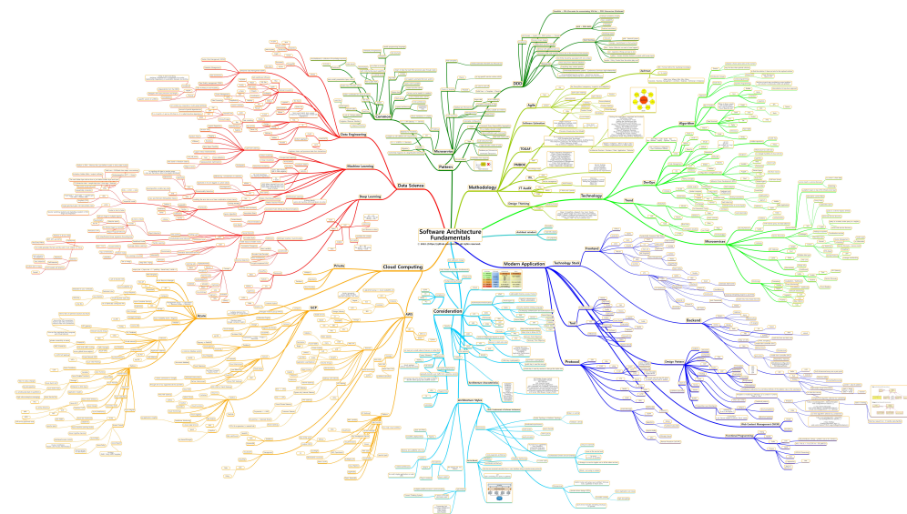

# Software Architecture Mindmap

> [!TIP]  
> The mindmap can be opened and edited using [mindmap-maker-clean](https://github.com/kimtth/mindmap-maker-clean). You can also use it to convert the JSON source into a high-resolution PNG. Verified on Chrome and Firefox.

## Contents

- **Section 1**: [Software Architecture Mindmap](#software-architecture-mindmap)
- **Section 2**: [Software Architecture Reference](#software-architecture-reference)
    - [Trend Reports and Mini-Books](#trend-reports-and-mini-books)
    - [Building from scratch](#building-from-scratch)
    - [Cloud Architecture](#cloud-architecture)
    - [Computer Science courses](#computer-science-courses)
    - [Beginner Series by Microsoft](#beginner-series-by-microsoft)
    - [Industry Trends](#industry-trends)
    - [Newsletter](#newsletter)
    - [Tools & Research](#tools--research)
    - [Engineering blog](#engineering-blog)
    - [Other Topics](#other-topics)
    - [Transformer Architecture (LLM Foundations)](#transformer-architecture-llm-foundations)
    - [Computer Science Books](#computer-science-books)
- **Section 3**: [Computer Science Papers](#computer-science-papers)
    - [Computer Science Papers Every Developer Should Read](#computer-science-papers-every-developer-should-read-ref)
    - [70+ Distributed Systems papers](#70-distributed-systems-papers)
    - [25 Papers That Completely Transformed the Computer World](#25-papers-that-completely-transformed-the-computer-world-ref)
    - [The best NLP papers from 2015 to now](#the-best-nlp-papers-from-2015-to-now)
- **Section 4**: [Data Science (ML/NN)](#data-science-mlnn)
    - [eBooks for ML, Data Science & AI](#ebooks-for-ml-data-science--ai)
    - [Github for ML, Data Science & AI](#github-for-ml-data-science--ai)
- **Section 5**: [Terminology and Comparisons](#terminology-and-comparisons)

Software terminologies and concepts, software architecture overview

`Software_Architecture_Mindmap.png`

**Three Main Pillars of Software Architecture:**

- Modern Application Development
- Cloud Computing (AWS/Azure/GCP)
- Data Science (ML/NN)

> [!TIP]  
> - This mind map is based on the Fresco Play curriculum (the internal learning platform of Tata Consultancy Services). © 2022 
> - This repository was initially created for the mind map; currently, it is used as a curated collection of software architecture references. 

<!--
so it does not cover all IT topics. I achieved a T-Factor of 3.99, completing 100+ courses and 90%+ of the curriculum. the mind map covers most of topic in the platform. 
--> 
---

## Software Architecture Reference

- [System Design 101](https://github.com/ByteByteGoHq/system-design-101): ByteByteGo
- [Awesome Lists](https://github.com/sindresorhus/awesome): 😎 Awesome lists about all kinds of interesting topics / `awesome.re` / [github topic](https://github.com/topics/awesome)
- [Ecosyste.ms: Awesome](https://awesome.ecosyste.ms/): An open API service indexing awesome lists
- [Awesome Software Architecture (simskij)](https://github.com/simskij/awesome-software-architecture)
- [Awesome Software Architecture](https://github.com/mehdihadeli/awesome-software-architecture): A curated list of awesome articles, videos, and other resources to learn and practice software architecture, patterns, and principles
- [Software Architecture Books](https://github.com/mhadidg/software-architecture-books): A comprehensive list of books on Software Architecture
- [System Design](https://github.com/karanpratapsingh/system-design): Learn how to design systems at scale and prepare for system design interviews
- [Microsoft .NET Application Architecture - Reference Apps](https://github.com/dotnet-architecture/eShopOnWeb)
- [Software Architecture Books](https://github.com/mhadidg/software-architecture-books)
- [System Design Fight Club](https://github.com/systemdesignfightclub/SDFC)
- [System Design - Neo Kim](https://github.com/systemdesign42/system-design)
- [Awesome System Design Resources](https://github.com/ashishps1/awesome-system-design-resources)
- [Awesome Low Level Design (LLD) / Object Oriented Design (OOD)](https://github.com/ashishps1/awesome-low-level-design)

### Trend Reports and Mini-Books

- [InfoQ](https://www.infoq.com): News and Articles
- [Dzone](https://dzone.com/): RefCards and Trend Reports
- [Thoughtworks](https://www.thoughtworks.com/radar): Technology Radar
- [Microsoft Learn](https://learn.microsoft.com/en-us/): Documentation and Code samples
- [Trendshift](https://trendshift.io/): GitHub Trending repositories
- [Design Gurus](https://www.designgurus.io/): Portal For Tech Interviews
- [System Design Blueprint: The Ultimate Guide](https://blog.bytebytego.com/p/ep56-system-design-blueprint-the)
- [InfoQ minibooks](https://www.infoq.com/minibooks/): Architectures You’ve Always Wondered About .. [2021](./files/minibooks/AYAWA-2021-1635782607730.pdf) / [2023](./files/minibooks/AYAWA-2023-1685636455618.pdf) / [2024](./files/minibooks/AYAWA-2024-1712241257109.pdf) /[2025](./files/minibooks/AYAWA-2025-1745910098236.pdf) / [Cell-Based Architecture](https://www.infoq.com/minibooks/cell-based-architecture-2024)
- [Building a scalable authorization system](./files/minibooks/Building%20a%20scalable%20authorization%20system_%20a%20step-by-step%20blueprint.pdf)
- [Mastering RAG](./files/minibooks/Mastering%20RAG-compressed.pdf)
- [Mastering AI Agents](./files/minibooks/Mastering%20AI%20Agents-compressed.pdf)
- [Agentic Architectures for Retrieval-intensive Applications](./files/minibooks/Weaviate%20Agentic%20Architectures-ebook.pdf)
- [Programming Notes for Professionals books](https://goalkicker.com/)
- [Google SRE Handbook](https://sre.google/sre-book/monitoring-distributed-systems/#xref_monitoring_golden-signals)

### Building from scratch

- [Let's Build a Simple Database](https://cstack.github.io/db_tutorial/): Writing a sqlite clone from scratch in C
- [Let’s Build A Simple Interpreter](https://ruslanspivak.com/lsbasi-part1/)
- [Let’s Build A Web Server](https://ruslanspivak.com/lsbaws-part1/)
- [Web Browser Engineering](https://browser.engineering/): Building a basic but complete web browser from scratch
- [Clone Wars](https://github.com/GorvGoyl/Clone-Wars): 100+ open-source clones of popular sites 
- [Curated list of project-based tutorials](https://github.com/practical-tutorials/project-based-learning)
- [Master programming by recreating your favorite technologies from scratch](https://github.com/codecrafters-io/build-your-own-x)
- [Build frontend applications at scale](https://frontendatscale.com/courses/frontend-architecture/)
- [Writing an Operating System in 1,000 Lines](https://github.com/nuta/operating-system-in-1000-lines)
- [minimal GPT](https://www.k-a.in/minimalGPT.html)
- [PyTorch internals](https://blog.ezyang.com/2019/05/pytorch-internals/)
- [JavaScript Runtime from Scratch](https://devlogs.xyz/blog/building-a-javaScript-runtime): C programming

### Cloud Architecture

- [AWS to Azure services comparison](https://learn.microsoft.com/en-us/azure/architecture/aws-professional/services)
- [Google Cloud to Azure services comparison](https://learn.microsoft.com/en-us/azure/architecture/gcp-professional/services)
- [Compare AWS and Azure services to Google Cloud](https://cloud.google.com/docs/get-started/aws-azure-gcp-service-comparison)
- [Microsoft Azure Developer's Cheat Sheet](https://github.com/milanm/azure-cheat-sheet): Every product, feature and service in the Azure family
- [Azure Cloud Adoption Framework :CAF](https://learn.microsoft.com/en-gb/azure/cloud-adoption-framework/): organization-wide adoption guidance
- [Azure Well-architected Framework :WAF](https://learn.microsoft.com/en-us/azure/well-architected/): workload-focussed design and continuous improvement guidance
- [Azure Architecture Center :AAC](https://learn.microsoft.com/en-us/azure/well-architected/service-guides/?product=popular): architecture patterns and reference architectures
- [Best practices in cloud applications](https://learn.microsoft.com/en-us/azure/architecture/best-practices/index-best-practices)
- [Cloud Design Patterns](https://learn.microsoft.com/en-us/azure/architecture/patterns/)
- [Landing zone](https://learn.microsoft.com/en-us/azure/architecture/landing-zones/azure-virtual-desktop/design-guide?tabs=baseline)
- [Resources for architects and developers of multitenant solutions](https://learn.microsoft.com/en-us/azure/architecture/guide/multitenant/related-resources)
- [Data partitioning strategies](https://learn.microsoft.com/en-us/azure/architecture/best-practices/data-partitioning-strategies)
- [Azure FinOps Guide](https://techcommunity.microsoft.com/t5/fasttrack-for-azure/the-azure-finops-guide/bc-p/4237205#M1023)
- [Modern Web App pattern for .NET](https://learn.microsoft.com/en-us/azure/architecture/web-apps/guides/enterprise-app-patterns/modern-web-app/dotnet/guidance) / [git](https://github.com/Azure/modern-web-app-pattern-dotnet)
- [AI agent orchestration patterns](https://learn.microsoft.com/en-us/azure/architecture/ai-ml/guide/ai-agent-design-patterns#implementations-in-microsoft-semantic-kernel)

### Computer Science courses

- [Kaggle Solutions and Ideas](https://github.com/faridrashidi/kaggle-solutions): Collection of Kaggle Solutions and Ideas
- [Best-of Machine Learning with Python](https://github.com/ml-tooling/best-of-ml-python): A ranked list of awesome machine learning Python libraries. Updated weekly.
- [freeCodeCamp](https://www.freecodecamp.org): Learn to code for free. [youtube](https://www.youtube.com/freecodecamp)
- [Ultimate Collection of 60 YouTube Courses for 21 Programming Languages](https://dev.to/arjuncodess/ultimate-collection-of-60-youtube-courses-for-21-programming-languages-mega-list-47b5)
- [Computer Science courses with video lectures](https://github.com/Developer-Y/cs-video-courses)
- [Introduction to CUDA Programming for Python Developers](https://www.pyspur.dev/blog/introduction_cuda_programming)
- [AI by Hand](https://by-hand.ai)
- [Computer Networking Fundamentals For Developers, DevOps, and Platform Engineers](https://labs.iximiuz.com/courses/computer-networking-fundamentals)

### Beginner Series by Microsoft

- [Generative AI for Beginners](https://github.com/microsoft/generative-ai-for-beginners?WT.mc_id=academic-105485-koreyst)
- [ML for Beginners](https://github.com/microsoft/ML-For-Beginners?WT.mc_id=academic-105485-koreyst)
- [Web Dev for Beginners](https://github.com/microsoft/Web-Dev-For-Beginners?WT.mc_id=academic-0000-abartolo)
- [AI for Beginners](https://github.com/microsoft/ai-for-beginners?WT.mc_id=academic-105485-koreyst)
- [Data Science for Beginners](https://github.com/microsoft/Data-Science-For-Beginners?WT.mc_id=academic-105485-koreyst)
- [IoT for Beginners](https://github.com/microsoft/IoT-For-Beginners?WT.mc_id=academic-105485-koreyst)
- [AI Agents for Beginners](https://github.com/microsoft/ai-agents-for-beginners)
- [Cybersecurity for Beginners](https://github.com/microsoft/Security-101?WT.mc_id=academic-96948-sayoung)
- [Model Context Protocol (MCP) For Beginners](https://github.com/microsoft/mcp-for-beginners?WT.mc_id=academic-105485-koreyst)
- [Generative AI for Beginners using .NET](https://github.com/microsoft/Generative-AI-for-beginners-dotnet?WT.mc_id=academic-105485-koreyst)
- [Mastering GitHub Copilot for C#/.NET Developers](https://github.com/microsoft/mastering-github-copilot-for-dotnet-csharp-developers?WT.mc_id=academic-105485-koreyst)
- [Choose Your Own Copilot Adventure](https://github.com/microsoft/CopilotAdventures?WT.mc_id=academic-105485-koreyst)
- [XR Development for Beginners](https://github.com/microsoft/xr-development-for-beginners?WT.mc_id=academic-105485-koreyst)
- [Mastering GitHub Copilot for AI Paired Programming](https://github.com/microsoft/Mastering-GitHub-Copilot-for-Paired-Programming?WT.mc_id=academic-113596-abartolo)

### Industry Trends

- [Software Industry Statistics](https://www.statista.com/markets/418/topic/484/software/#overview): Statista Industry Insight
- [Gartner Top Strategic Technology Trends 2024](https://www.gartner.com/en/articles/gartner-top-10-strategic-technology-trends-for-2024)
- [MAD (ML/AI/Data) Landscape](https://mad.firstmark.com/)
- [Hype Cycle for Emerging Technologies 2024](https://www.gartner.com/en/newsroom/press-releases/2024-08-21-gartner-2024-hype-cycle-for-emerging-technologies-highlights-developer-productivity-total-experience-ai-and-security)
- [Microsoft Digital Defense Report](https://aka.ms/MDDR)
- [Google DORA](https://dora.community/): DevOps Research and Assessment (DORA)
- [Postman State of the API Report](https://www.postman.com/state-of-api)
- [Stanford AI Index Annual Report](https://hai.stanford.edu/ai-index)

### Newsletter

- [Substack Leaderboard](https://substack.com/browse/technology): Newsletter
- [daily.dev](https://app.daily.dev): Personalized news feed

### Tools & Research

##### Algorithm & Visualization
- [Algorithm Visualizer](https://github.com/algorithm-visualizer/algorithm-visualizer): Interactive algorithm visualization
- [Netron](https://github.com/lutzroeder/netron): Neural network visualizer
- [Hello Algo](https://www.hello-algo.com/en/): Algorithm tutorials
- [Wikipedia: List of Algorithms](https://www.wikiwand.com/en/articles/List_of_algorithms): Comprehensive algorithm reference

##### Design Patterns & Development
- [OOP Design Patterns](https://refactoring.guru/design-patterns): Object-oriented design patterns explained
- [Dev Encyclopedia](https://devpedia.dev/): Encyclopedia for developers ([GitHub](https://github.com/Buzzpy/Dev-Encyclopedia))
- [Data Engineering Wiki](https://dataengineering.wiki/Index): Data engineering resources and guides

##### Research & Academic Tools
- [Semantic Scholar](https://www.semanticscholar.org): AI-powered academic search engine
- [Liner](https://getliner.com/): AI research tool for highlighting and annotating
- [Litmaps](https://www.litmaps.com): Visualize relationships between research papers
- [Connected Papers](https://www.connectedpapers.com/): Explore connected academic papers
- [Ask R Discovery](https://discovery.researcher.life/ask-rdiscovery): AI-powered paper discovery tool
- [scite_](https://scite.ai/): Smart citation analysis and discovery
- [Moonlight](https://www.themoonlight.io/en): Browser extension for academic research

##### Diagramming & Visualization Tools
- [Excalidraw](https://excalidraw.com/): Hand-drawn style diagrams
- [Eraser.io](https://www.eraser.io/): Diagramming as code
- [PlantUML](https://plantuml.com/): UML diagrams
- [GraphViz](https://graphviz.org/): Graph visualization
- [Mermaid Diagram](https://mermaid.live): Diagramming and charting tool

##### Best Practices
- [Robin Wieruch Blog](https://www.robinwieruch.de/blog/): React.js, Next.js, TypeScript, JavaScript libraries, and trends
- [Best Kubernetes Tools](https://bluelight.co/blog/best-kubernetes-tools): Curated Kubernetes tools by Bluelight Consulting
- [PostgreSQL Wiki: Don't Do This](https://wiki.postgresql.org/wiki/Don%27t_Do_This): Common PostgreSQL pitfalls
- [Power BI DAX Patterns](https://www.daxpatterns.com/patterns/): Patterns and best practices for Power BI DAX
- [How To Secure A Linux Server](https://github.com/imthenachoman/How-To-Secure-A-Linux-Server)

##### Visual Learning 
- [Assembly code visualizer](https://asm.diveintosystems.org): Visualize Your Assembly Code
- [explorar.dev](https://explorar.dev/torvalds/linux): Explore curated open-source repositories with an interactive code browser.
- [Interactive Reinforcement Learning Explorer](https://www.alphaxiv.org/labs/rl-playground)
- [LLM Visualization](https://bbycroft.net/llm)
- [Understanding the Linux Kernel, Visually](https://jm233333.github.io/assets/papers/visualinux-eurosys25.pdf)

##### LLM-generated wiki

- [Grokpedia](https://grokipedia.com/) 
- [DeepWiki](https://deepwiki.org/)
- [Google Code Wiki](https://codewiki.google/)

### Engineering blog

- [AWS Architecture Blog](https://aws.amazon.com/blogs/architecture/)
- [Azure Architecture Blog](https://techcommunity.microsoft.com/t5/azure-architecture-blog/bg-p/AzureArchitectureBlog)
- [GCP Cloud Blog](https://cloud.google.com/blog)
- [Netflix TechBlog](https://medium.com/netflix-techblog)
- [Uber Blog](http://eng.uber.com/)
- [The Cloudflare Blog](https://blog.cloudflare.com/)
- [Engineering at Meta](https://engineering.fb.com/)
- [LinkedIn Engineering](https://engineering.linkedin.com/blog)
- [Stripe Blog: Engineering](https://stripe.com/blog/engineering)
- [Discord Blog: Engineering & Developers](https://discord.com/category/engineering)
- [Slack Engineering](https://slack.engineering/)
- [79 Engineering Blogs To Level Up Your System Design Skills](https://blog.bytebytego.com/p/79-engineering-blogs-to-level-up)

### Other Topics

- [How to Architect Software for a Greener Future](https://www.infoq.com/articles/architect-software-for-greener-future)
- [Generative Search: Practical Advice for Retrieval Augmented Generation (RAG)](https://www.infoq.com/presentations/vector-embedding-llm/)
- [What are the Greenest Programming Languages?](https://datasciencelearningcenter.substack.com/p/what-are-the-greenest-software-programming)
- [Frugal Architect Handbook](http://thefrugalarchitect.com/)
- [.NET Developer Roadmap](https://github.com/milanm/DotNet-Developer-Roadmap)
- [Celebrate 50 years of Microsoft with the company's original source code: Altair Basic](https://www.gatesnotes.com/microsoft-original-source-code)
- [A periodic table for machine learning](https://www.microsoft.com/en-us/research/articles/a-periodic-table-for-machine-learning/)

### Transformer Architecture (LLM Foundations)

- [Attention Is All You Need](https://arxiv.org/abs/1706.03762)
- [The Illustrated Transformer](https://jalammar.github.io/illustrated-transformer/)
- [Transformer Explainer](https://poloclub.github.io/transformer-explainer/)
- [Why Momentum Really Works](https://distill.pub/2017/momentum/)

### Computer Science Books

##### General

- [The Pragmatic Programmer](https://www.amazon.com/dp/020161622X) by David Thomas and Andrew Hunt
- [Modern Software Engineering](https://www.amazon.com/dp/0137314914) by David Farley
- [Code Complete](https://www.amazon.com/dp/0735619670) by Steve McConnell
- [Software Engineering at Google](https://www.amazon.com/dp/1492082791) by Titus Winters, Tom Manshreck, and Hyrum Wright

##### Good Practices

- [Clean Code](https://www.amazon.com/dp/0132350882) by Uncle Bob Martin
- [Head First Design Patterns](https://www.amazon.com/dp/0596007124) by Eric Freeman
- [Refactoring](https://www.amazon.com/dp/0201485672) by Martin Fowler
- [Design Patterns](https://www.amazon.com/dp/0201633612) by Eric Gamma and Others

##### Data Structures and Algorithms

- [Grokking Algorithms](https://www.amazon.com/dp/1617292230) by Aditya Bhargava
- [Introduction to Algorithms](https://www.amazon.com/dp/0262033844) by Thomas H. Cormen, Charles E. Leiserson, Ronald L. Rivest, Clifford Stein
- [Cracking the Coding Interview](https://www.amazon.com/dp/0984782850) by Gayle Laakmann McDowell

##### Data

- [Designing Data-Intensive Applications](https://www.amazon.com/dp/1449373321) by Martin Kleppman
- [Learning SQL](https://www.amazon.com/dp/0596520832) by Alan Beaulieu

##### Testing

- [Growing Object-Oriented Software, Guided by Tests](https://www.amazon.com/dp/0321503627) by Steve Freeman
- [Unit Testing Principles, Practices, and Patterns](https://www.amazon.com/dp/1617296279) by Vladimir Khorikov
- [The Art of Unit Testing](https://www.amazon.com/dp/1617290890) by Roy Osherove
- [TDD by Example](https://www.amazon.com/dp/0321146530) by Kent Beck

##### Software Architecture

- [Fundamentals Of Software Architecture](https://www.amazon.com/dp/1492043451) by Mark Richards and Neil Ford
- [Clean Architecture](https://www.amazon.com/dp/0134494164) by Uncle Bob Martin
- [Software Architecture: The Hard Parts](https://www.amazon.com/dp/1492086894) by Neal Ford, Mark Richards, Pramod Sadalage, and Zhamak Dehghani
- [Domain-Driven Design Quickly](https://www.amazon.com/dp/1411609255) by Abel Avram and Floyd Marinescu
- [A Philosophy of Software Design](https://www.amazon.com/dp/1732102201) by John Ousterhout
- [System Design Interview](https://www.amazon.com/dp/1736049119) by Alex Xu
- [Domain-Driven Design](https://www.amazon.com/dp/0321125215) by Eric Evans

##### Distributed Systems

- [Understanding Distributed Systems](https://www.amazon.com/dp/1838430210) by Roberto Vitillo
- [Designing Distributed Systems](https://www.amazon.com/dp/1491983647) by Brendan Burns

##### DevOps

- [DevOps Handbook](https://www.amazon.com/dp/1942788002) by Gene Kim, Patrick Debois, John Willis, and Jez Humble
- [Continuous Delivery](https://www.amazon.com/dp/0321601912) by Jez Humble and David Farley
- [Accelerate](https://www.amazon.com/dp/1942788339) by Nicole Forsgren, Jez Humble, and Gene Kim

##### Machine Learning

- [The Hundred-Page Machine Learning Book](https://www.amazon.com/dp/199957950X) by Andriy Burkov
- [Designing Machine Learning Systems](https://www.amazon.com/dp/1098107969) by Chip Huyen
- [AI Engineering](https://www.amazon.com/dp/1098166302) by Chip Huyen / [git](https://github.com/chiphuyen/aie-book)

## Computer Science Papers

### Computer Science Papers Every Developer Should Read

- [On the Criteria To Be Used in Decomposing Systems into Modules (1972)](https://win.tue.nl/~wstomv/edu/2ip30/references/criteria_for_modularization.pdf): D.L. Parnas  
- [An Axiomatic Basis for Computer Programming (1969)](http://sunnyday.mit.edu/16.355/Hoare-CACM-69.pdf): C.A.R. Hoare  
- [Time, Clocks, and the Ordering of Events in a Distributed System (1978)](https://microsoft.com/en-us/research/publication/time-clocks-ordering-events-distributed-system/): L. Lamport  
- [Out of the Tar Pit (2006)](https://curtclifton.net/papers/MoseleyMarks06a.pdf): B. Moseley, P. Marks  
- [Dynamo: Amazon’s Highly Available Key-value Store (2007)](https://allthingsdistributed.com/files/amazon-dynamo-sosp2007.pdf): G. DeCandia et al.  
- [MapReduce: Simplified Data Processing on Large Clusters (2004)](https://static.googleusercontent.com/media/research.google.com/en//archive/mapreduce-osdi04.pdf): J. Dean, S. Ghemawat  
- [A Note On Distributed Computing (1994)](https://scholar.harvard.edu/files/waldo/files/waldo-94.pdf): J. Waldo, G. Wyant, A. Wollrath, S. Kendall  
- [A Metrics Suite for Object-Oriented Design (1994)](https://sites.pitt.edu/~ckemerer/CK%20research%20papers/MetricForOOD_ChidamberKemerer94.pdf): S.R. Chidamber  
- [A Relational Model of Data for Large Shared Data Banks (1969)](https://dl.acm.org/doi/10.1145/362384.362685): E.F. Codd  
- [Why Functional Programming Matters (1990)](https://www.cs.kent.ac.uk/people/staff/dat/miranda/whyfp90.pdf): J. Hughes 
1- [Transmission Control Protocol (1981)](https://archive.org/details/rfc793): J. Postel | [A TCP/IP Tutorial (1991)](https://archive.org/details/rfc1180): a tutorial on the TCP/IP protocol 

### 70+ Distributed Systems papers

- Here's a reading list of 70+ Distributed Systems papers *mostly from conferences in just last 2 years*! [70+ Distributed Systems papers](https://docs.google.com/document/d/1XX5ksgLVnkPE-dfeVDZPlv5NMbgxJqWmi13YEQt1t1o/edit) [Jan 2024]

### 25 Papers That Completely Transformed the Computer World

- [Dynamo](https://www.allthingsdistributed.com/files/amazon-dynamo-sosp2007.pdf): Amazon’s Highly Available Key Value Store  
- [Google File System](https://static.googleusercontent.com/media/research.google.com/en//archive/gfs-sosp2003.pdf): Insights into a highly scalable file system  
- [Scaling Memcached at Facebook](https://research.facebook.com/file/839620310074473/scaling-memcache-at-facebook.pdf): A look at the complexities of caching  
- [BigTable](https://static.googleusercontent.com/media/research.google.com/en//archive/bigtable-osdi06.pdf): The design principles behind a distributed storage system  
- [Borg](https://storage.googleapis.com/pub-tools-public-publication-data/pdf/43438.pdf): Large Scale Cluster Management at Google  
- [Cassandra](https://www.cs.cornell.edu/projects/ladis2009/papers/lakshman-ladis2009.pdf): A look at the design and architecture of a distributed NoSQL database  
- [Attention Is All You Need](https://arxiv.org/abs/1706.03762): Into a new deep learning architecture known as the transformer  
- [Kafka](https://www.microsoft.com/en-us/research/wp-content/uploads/2017/09/Kafka.pdf): Internals of the distributed messaging platform  
- [FoundationDB](https://www.foundationdb.org/files/fdb-paper.pdf): A look at how a distributed database works  
- [Amazon Aurora](https://web.stanford.edu/class/cs245/readings/aurora.pdf): How Amazon provides high availability and performance  
- [Spanner](https://static.googleusercontent.com/media/research.google.com/en//archive/spanner-osdi2012.pdf): Design and architecture of Google’s globally distributed database  
- [MapReduce](https://storage.googleapis.com/pub-tools-public-publication-data/pdf/16cb30b4b92fd4989b8619a61752a2387c6dd474.pdf): A detailed look at how MapReduce enables parallel processing of massive volumes of data  
- [Shard Manager](https://dl.acm.org/doi/pdf/10.1145/3477132.3483546): Understanding the generic shard management framework  
- [Dapper](https://static.googleusercontent.com/media/research.google.com/en//archive/papers/dapper-2010-1.pdf): Insights into Google’s distributed systems tracing infrastructure  
- [Flink](https://www.researchgate.net/publication/308993790_Apache_Flink_Stream_and_Batch_Processing_in_a_Single_Engine): A detailed look at the unified architecture of stream and batch processing  
- [A Comprehensive Survey on Vector Databases](https://arxiv.org/pdf/2310.11703.pdf)  
- [Zanzibar](https://storage.googleapis.com/pub-tools-public-publication-data/pdf/d84ab6c93881af998de877d0070a706de7bec6d8.pdf): A look at the design, implementation, and deployment of a global system for managing access control lists at Google  
- [Monarch](https://storage.googleapis.com/pub-tools-public-publication-data/pdf/d84ab6c93881af998de877d0070a706de7bec6d8.pdf): Architecture of Google’s in-memory time series database  
- [Thrift](https://thrift.apache.org/static/files/thrift-20070401.pdf): Explore the design choices behind Facebook’s code-generation tool  
- [Bitcoin](https://bitcoin.org/bitcoin.pdf): The ground-breaking introduction to the peer-to-peer electronic cash system  
- [WTF - Who to Follow Service at Twitter](https://web.stanford.edu/~ashishg/papers/wtf_overview.pdf): Twitter’s (now X) user recommendation system  
- [MyRocks](https://www.vldb.org/pvldb/vol13/p3217-matsunobu.pdf): LSM-Tree Database Storage Engine  
- [GoTo Considered Harmful](https://homepages.cwi.nl/~storm/teaching/reader/Dijkstra68.pdf)  
- [Raft Consensus Algorithm](https://raft.github.io/raft.pdf): Learn about the more understandable consensus algorithm  
- [Time Clocks and Ordering of Events](https://lamport.azurewebsites.net/pubs/time-clocks.pdf): The extremely important paper that explains the concept of time and event ordering in a distributed system  

### The best NLP papers from 2015 to now
- [The best NLP papers](https://thebestnlppapers.com/nlp/papers/all/)

## Data Science (ML/NN)

- [Awesome_Math_Books](https://github.com/valeman/Awesome_Math_Books)
- [Free eBooks for ML, Data Science & AI](https://newsletter.theaiedge.io/p/30-free-machine-learning-e-books)
- [ML and LLM system design](https://www.evidentlyai.com/ml-system-design): A database of 800 case studies from 150+ companies.

### eBooks for ML, Data Science & AI

##### Machine Learning & Deep Learning

- [Deep Learning](http://www.deeplearningbook.org/) – Ian Goodfellow, Yoshua Bengio, Aaron Courville
- [Dive into Deep Learning](https://d2l.ai/) – Aston Zhang et al.
- [The Hundred-Page Machine Learning Book](http://themlbook.com/) – Andriy Burkov
- [Machine Learning Yearning](https://github.com/ajaymache/machine-learning-yearning) – Andrew Ng
- [Understanding Machine Learning](https://www.cs.huji.ac.il/~shais/UnderstandingMachineLearning/) – Shai Shalev-Shwartz, Shai Ben-David
- [Machine Learning for Humans](https://vas3k.com/blog/machine_learning/) – Vishal Maini, Samer Sabri
- [Approaching (Almost) Any ML Problem](https://github.com/abhishekkrthakur/approachingalmost) – Abhishek Thakur
- [Machine Learning For Dummies](https://www.ibm.com/downloads/cas/GB8ZMQZ3) – Judith Hurwitz, Daniel Kirsch
- [Hands-On Machine Learning with R](https://bradleyboehmke.github.io/HOML/) – Boehmke & Greenwell
- [Machine Learning Engineering](http://www.mlebook.com/wiki/doku.php) – Andriy Burkov
- [Machine Learning Systems](https://www.mlsysbook.ai/): [Introduction to Machine Learning Systems](https://github.com/harvard-edge/cs249r_book) – Vijay Janapa Reddi 

##### Mathematics & Statistical Foundations

- [Mathematics for Machine Learning](https://mml-book.github.io/) – Deisenroth, Faisal, Ong
- [The Elements of Statistical Learning](https://web.stanford.edu/~hastie/ElemStatLearn/) – Friedman, Tibshirani, Hastie
- [An Introduction to Statistical Learning](https://www.statlearning.com/) – James et al.
- [Pattern Recognition and ML](https://www.microsoft.com/en-us/research/people/cmbishop/#!prml-book) – Christopher Bishop
- [Information Theory, Inference, and Learning Algorithms](http://www.inference.org.uk/mackay/itila/) – David J. C. MacKay
- [Algebra, Topology, Calculus & Optimization for CS/ML](https://www.cis.upenn.edu/~jean/gbooks/geomath.html) – Jean Gallier
- [Mathematical Methods for CV, Robotics, Graphics](http://graphics.stanford.edu/courses/cs205a-13-fall/assets/notes/cs205a_notes.pdf) – Stanford
- [Math Foundations for Computer Science](https://web.stanford.edu/class/archive/cs/cs103/cs103.1184/notes/Mathematical%20Foundations%20of%20Computing.pdf) – Stanford CS103
- [@mathtalent Lecture Notes](https://skim.math.msstate.edu/LectureNotes/) – Math-focused CS notes
- [Algorithms for Artificial Intelligence](https://web.stanford.edu/~mossr/pdf/alg4ai.pdf) – Moss
- [Calculus for Mathematicians, Computer Scientists, and Physicists](https://mathcs.holycross.edu/~ahwang/print/calc.pdf) – Andrew D. Hwang

##### Probabilistic, Special Topics

- [Probabilistic ML: An Introduction](https://probml.github.io/pml-book/) – Kevin P. Murphy
- [Probabilistic ML: Advanced Topics](https://probml.github.io/pml-book/) – Kevin P. Murphy
- [Applied Causal Inference](https://appliedcausalinference.github.io/aci_book/index.html) – Uday Kamath et al.
- [Reinforcement Learning: An Introduction](http://incompleteideas.net/book/the-book-2nd.html) – Sutton & Barto
- [Deep Learning on Graphs](https://yaoma24.github.io/dlg_book/index.html) – Yao Ma & Jiliang Tang
- [Speech and Language Processing](https://web.stanford.edu/~jurafsky/slp3/) – Jurafsky & Martin
- [Natural Language Processing with Python](https://www.nltk.org/book/) – Bird, Klein, Loper
- [Computer Vision: Models, Learning, and Inference](https://udlbook.github.io/cvbook/) – Simon J.D. Prince
- [Interpretable Machine Learning](https://christophm.github.io/interpretable-ml-book/) – Christoph Molnar
- [ML Interpretability](https://www.oreilly.com/library/view/an-introduction-to/9781492033158/) – Patrick Hall & Navdeep Gill
- [Automated Machine Learning](https://www.automl.org/book/) – Frank Hutter et al.
- [Feature Engineering and Selection](https://bookdown.org/max/FES/) – Max Kuhn & Kjell Johnson
- [Deep Learning Interviews](https://arxiv.org/abs/2201.00650) – Shlomo Kashani, Amir Ivry
- [Boosting: Foundations and Algorithms](https://direct.mit.edu/books/oa-monograph/5342/BoostingFoundations-and-Algorithms) – Schapire & Freund
- [A Brief Introduction to ML for Engineers](https://arxiv.org/abs/1709.02840) – Osvaldo Simeone

### Github for ML, Data Science & AI

##### Foundational Learning

- [Machine Learning for Beginners – Microsoft](https://github.com/microsoft/ML-For-Beginners)
- [The Data Engineering Handbook](https://github.com/DataExpert-io/data-engineer-handbook)
- [Virgilio – Data Science Curriculum](https://github.com/virgili0/Virgilio)
- [Open Source Data Science Masters](https://github.com/datasciencemasters/go)
- [Python Data Science Handbook](https://github.com/jakevdp/PythonDataScienceHandbook)
- [Data Science Python Notebooks](https://github.com/donnemartin/data-science-ipython-notebooks)
- [Awesome Data Science](https://github.com/academic/awesome-datascience)
- [Awesome Machine Learning](https://github.com/josephmisiti/awesome-machine-learning)
- [Interactive Educational Data Science Python Dashboards](https://github.com/GeostatsGuy/DataScienceInteractivePython)

##### Deep Learning & Math

- [Deep Learning Book (MIT)](https://github.com/janishar/mit-deep-learning-book-pdf)
- [fastai Book (fastbook)](https://github.com/fastai/fastbook) | [Fast.ai courses](https://course.fast.ai/)
- [Mathematics for Machine Learning](https://github.com/mml-book/mml-book.github.io)
- [labml.ai – Deep Learning Paper Implementations](https://github.com/labmlai/annotated_deep_learning_paper_implementations)
- [Deep Learning Models by Rasbt](https://github.com/rasbt/deeplearning-models)

##### Practical Skills & Production

- [Machine Learning Tutorials](https://github.com/ujjwalkarn/Machine-Learning-Tutorials)
- [Machine Learning ZoomCamp](https://github.com/alexeygrigorev/mlbookcamp-code)
- [Applied ML – Papers & Blogs](https://github.com/eugeneyan/applied-ml)
- [Awesome Production Machine Learning](https://github.com/EthicalML/awesome-production-machine-learning)
- [Data Science Project Template (Cookiecutter)](https://github.com/drivendataorg/cookiecutter-data-science)
- [365 Data Science Flashcards](https://365datascience.com/flashcards/)
- [openpilot – Driver Assistance System](https://github.com/commaai/openpilot)

##### Interviews & Cheatsheets

- [CS 229 ML Cheatsheets](https://github.com/afshinea/stanford-cs-229-machine-learning)
- [ML Interview Guide](https://github.com/Sroy20/machine-learning-interview-guide)
- [Data Science Interview Q\&A](https://github.com/alexeygrigorev/data-science-interviews)

##### Machine Learning Essentials

- [StatQuest by Josh Starmer](https://www.youtube.com/user/joshstarmer)
- [Machine Learning Mastery by Jason Brownlee](https://machinelearningmastery.com/)
- [Papers With Code](https://paperswithcode.com/)

## Terminology and Comparisons

- See [Glossary.md](Glossary.md): an overview of key terminology, definitions, and comparisons between related concepts.

## Citation

- [bytebytego](https://blog.bytebytego.com/p/ep111-my-favorite-10-books-for-software) | [techworld-with-milan](https://newsletter.techworld-with-milan.com/p/learn-things-that-dont-change) | [bytebytego](https://blog.bytebytego.com/p/ep111-my-favorite-10-books-for-software) | [mhadidg (github)](https://github.com/mhadidg/software-architecture-books) | [milan_milanovic](https://x.com/milan_milanovic/status/1747167493553062398?s=20)

**[`^        back to top        ^`](#contents)**
